* recommended lec to watch : Lec 5

# Power BI Course README
# Lec 1

## 📌 Overview

This course teaches **Power BI**, a powerful data visualization and analytics tool used to:

* Collect data from multiple sources
* Clean and transform data
* Build relationships between tables
* Create charts and dashboards
* Share reports with others
* Perform calculations using **DAX (Data Analysis Expressions)**

Power BI can be thought of as a **data storytelling tool** that converts raw data into meaningful, interactive insights.

## 🖥️ Power BI Components

### Power BI Desktop

* Used to **build and design reports**
* Acts as the development environment

### Power BI Service

* Used to **publish and share reports online**
* Enables collaboration and dashboard creation

---

## 📊 Course Project

The course includes a hands-on project using a **Formula One dataset**, which contains:

* Drivers
* Teams
* Races
* Lap times
* Points
* Seasons

This dataset is chosen to demonstrate a wide range of Power BI features.

---

## 🧩 Course Structure

The course is divided into **5 parts**:

### 1️⃣ Data Preparation and Transformation

* Load data into Power BI
* Clean and format data
* Handle missing or incorrect values
* Set appropriate data types

#### 🔧 Query Editor

* Tool used for data cleaning and transformation
* Helps fix issues such as:

  * Incorrect data formats
  * Blank values
  * Inconsistent data

---

### 2️⃣ Data Modeling

* Define relationships between tables
* Structure data efficiently

#### Key Concepts:

* **Relationships**: Linking tables using keys
* **Star Schema**:

  * One central fact table
  * Multiple dimension tables
* **Snowflake Schema**:

  * More normalized structure with additional tables

---

### 3️⃣ Data Visualization and Reporting

* Create interactive visuals:

  * Charts
  * Tables
  * Cards
  * Maps
  * Slicers

* Build multi-page reports

* Enable user interaction and filtering

---

### 4️⃣ Power BI Service

* Publish reports online
* Share with team members
* Create dashboards
* Build apps for distribution

#### Components:

* **Dashboard**: Summary view of key visuals
* **App**: Packaged reports and dashboards for users

---

### 5️⃣ DAX (Data Analysis Expressions)

DAX is used for advanced data calculations.

#### Used to create:

* **Calculated Columns**: Row-level calculations
* **Measures**: Aggregated calculations (evaluated at runtime)
* **Custom Tables**: Tables created using formulas

#### Example Use Cases:

* Total sales
* Average values
* Growth percentage
* Rankings
* Running totals

---

## 🔄 Power BI Workflow

1. Load Data
2. Clean Data
3. Model Data
4. Create Visuals
5. Publish & Share
6. Apply DAX for analysis

---

## 🧠 Key Takeaway

Power BI enables users to transform raw data into **interactive dashboards and insightful reports**.

---

## ⚡ Quick Summary

* **Power BI Desktop** → Report creation
* **Query Editor** → Data cleaning
* **Data Modeling** → Table relationships
* **Visualizations** → Charts and reports
* **Power BI Service** → Sharing and collaboration
* **DAX** → Advanced calculations

---

## 🧭 Memory Trick

**Load → Clean → Model → Visualize → Share → Calculate**

---

## 🚀 Next Steps

* Start with data loading and cleaning
* Practice building relationships
* Create simple dashboards
* Learn basic DAX functions
* Publish your first report

---
# ==============================================================================================
# Lec 2

# Power BI Ecosystem README

## 🌐 What is Power BI (Simple Meaning)

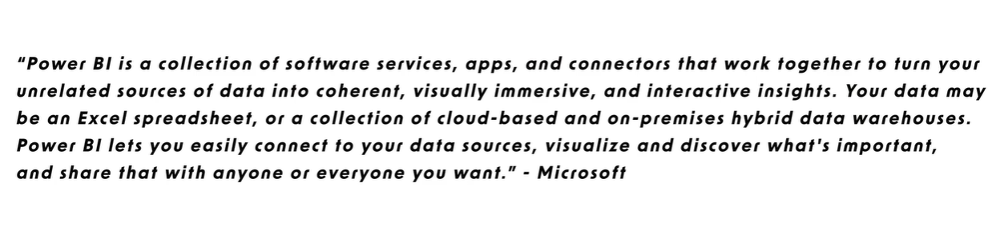

Microsoft defines **Power BI** as a system that:

> Takes scattered, unrelated data and turns it into meaningful, interactive insights.

### Beginner Explanation:

You may have data in multiple places:

* Excel files
* Databases
* Cloud applications
* Local folders

Power BI acts as a **data translator and visualization tool** that:

* Connects different data sources
* Cleans and prepares data
* Builds relationships between data
* Converts it into interactive dashboards and reports 📊

---

## 🧠 Key Concept: Power BI Ecosystem

Power BI is not a single tool. It is a **collection of tools working together**.

### Components work as a team:

* One tool prepares data
* One tool builds reports
* One tool shares reports
* One tool allows viewing on mobile devices

This complete system is called the **Power BI Ecosystem**.

---

## 🧩 Components of Power BI Ecosystem

### 💻 1. Power BI Desktop

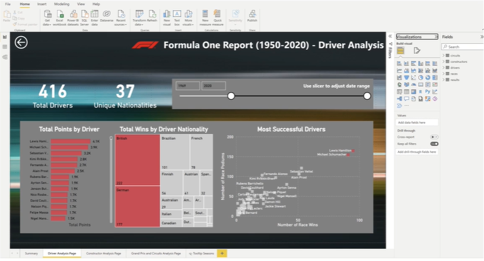

The most important tool for beginners.

* Installed on your local computer
* Completely free
* Used for building reports and dashboards

#### Main Areas in Power BI Desktop:

##### 🔧 Query Editor (Data Preparation)

* Load data from sources
* Clean and transform data
* Handle missing or incorrect values

**Examples:**

* Remove null values
* Convert text to numbers
* Fix date formats

👉 Think of it as a **data cleaning stage**

---

##### 🧱 Data View (Data Modeling)

* View tables
* create insight and analysis
* Organize data structure

**Example:**

* Connect "Drivers" table with "Race Results" table

👉 Think of it as building the **structure of data**

---

##### 📊 Report View (Visualization)

* Create charts and graphs
* Design dashboards
* Add filters (slicers)
* create your visualizations and your report

👉 This is the **final output stage**

---

### 💡 Quick Memory

**Query Editor → Clean**
**Data View → Connect**
**Report View → Show**

---

### ☁️ 2. Power BI Service (Cloud Platform)

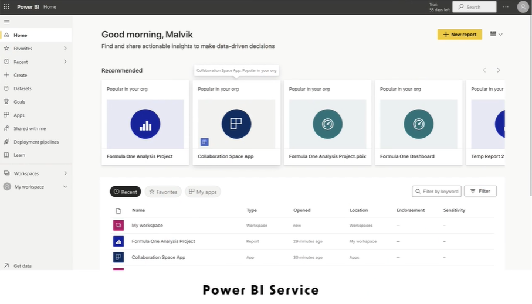

The online version of Power BI.

#### Features:

* Publish reports online
* Share with team members
* Collaborate with others
* Create dashboards and apps

#### Notes:

* Requires Microsoft account login
* Not fully free (trial available)

👉 Think of it as **online sharing and collaboration platform**

---

### 📱 3. Power BI Mobile


Mobile application for Power BI.

#### Features:

* View reports on mobile devices
* Interact with dashboards
* Access insights anytime

👉 Used only for **viewing**, not creating

---

## 🔄 How Power BI Works (Workflow)

1. Build reports in **Power BI Desktop**
2. Publish reports to **Power BI Service**
3. View reports using **Power BI Mobile**

---

## 🧪 Real-Life Example

Scenario: Sales Analysis

* Data stored in Excel and databases
* Load and clean data in Power BI Desktop
* Build relationships between tables
* Create visual reports

Then:

* Publish report to Power BI Service
* Manager views report on mobile device

---

## 🧠 One-Line Understanding

Power BI Ecosystem =
**Desktop (Build) + Service (Share) + Mobile (View)**

---

## ⚡ Beginner Summary

* **Power BI Desktop** → Report creation
* **Query Editor** → Data cleaning
* **Data View** → Data modeling
* **Report View** → Visualization
* **Power BI Service** → Sharing and collaboration
* **Power BI Mobile** → Viewing reports

---

## 🧭 Memory Trick

**Build → Publish → View**

---

## 🚀 Next Steps

* Install Power BI Desktop
* Load sample dataset
* Practice cleaning data in Query Editor
* Create basic visualizations
* Publish your first report

---

# =======================================================================================
# Lec 4

# How to Install Power BI Desktop

Follow these step-by-step instructions to download and install Power BI Desktop on your local Windows system.

## Step 1: Navigate to the Download Page
1. Search for **"Download Power BI Desktop"** on Google or use a direct link (https://powerbi.microsoft.com/en-us/downloads/).
2. Click on the link for **Microsoft Power BI Desktop Advanced Download Options**.
3. Select your preferred language (e.g., English) and click **Download**.

## Step 2: Determine Your System Type (64-bit vs. 32-bit)
*If you already know your system type, you can skip to Step 3.*
1. Click your Windows Start icon and type **"System Information"**.
2. Open the System Information app.
3. Look for the "System Type" row to see if your computer is x64-based (64-bit) or x86-based (32-bit).

## Step 3: Select the Correct Setup File
Based on your system type, select the appropriate file from the download prompt:
* **For 64-bit systems:** Select `PBIDesktopSetup_x64.exe`
* **For 32-bit systems:** Select `PBIDesktopSetup.exe`

## Step 4: Run the Installation Wizard
1. Once the download finishes, click **Open File** on the executable.
2. Select your language from the initial prompt. *(Note: Ensure you have administrator privileges on your computer to proceed, especially if using a work machine).*
3. Click **Next** and click **Yes** if prompted by Windows User Account Control.
4. Accept the license terms and click **Next**.
5. Choose your installation path (the default option is usually best) and click **Next**.
6. Check the box to **Create a desktop shortcut** for easy access.
7. Click **Install**.

## Step 5: Launch Power BI Desktop
1. Once the installation is complete, uncheck the "Launch Power BI Desktop" box to close the wizard, and click **Finish**.
2. Go to your desktop and double-click the new **Power BI** shortcut.
3. When the application opens, an initial welcome window will appear. Click the **X** to close it.
4. You are now ready to use your blank, untitled Power BI file!

---

# ========================================================================================
# Lec 5

# Power BI Interface README

## 📌 Overview

This document explains the **Power BI Desktop Interface** in a beginner-friendly way.

It covers:

* Welcome screen
* Main workspace
* Views (Report, Data, Model)
* Power Query Editor
* Basic workflow

---

## 🏁 Welcome Screen

When you open Power BI Desktop, you will see the welcome screen.

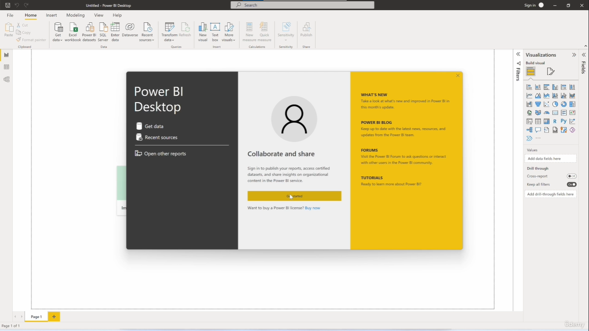

### Options available:

* **Get Data** → Connect to new data sources
* **Recent Sources** → Previously used data connections
* **Open Reports** → Open existing Power BI files

👉 This is just a starting point. You can close it to enter the main workspace.

---

## 🖥️ Main Workspace Overview

After closing the welcome screen, you enter the main working area where reports are created.

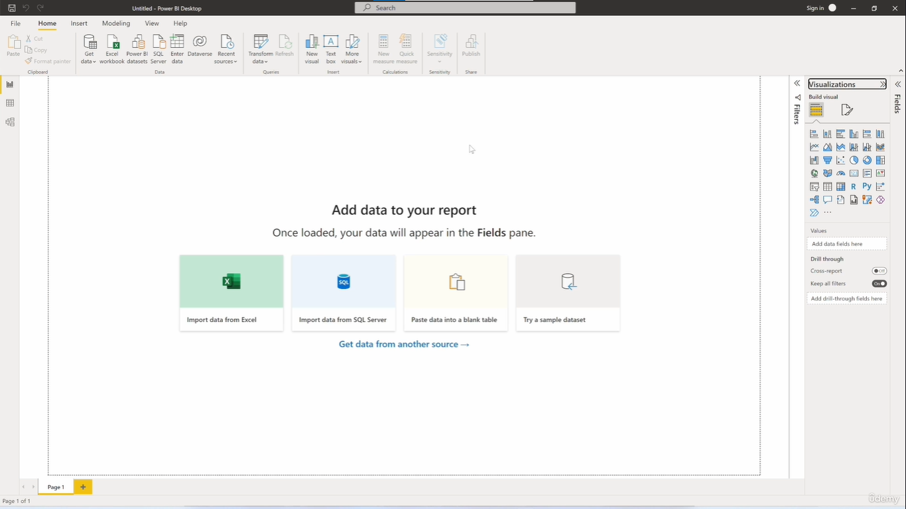

### Top Section: Ribbon

The ribbon contains different tabs:

* **Home** → Connect to data (Get Data), refresh, transform
* **Insert** → Add visuals and elements
* **Modeling** → Create relationships, measures, columns
* **View** → Change layout, themes
* **Help** → Documentation and support

👉 New tabs may appear depending on what you select.

---

## 📊 Left Panel: Views

There are **3 main views** in Power BI Desktop:

### 1️⃣ Report View (Default)

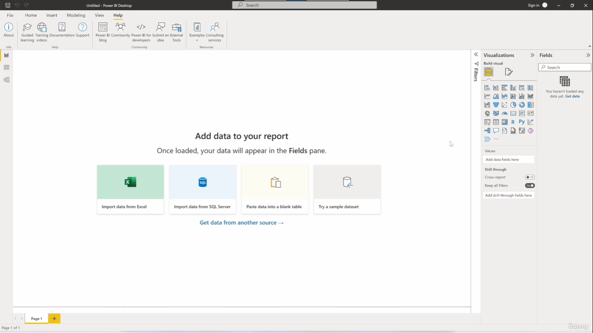

* Main area to create visualizations
* Canvas (center) is where charts appear

#### Right Panel Contains:

* **Filters** → Apply filters
* **Visualizations** → Choose chart types
* **Fields** → Data columns

👉 You drag fields into visuals (X-axis, Y-axis, values, legend)

---

### 2️⃣ Data View

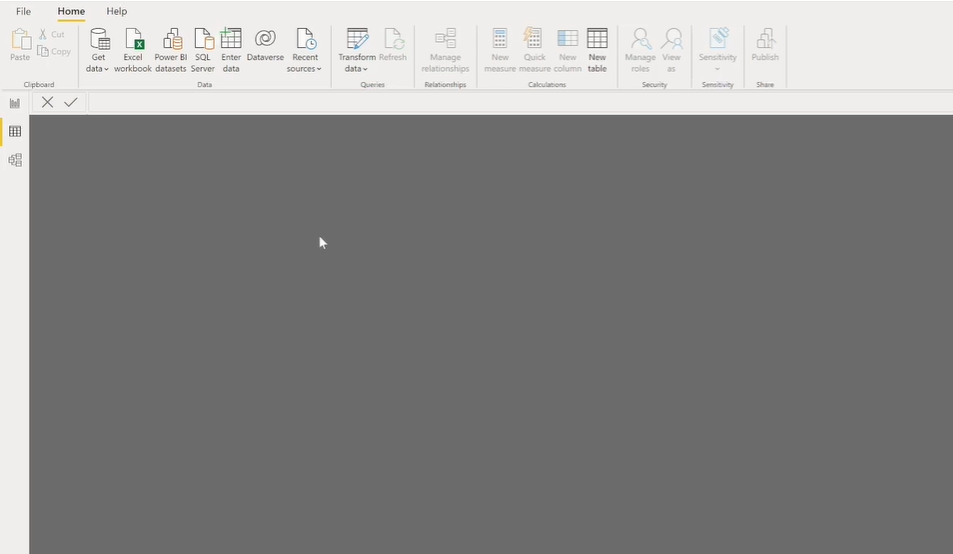

* Shows table data in rows and columns
* Used to inspect loaded data

---

### 3️⃣ Model View

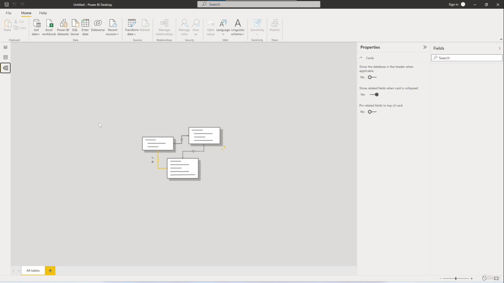

* Displays relationships between tables
* Shows data model structure (diagram view)

---

## 🔧 Power Query Editor (Data Preparation)

This is used for **data cleaning and transformation**.

### How to open:

* Click **Transform Data**

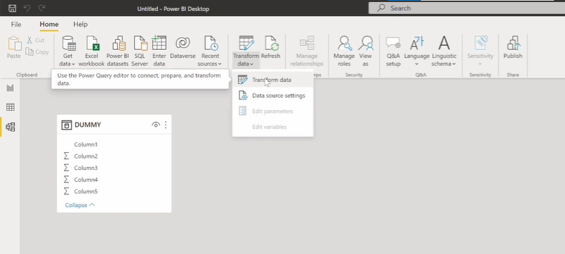

---

### Interface Overview:

#### Left Panel: Queries

* List of all loaded datasets

#### Center: Data Preview

* Shows table data

#### Right Panel: Query Settings

* Rename queries
* View **Applied Steps**

---

### 🔄 Applied Steps (Very Important)

* Each transformation is recorded step-by-step
* Steps run in sequence (top → bottom)

#### Examples:

* Source (data loaded)
* Navigation
* Promoted Headers
* Changed Data Types
* Removed Columns

👉 You can:

* Edit steps
* Delete steps (undo transformation)

---

### 🛠 Common Transformations

* Change data types (text → number)
* Remove columns
* Filter rows
* Rename columns

---

### Apply Changes

* **Close & Apply** → Save changes and load data into model
* **Close** → Exit without saving

---

## 🔄 Power BI Workflow

Typical steps:

1. Get Data
2. Transform Data (Power Query Editor)
3. Load Data into Model
4. Build Visualizations (Report View)

---

## 📥 Loading Data Example (Excel)

Steps:

1. Click **Get Data**

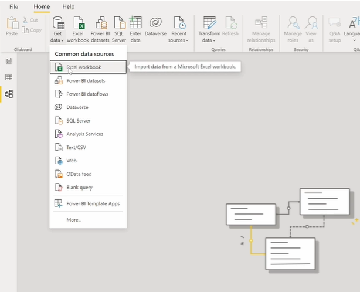

2. Select **Excel Workbook**

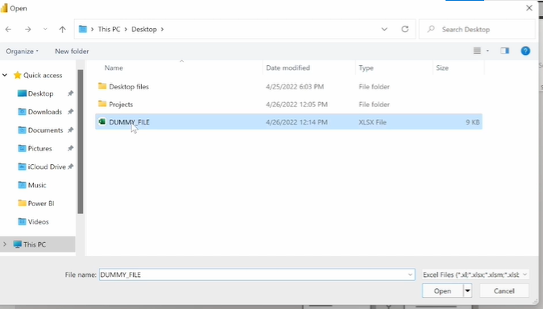

3. Choose file

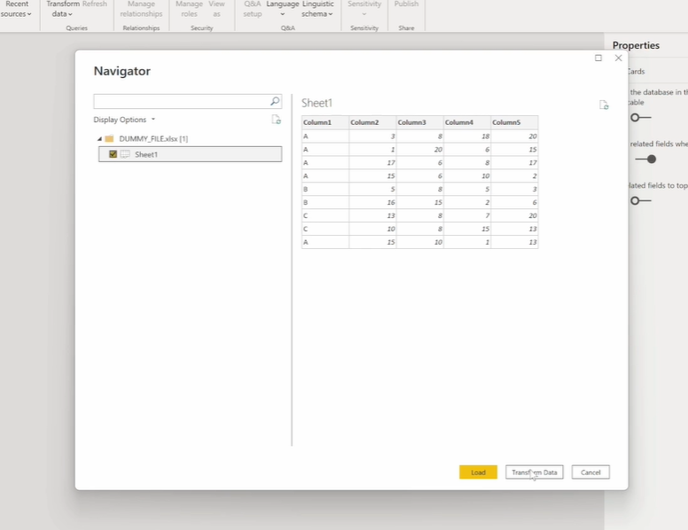

4. Select sheet

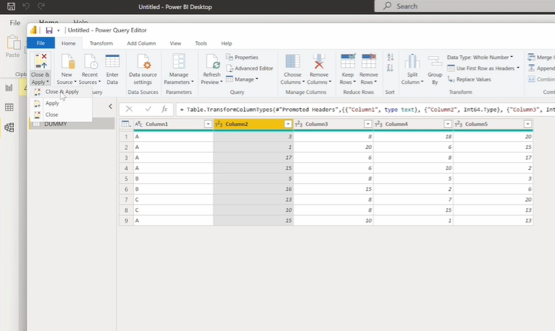

5. Click:

   * **Load** → Direct load
   * **Transform Data** → Clean first

---

## 📊 Creating First Visualization

1. Select a chart type (e.g., Area Chart)
2. Drag fields into:

   * X-axis
   * Y-axis
3. Chart will be generated

---

## ⚙️ Managing Queries

* Right-click query → **Enable Load**

### If disabled:

* Data will NOT appear in report
* Visualizations will break

### If enabled again:

* Data and visuals return

---

## 💾 Saving Power BI File

Steps:

1. Click **File → Save As**
2. Save with extension: .pbix
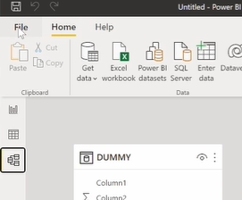
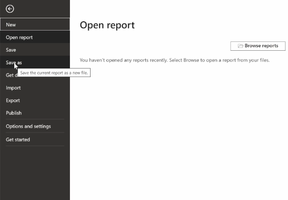

👉 This is the Power BI report file

---

## 🧠 Key Takeaways

* Power BI has 3 main views: Report, Data, Model
* Power Query Editor is used for data cleaning
* Applied Steps track all transformations
* Visualizations are created by dragging fields
* Data must be loaded to build reports

---

## ⚡ Quick Summary

* **Report View** → Create visuals
* **Data View** → View data
* **Model View** → Manage relationships
* **Power Query Editor** → Transform data
* **.pbix** → Power BI file format

---

## 🧭 Memory Trick

**Load → Transform → Model → Visualize → Save**

---

# =========================================================================================
# Lec 6

# Power BI Formula One Dataset README

## 📌 Overview

This section of the course focuses on understanding the **dataset** used to build a Power BI report.

The dataset contains **Formula One racing data (1952–2020)** and will be used to analyze:

* Races
* Drivers
* Teams (Constructors)
* Circuits
* Points
* Dates
* Locations

👉 Before building reports, it is essential to understand what the data represents.

---

## 🎯 Why This Dataset is Useful

This dataset is ideal for learning Power BI because it includes multiple data types:

* **Geographical Data** → Circuit locations
* **Numerical Data** → Points, positions
* **Date Data** → Race dates
* **Reference IDs** → Race ID, Driver ID, Constructor ID

👉 Power BI works best with structured and diverse data, making this dataset perfect for learning.

---

## 🏎️ What is Formula One?

Formula One (F1) is a professional international car racing sport.

### Basic Structure:

* A season consists of multiple races
* Each race is called a **Grand Prix**
* Races are held on **circuits (tracks)**
* Drivers compete for teams called **constructors**
* Points are awarded based on performance
* Champions are decided at the end of the season

---

## 📘 Key Formula One Terms

### 1️⃣ Grand Prix

* A single race event
* Example: British Grand Prix, Monaco Grand Prix
* A season contains multiple Grand Prix races

---

### 2️⃣ Circuit

* The race track where the event takes place

👉 Grand Prix = Event
👉 Circuit = Location (Track)

---

### 3️⃣ Constructor

* The team/company that builds the car

**Examples:** Mercedes, Ferrari, Red Bull

---

### 4️⃣ Driver

* The person driving the car
* Each constructor usually has **two drivers**

---

### 5️⃣ Championship

Two types of championships:

#### Drivers’ Championship

* Awarded to the driver with the highest points

#### Constructors’ Championship

* Awarded to the team with the highest combined driver points

---

## 🧮 Points System

### Current System:

| Position | Points |
| -------- | ------ |
| 1st      | 25     |
| 2nd      | 18     |
| 3rd      | 15     |
| 4th      | 12     |
| 5th      | 10     |
| 6th      | 8      |
| 7th      | 6      |
| 8th      | 4      |
| 9th      | 2      |
| 10th     | 1      |

* No points below 10th position
* +1 bonus point for fastest lap (if in top 10)

### ⚠️ Important Note

Historical seasons used different point systems (e.g., 10 points for 1st place).

👉 Be careful when comparing different years.

---

## 🏁 Qualifying & Grid Position

* Qualifying determines starting position
* Starting position is called **grid position**

### Key Idea:

* Lower number = better position
* Position 1 = front of the grid (advantage)

---

## 📂 Dataset Structure

Download the data by visiting github: 
(https://github.com/malvik01/powerbi) -> code -> download zip

The dataset consists of **5 main tables/files**:

---

## 📊 Main Tables

### 1️⃣ Results Table (Fact Table)

Contains race results for each driver.

#### Columns:

* `result ID`
* `race ID`
* `driver ID`
* `constructor ID`
* `driver number`
* `grid position`
* `finish position`
* `points`

#### Purpose:

Answers:

* Who raced?
* Which team?
* Starting position?
* Final position?
* Points earned?

---

### 2️⃣ Races Table

Contains race event details.

#### Columns:

* `race ID`
* `year`
* `round`
* `circuit ID`
* `Grand Prix name`
* `date`

#### Purpose:

* When the race happened
* Which round in the season
* Where it took place

---

### 3️⃣ Circuits Table

Contains track information.

#### Columns:

* Circuit name
* Location

#### Purpose:

* Where the race occurred
* Useful for maps and geographical analysis

---

### 4️⃣ Drivers Table

Contains driver details.

#### Columns:

* Driver name
* Nationality
* Date of birth

#### Purpose:

* Identify drivers
* Analyze performance, nationality, age

---

### 5️⃣ Constructors Table

Contains team information.

#### Columns:

* Constructor name
* Nationality

#### Purpose:

* Identify teams

---

## 🔗 Relationships in Power BI

Tables are connected using ID fields:

* `race ID`
* `driver ID`
* `constructor ID`
* `circuit ID`

👉 Example:

* Results table → Driver ID
* Drivers table → Driver ID

These connections are called **relationships**.

---

## ⚠️ Raw Data Format

Files may be in different formats:

* JSON
* CSV
* Text

👉 This is normal.

Data may look messy initially but will be cleaned in Power BI.

---

## 🔧 Load & Transform Process

Before analysis, data must be prepared:

1. Load data into Power BI
2. Clean and transform data
3. Set correct data types
4. Organize columns
5. Build data model

---

## 🔄 Power BI Workflow

```
Raw Data → Load → Transform → Model → Visualize
```

---

## 📌 Table Summary

* **Results** → Race outcomes
* **Races** → Event details
* **Circuits** → Track information
* **Drivers** → Driver details
* **Constructors** → Team details

---

## 🎯 Why This Matters

This dataset helps you learn:

* Working with multiple data sources
* Building relationships between tables
* Designing a proper data model
* Creating meaningful reports

👉 You are not just learning Power BI tools, but how to think like a **data analyst/developer**.

---

## 🧠 One-Line Summary

This dataset contains Formula One racing data that will be cleaned, connected, and analyzed using Power BI.

---