# Power BI: Data Loading and Transformation

how to load, transform, and prepare data for reporting using the Query Editor in Power BI.

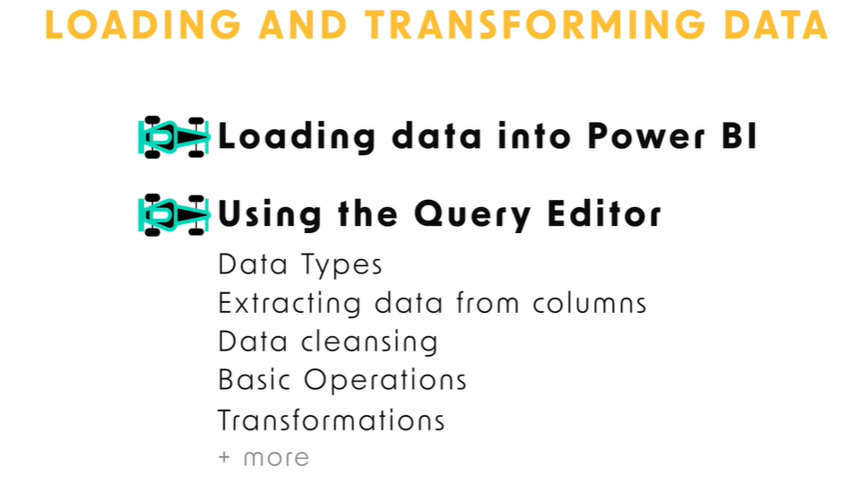

## Terminology
* **Query vs. Table:** These terms are used interchangeably. A **table** is simply the final, polished product of a **query** after all data preparation steps are complete.

## Transformation Steps
data preparation and cleansing techniques:
* **Data Types:** Assigning the correct formats to your data.
* **Extracting Data from Columns:** Pulling specific information out of existing columns.
* **Data Cleansing:** Removing unwanted rows and replacing incorrect values.
* **Basic Operations:** Transposing data to change its structure.
* **Grouping & Aggregating:** Summarizing query data for better high-level analysis.

---
---

# Entering Data Manually

## Method 1: Entering Data from the Home Tab

- Open power bi.
- Navigate to the Home tab.
- Click on the Enter Data button.
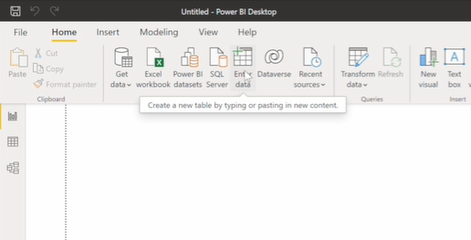

- A "Create Table" pop-up window will appear.
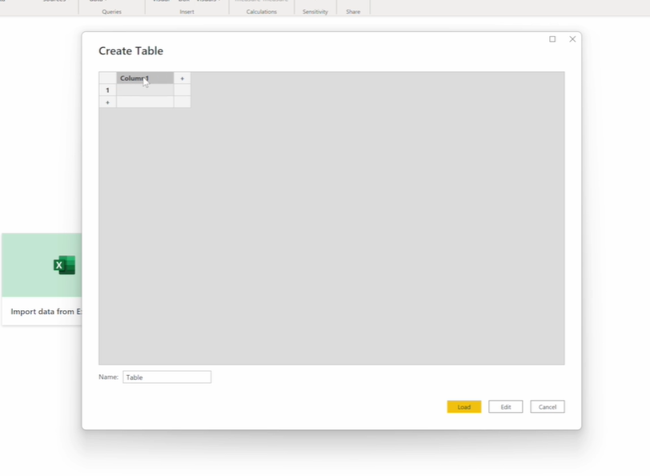

- Type in your column names in the headers (e.g., "Name", "Age").
- Enter your dummy data into the cells, ensuring you maintain a proper tabular structure.
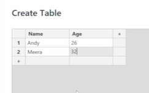

- In the "Name" field at the bottom, type a name for your table (e.g., manual_input).
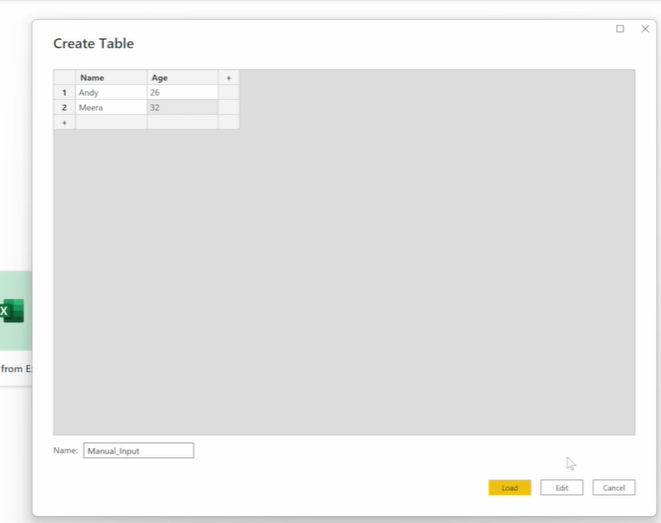

- Choose your next action:
  - Click Load to push the data directly into your data model.
  - Click Edit to open the Power Query Editor and perform transformations first.
- If you clicked Edit,  (review your data in the preview pane), then click Close & Apply. The data will load into the model and become available in the Fields pane for creating visualizations.

## Method 2: Entering Data from the Power Query Editor

- While in the Power Query Editor (Transformation view), locate the New Query section on the Home ribbon.
- Click on Enter Data.
- The "Create Table" window will appear, allowing you to input your data and name the query just like in Method 1.

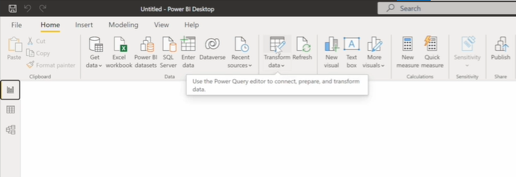
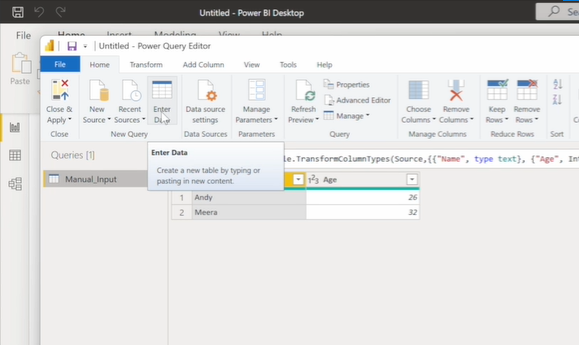

## Copy and Paste Data

- Regardless of which method you use to open the "Create Table" window, you do not actually have to type the data manually.
- If you have tabular data in another program (like an Excel file), you can simply highlight and copy it, click into the "Create Table" window in Power BI, and press Ctrl + V to paste the entire table.

---
---

# How to Save Your Work in Power BI

Saved file will retain all of the data and transformations you have applied.

## Steps to Save a File

- Click on the File tab in the top-left corner of the ribbon.
- Select Save As from the menu.
- Choose the destination path on your computer where you want to save the file (e.g., your Desktop).
- Enter a name for your file (e.g., temp_report).
- Note: Power BI Desktop files are automatically saved with the .pbix file extension.
- Click Save.

## Re-opening Your Saved File

Once saved, you can safely close the Power BI application.

To pick up right where you left off:

- Navigate to the folder where you saved the file.
- Double-click the .pbix file to launch Power BI.
- The file will open, and you will see that all the data loaded from your previous session is still there and ready to use.

# Loading the Races csv data

Power BI can connect to a vast array of data sources. You can view the full list by searching online for "Power BI data sources," or by exploring the "Get Data" menu in the application.

## Types of Data Sources You Can Load

When you click Get Data and select More, you will see an extensive list of connections organized by categories:
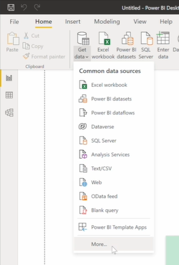
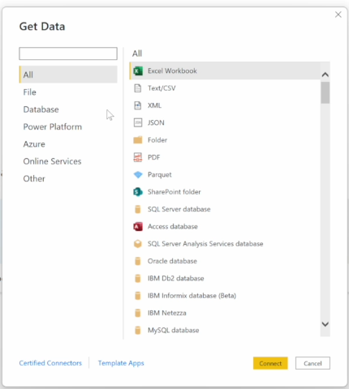

- Files: Text/CSV, XML, JSON, Excel, etc.
- Databases: A wide range of SQL and other database servers.
- Other/Additional: Various online services and custom connections.

## How to Load a CSV File (Example: races.csv)

Follow these steps to import a CSV file into Power BI Desktop file:

- Open Power BI Desktop.
- Under the Home tab, click on Get Data.
- From the dropdown menu (or the "More" menu), select Text/CSV.

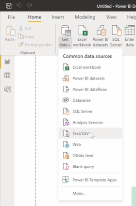

- A file explorer window will open. Navigate to the folder where your file is saved (e.g., your Desktop -> Formula One dataset).
- Select your file (e.g., races.csv) and click Open.

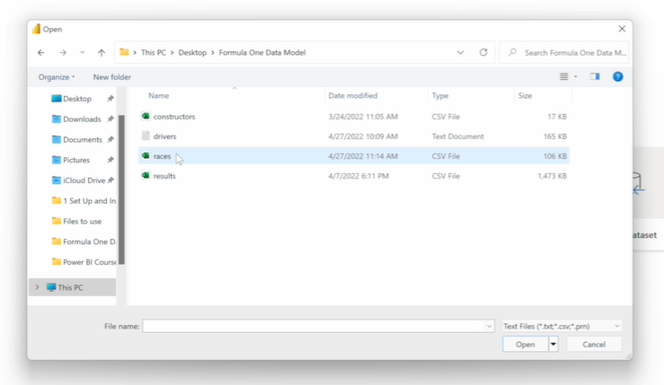

- A preview window will appear showing what the file looks like.

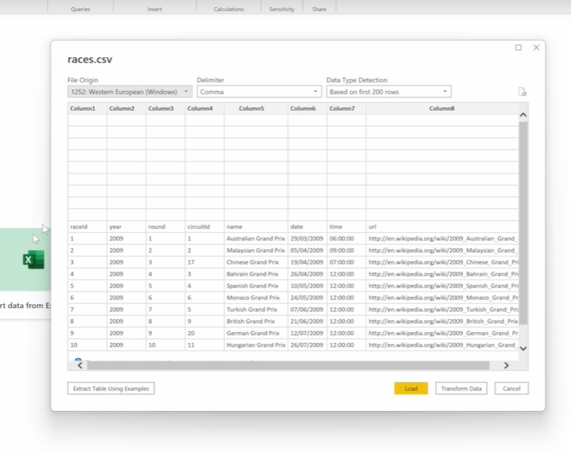

- click Transform Data. to open the Power Query Editor, creating a new query with your file's name (e.g., "Races") so you can clean the data before using it.

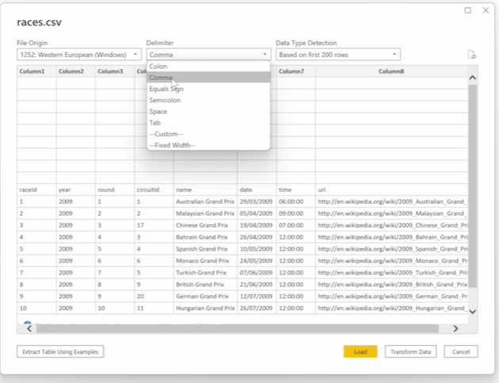

## Note

- Delimiters: Power BI usually detects how your file is separated. For a standard CSV, the delimiter is a comma. If your file is formatted differently, you can change the delimiter to spaces, tabs, or custom characters in the preview window.

---
---

# Removing rows & columns
---

## 1. The Preview Pane

In the center of the screen, you will see the Preview Pane. This displays a live snapshot of what your data currently looks like based on the transformations you have applied so far.

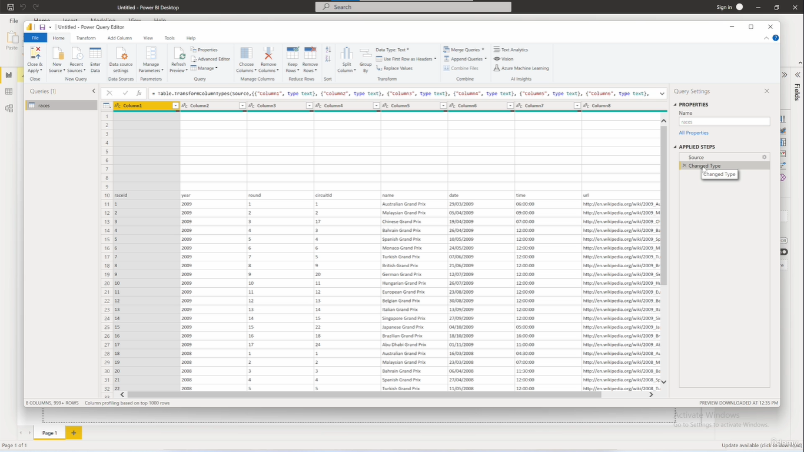

## 2. The Applied Steps Pane

On the right-hand side of the screen, you will find the Applied Steps pane.

This area acts as a history log or timeline of every single transformation you make to the query.

Every time you remove a row, change a header, or delete a column, a new step is added to this list.

You can click on previous steps to see what the data looked like at that exact moment in time, or delete a step to undo an action.

## 3. Reviewing Connection Settings

When you first connect to a data file, the initial connection step is recorded in the Applied Steps pane.

To see or edit exactly where your data is coming from, locate this initial connection step.

Click on the small gear icon (widget) next to it.

This will open a prompt displaying the specific connection details and file path for your data source.
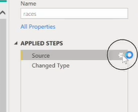
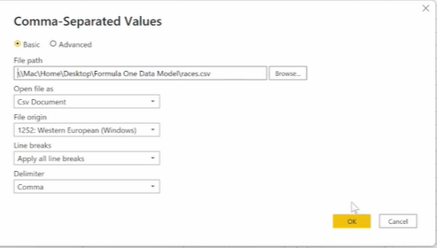

---

# Removing Rows and Columns in Power Query

When cleaning data in the Power Query Editor, there are multiple ways to remove unwanted rows and columns. 

## Managing Rows

### Method 1: Remove Top Rows

- How to do it: Go to the Home ribbon -> click Remove Rows -> select Remove Top Rows -> and enter the number of rows to delete (e.g., 9).

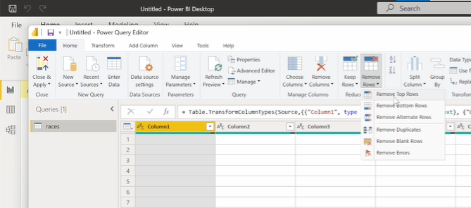
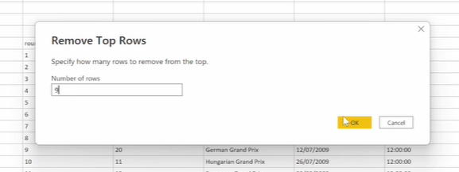
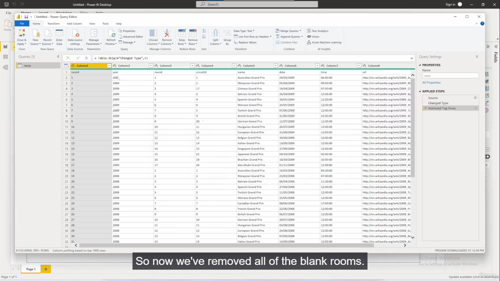
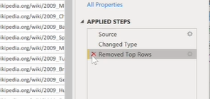

### Method 2: Remove Blank Rows

- How to do it: Go to the Home ribbon -> click Remove Rows ->  Remove Blank Rows. This automatically clears any row that is completely blank.

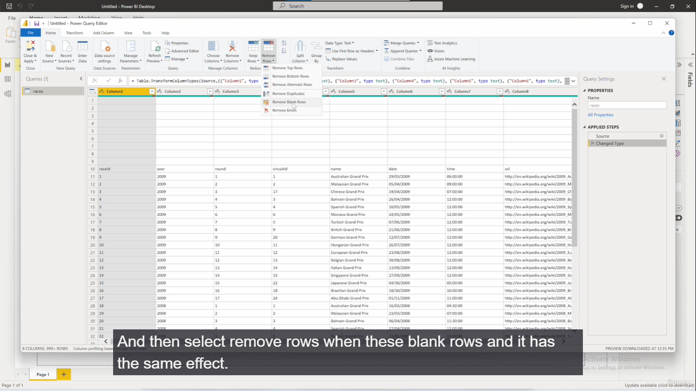

### Method 3: Filter Out Blank Rows

- How to do it: Click the dropdown icon directly on a column's header. Uncheck the "blank" or "null" values to filter them out of the dataset.

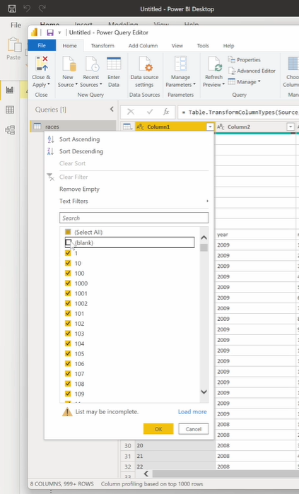

Note : To remove blank rows, Use method 2 (Remove Blank Rows) instead of method 1 (Remove Top Rows) to avoid accidental deletion of top rows.

## Fixing Headers

### Method 4: Use First Row as Headers

- How to do it: Click the **Use First Row as Headers** button on the **Home ribbon** to push the top row of data up into the column name slots. (Note: You can also do the reverse by selecting "Use Headers as First Row").

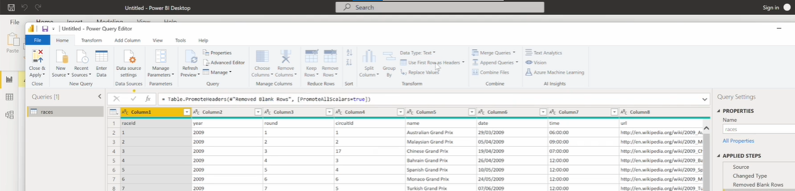
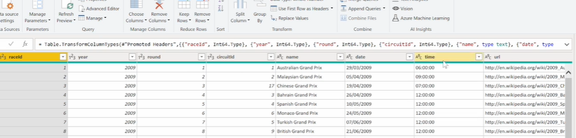

Note : If we select **Use headers as first row** then,
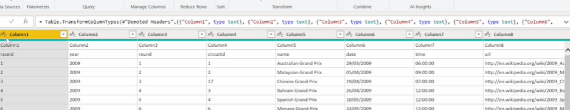

## Managing Columns

### Method 5: Remove a Single Column

- How to do it: Click on the column header you want to delete (e.g., URL), then click the Remove Columns button on the ribbon.

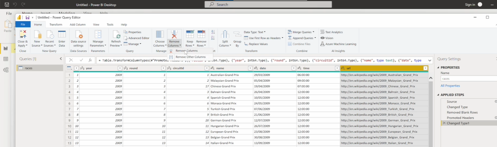

### Method 6: Choose Columns (Keep Specific Columns)

- How to do it: Click Choose Columns on the Home ribbon. A window will pop up allowing you to check the boxes only for the columns you want to keep. Unchecked columns will be removed.
- Instructor Action: Undone. (Demonstrated, then the step was deleted).

- Home -> choose columns -> choose columns -> deselect 'URL'
- Home -> choose columns -> go to column -> allows you to select a specific column.

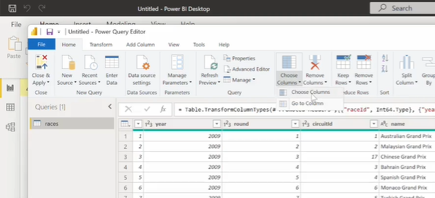
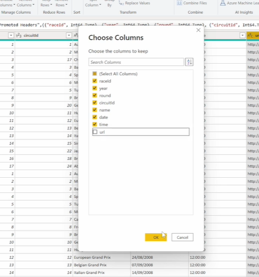

or
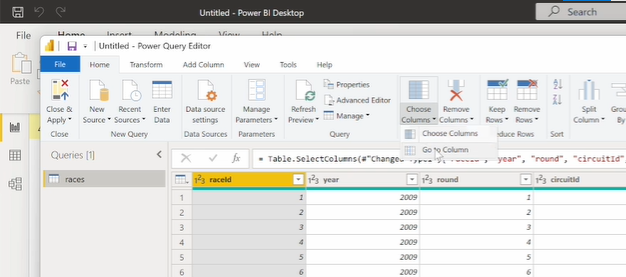
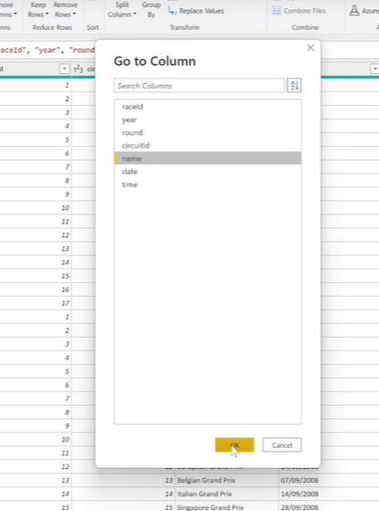
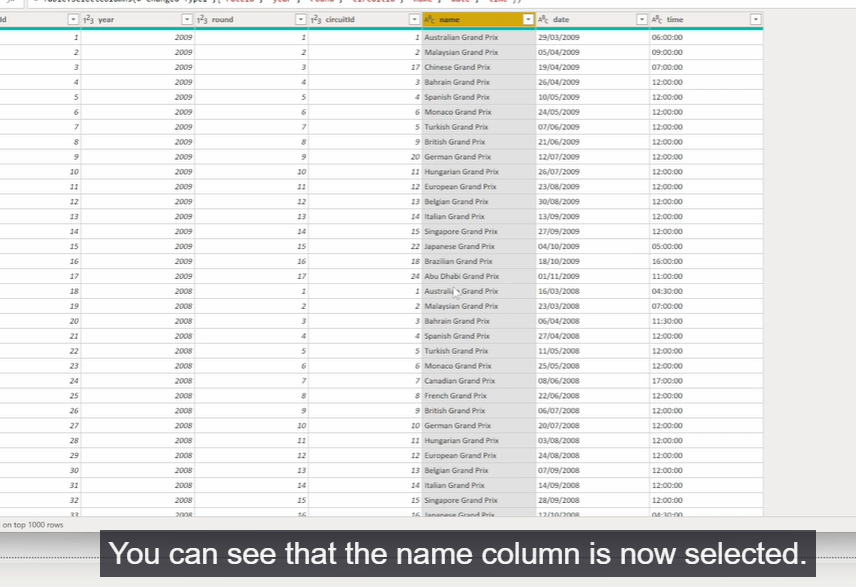

### Method 7: Remove Multiple Columns

- How to do it: Click on the first column you want to remove (e.g., Time). Hold down the Ctrl key on your keyboard, and click on any other columns you want to remove (e.g., URL). Once all are highlighted, click Remove Columns.
- Instructor Action: Kept. (Close & Apply).
- File -> Save As -> Formula One Analysis Project.pbix

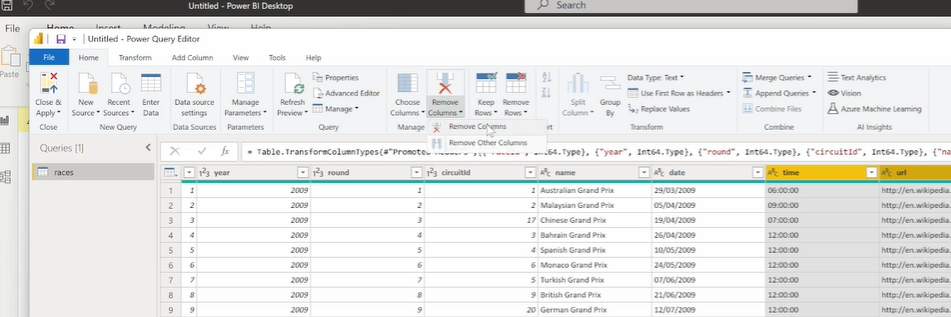

Final
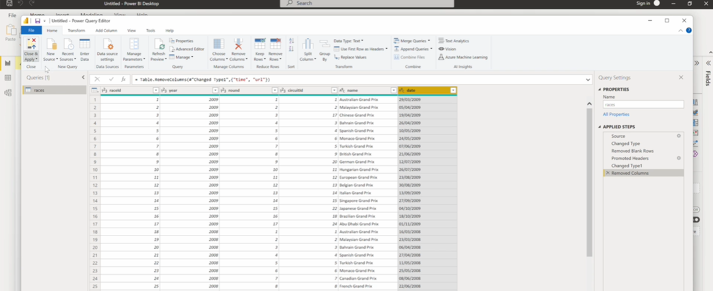

---
---

# Data Types

how Power BI handles data types, how to manage auto-detection:

## 1. Accessing the Power Query Editor

- Open your Power BI Desktop file (e.g., Formula One analysis project).
- Go to the Home ribbon.
- Click on Transform Data to open the Power Query Editor.

## 2. Auto-Detection of Data Types

When you load data or promote headers, Power Query automatically creates a Changed Type step in your "Applied Steps" pane.
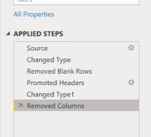

- How it works: Power Query samples the first 200 rows of a column to guess the correct data type.
- Limitations: It is not always perfect (e.g., a Date column might mistakenly be formatted as "ABC" text), so manual adjustments are often required.

### How to turn auto-detect off (Optional):

- Go to File > Options and settings > Options.
- In the left menu under Current File, select Data Load.
- Uncheck the auto-detect box. (Note: The instructor keeps this checked but notes the need for manual review).

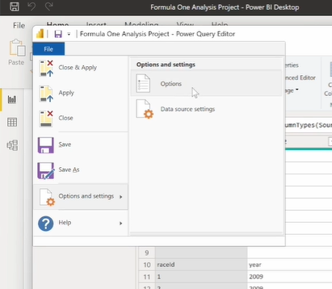
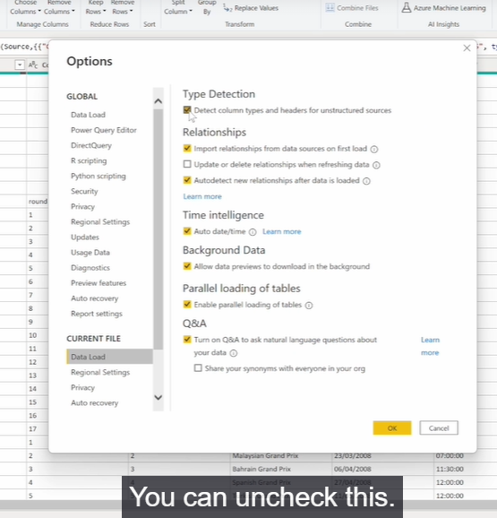

## 3. Changing Data Types Manually

To manually change a column's data type, simply click the small icon on the left side of the column header (e.g., the ABC or 123 square) and select the correct format from the dropdown menu.

## 4. List of Data Types

### Numerical Data Types

- Decimal Number: A 64-bit floating-point number. This is the most common number type. It handles both fractional and whole numbers. Max precision: 15 digits long.
- Fixed Decimal Number: Has a fixed location for the decimal separator (always exactly four digits to its right). Allows for 19 digits of significance. Useful for financial data or situations where rounding might introduce errors.
- Whole Number: An integer (a number with no decimal places). Allows for 19-digit positive or negative whole numbers.
- Percentage: Displayed with a % sign in your table, but underneath, it is loaded into the data model as a decimal number.

### Date and Time Data Types

- Date/Time: Represents both a date and a time. Under the hood, this is stored as a decimal number type, meaning you can easily convert between date and decimal formats.
- Date: Represents only the calendar date, with no time portion.
- Time: Represents only the time of day, with no date portion.
- Date/Time Timezone: Represents a UTC date/time value along with its specific timezone offset.
- Duration: Represents a specific length of time. When loaded into the data model, it is converted into a decimal number type.

### Text and Other Data Types

- Text: Used for strings, numbers, and/or dates formatted purely as text.
- True/False (Boolean): A logical data type that only accepts one of two values: True or False.
- Binary: Represents data in a binary format. This is typically used inside Power Query when initially loading binary files before converting them to other recognizable data types.

## 5. Using Locale

At the bottom of the data type dropdown, there is an option called Using Locale.

This allows you to set both the desired data type and the regional origin (locale) that the data format comes from (e.g., UK date formats vs. US date formats).

## Reference Note

Microsoft provides official documentation outlining all of these data types in detail via their website if you need to reference the specific integer limits or technical specifications.
(https://docs.microsoft.com/en-us/power-bi/connect-data/desktop-data-types)
----

## 6. Practical Example: Validating Data Types & Fixing Date Locales (Races Query)

### Step A: Validating Correct Types

- Whole Numbers: Check columns like raceId, year, round, and circuitId. If they show the 123 icon, they are correctly identified as Whole Numbers.
- Text: Check columns like name. If it shows the ABC icon, it is correctly identified as Text.

### Step B: Troubleshooting Incorrect Types (The Date Issue)

Sometimes, a date column will show the ABC (Text) icon instead of a calendar icon. If you try to directly change it to a Date data type, you might get an error message (e.g., 59% of rows returning errors).

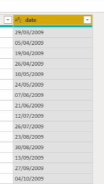
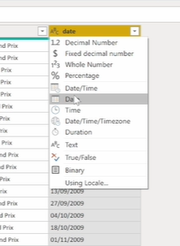
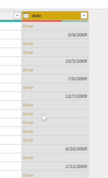

Why does this happen? This is usually caused by a conflict between your Regional Settings and the format of the incoming data.

To check your settings, go to File > Options and settings > Options > Current File > Regional Settings.

If your setting is English (United States), Power Query expects dates to be formatted as Month/Day/Year (MM/DD/YYYY).

If your incoming data is from the UK, it is formatted as Day/Month/Year (DD/MM/YYYY).

The Error: Because a month cannot go above 12, any row where the "Day" is 13 or higher will trigger an error because Power BI thinks it's reading an invalid 13th+ month.

### Step C: Fixing the Date Error with "Using Locale"

If you encounter this error, undo the broken "Changed Type" step and follow these instructions:

- Click the data type icon (ABC) on the date column header.
- Select Using Locale at the very bottom of the menu.

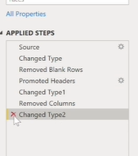
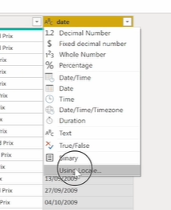
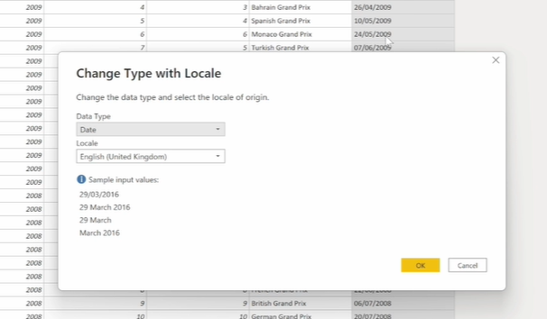

In the pop-up window:

- Change Data Type to Date.
- Change Locale to the origin format of the data. For example, choose English (United Kingdom) to tell Power BI to read the incoming data as DD/MM/YYYY.
- Click OK.

Result: The conversion will now work perfectly without errors. Because your underlying Regional Settings are still set to the US, the final output will automatically reformat into the US MM/DD/YYYY display format, but it is now successfully recognized as a true Date data type.

## 7. Saving Your Progress

Once your data types are correctly assigned and validated:

- Click Close & Apply in the top left corner of the Home ribbon to exit the Query Editor and apply your transformations to the data model.
- Save your report to retain these changes for your next session.

---
---

# Working with Columns 

Column rearranging, renaming, and understanding the critical difference between the Transform and Add Column tabs.

## 1. Start

To begin making these changes, you first need to open your data in the Power Query Editor:

- Open your Power BI Desktop file (e.g., the Formula One analysis project).
- On the Home ribbon, click on Transform Data to open the Power Query Editor.

## 2. Rearranging Columns

You can easily change the order of your columns to make your dataset easier to read or navigate.

### Method 1: Drag and Drop

Simply click and hold a column header, then physically drag it to your desired position left or right, and drop it.

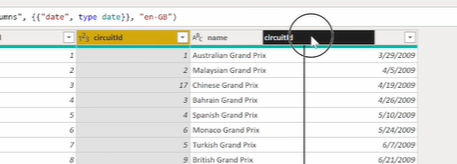

### Method 2: Using the Transform Tab

Click on the column header you want to move. Navigate to the Transform tab, click on the Move dropdown menu, and select one of the following options:

- Move Left
- Move Right
- Move to Beginning
- Move to End

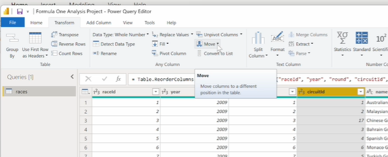
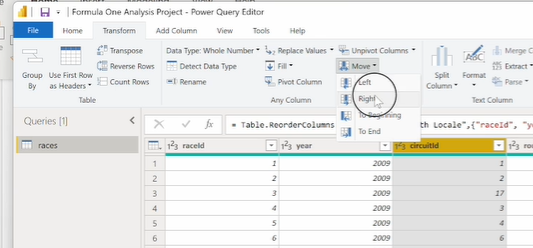

## 3. Renaming Columns

### How to rename (Two Methods):

1. Double-click directly on the column header text.
2. Click to highlight the column, Transform Tab -> Rename.
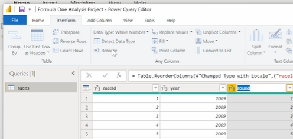

- Rename raceId to race_id
- Rename CircuitId to circuit_id
- Rename name to grand_prix

## 4. The Difference Between "Transform" vs. "Add Column" Tabs

As you navigate the Power Query ribbon, you will notice that both the Transform tab and the Add Column tab share many of the exact same tools and icons (such as Extract and Format).

### The Transform Tab (Modifies In-Place):

When you use a tool from this tab, the change happens directly to the column you currently have selected.

Example: If you select the grand_prix column -> go to the Transform tab -> click Format > Uppercase, the existing text inside that specific column is instantly and completely converted to uppercase. The original lowercase data is overwritten.

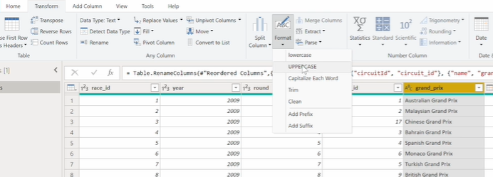
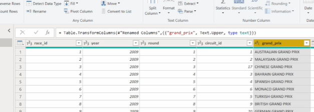

### The Add Column Tab (Creates a New Column):

When you use a tool from this tab, Power Query preserves your original column exactly as it is, and creates a brand new column in your table with the formatted data.

Example: If you select the grand_prix column -> go to the Add Column tab -> click Format > Uppercase, your original grand_prix column stays exactly the same. However, a new column is appended to the table containing a copy of that data converted to uppercase.

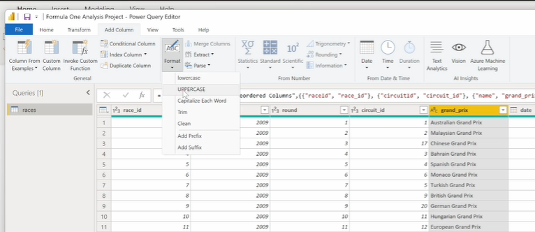
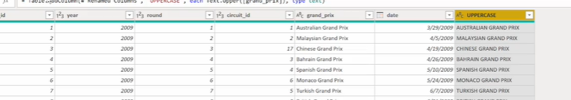

## 5. Saving Your Progress

- Go to the Home tab in the Power Query Editor.
- Click Close & Apply to apply these structural changes to overall data model.
- Save Power BI Desktop file before closing it to ensure work is retained for the next lecture.

---
---

# Splitting / Extracting information from the columns

## 1. Opening Power Query Editor

Before performing any splits or extractions, open the editor.

- Open Power BI Desktop file.
- On the **Home ribbon**, click on **Transform Data**.
- This opens the **Power Query Editor** in a new window.

---

## 2. Splitting Columns

**Navigation Path:**  
Select Column -> Home tab (or Transform tab) -> Split Column
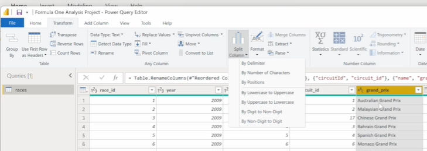

### Method A: Split by Delimiter (Space, Comma, Slash, etc.)

A **delimiter** is a character (or characters) that separates text strings (e.g., spaces, commas, quotes, slashes).

#### Steps to split by whitespace:

- Click on the column header you want to split (e.g., "Grand Prix" column).
- Go to the **Home tab** (or **Transform tab**) and click **Split Column**.
- Select **By Delimiter** from the dropdown menu.

- In the prompt, select **Space** as your delimiter.
- Choose to split at **Each occurrence** of the delimiter.
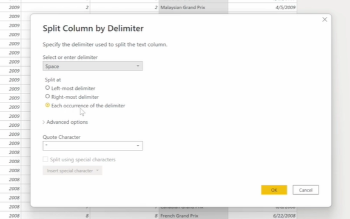

- Click **OK**.

**Result:** Each word gets its own column. Rows with fewer words will populate the extra columns with **null**.
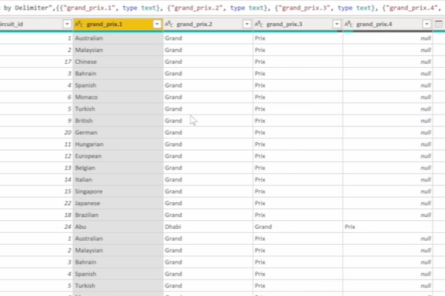
---

#### Steps to split by a Custom Delimiter (e.g., a specific word):

- Select the column.
- Click **Split Column -> By Delimiter**.
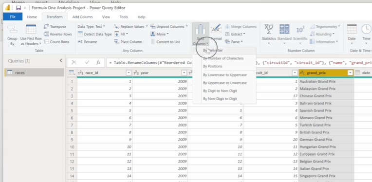

- Choose **Custom** from the delimiter dropdown.
- Type your custom string (e.g., Grand - note the spaces before and after the word).
- Choose your occurrence logic and click **OK**.
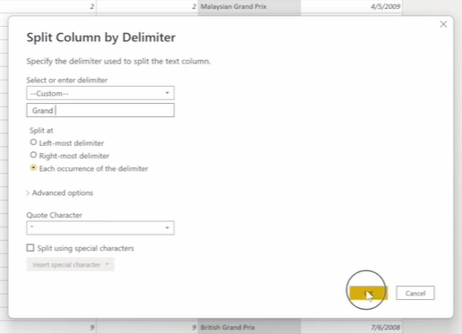

**Note:** This is **case-sensitive**!

---

#### Steps to split Dates by Delimiter:

- Select a Date column.
- Click **Split Column -> By Delimiter**.
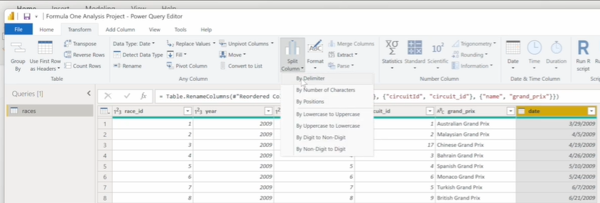

- Power BI intelligently auto-selects **Custom** and inputs the slash (/) delimiter for you.
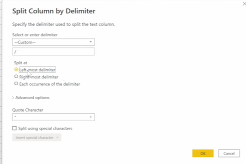

Choose an occurrence option:

- **Leftmost delimiter:** Splits only at the first slash it finds (returns two columns: Month, and Day/Year combined).

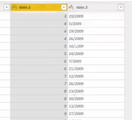

- **Each occurrence:** Splits at every slash (returns three columns: Month, Day, and Year).
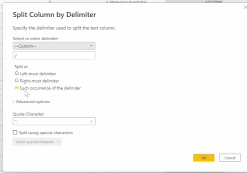

- Click **OK**.

---

### Method B: Split by Number of Characters or Positions

- Select the column you want to split.
- Click **Split Column**.

#### Select By Number of Characters:
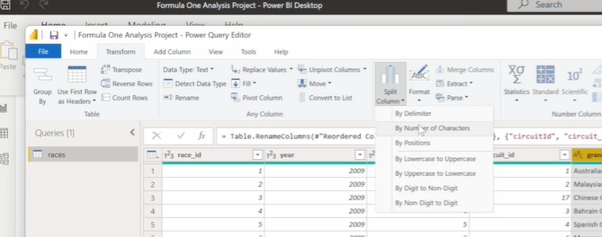

- Specify the number (e.g., 10).
- Choose direction (e.g., As far Right/Left as possible).
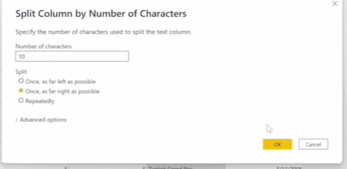

#### OR Select By Positions:

- Type the exact index numbers separated by a comma (e.g., typing 0, 5 extracts from the start of the string to the 5th character).
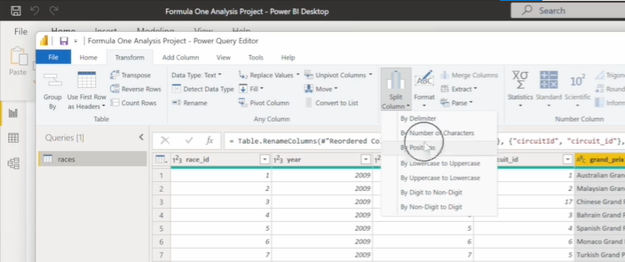

---

## 3. Extracting Text

**Navigation Path:**  
Select Column -> Transform tab OR Add Column tab -> Extract
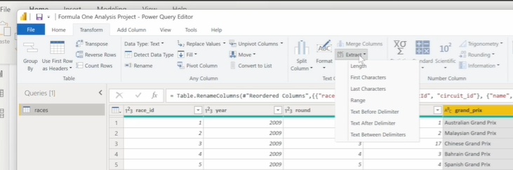

### Transform Tab vs. Add Column Tab

- **Transform Tab -> Extract:** Overwrites the currently selected column with the extracted data.
- **Add Column Tab -> Extract:** Keeps your original column intact and creates a new column containing the extracted data.

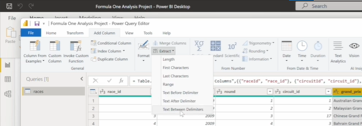

---

### Method A: Extract Text Between Delimiters

- Select the column.
- Go to the **Transform** tab and click **Extract**.
- Select **Text Between Delimiters**.
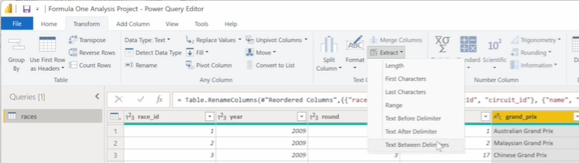

- Define your **Start and End delimiters** (e.g., a whitespace for both).
- Click **OK**.
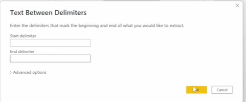

**Result:** Extracts the text found between the first match of those delimiters (e.g., extracting the second word of a string).
* here, we can say we extracted the second word. (Between the first & second occurence of white spaces.)

> Lets do the same using "Add Column" TAB.

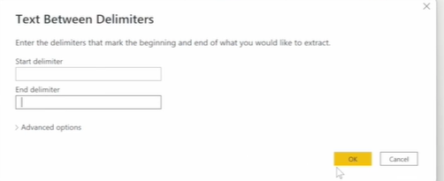
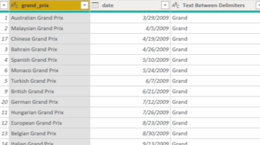

---

### Method B: Extract First/Last Characters or Range

> Retain first 10 characters.

- Add column tab.
- Select the column.
- Click **Extract**.

Choose your desired method:

- **First Characters / Last Characters:** Enter the count of characters you want to retain from the beginning or end (e.g., type 10 to keep the first 10 characters).
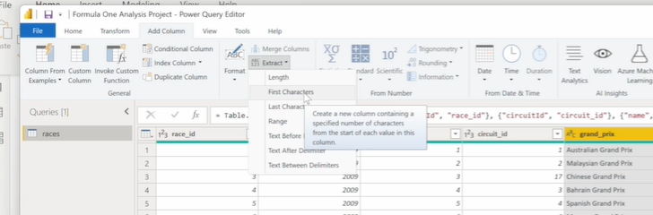
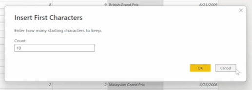

- **Range:** Enter a starting index and the total number of characters you want to extract.
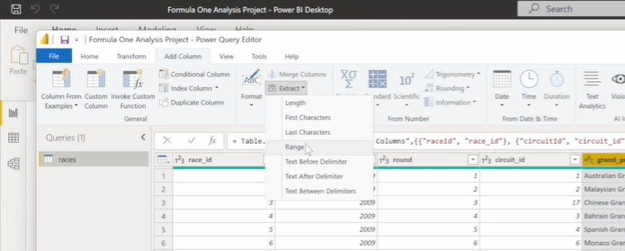
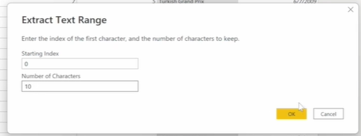

---

## 4. Extracting Date & Time Specifics

**Navigation Path:**  
Select Date Column -> Transform tab -> Date and Time column section -> Date dropdown
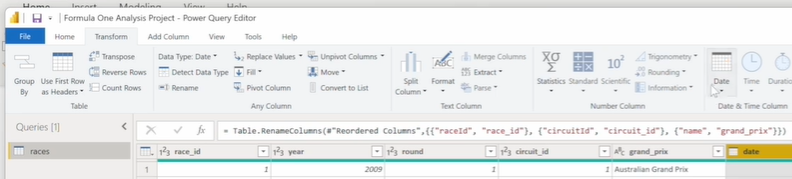

### Steps to extract Date elements:

- Ensure your column data type is explicitly set to **Date**.
- Select the Date column.
- Go to the **Transform tab**.
- Look for the **Date & Time column** section and click the **Date dropdown button**.

- Select the specific information you want to extract (e.g., **Year, Quarter of the Year, Day of the Week, Week of the Year**).

* extract year
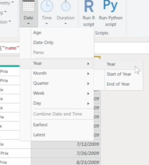
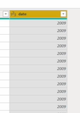

* extract Quarter Of Year
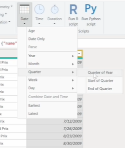
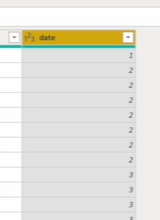

* extract day of the week
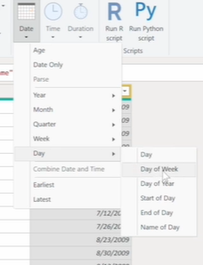
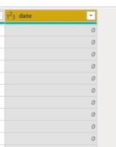

* extract Week of year
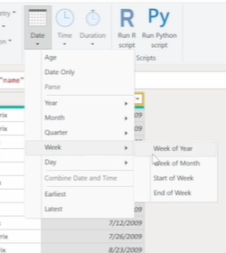

---

## Additional Info

- **Null Values:** When splitting columns, if a row doesn't have enough delimiters to fill all the newly created columns, Power BI will automatically fill those empty spaces with **null**.

- **Missing Delimiters:** If you try to split a column by a delimiter that doesn't exist in the data (like trying to split by a comma when there are no commas), nothing will happen, and the result will be full of **null values**.

- **Auto-Detection:** Power BI is often intelligent enough to auto-detect the delimiter for you based on the column's contents.

---
---

# Simple Mathematical Operation

**Navigation Path:**  
Select Numerical Column(s) -> Transform tab (Number Column section) OR Add Column tab (From Number section)
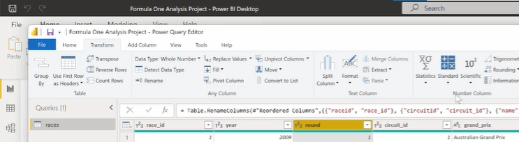
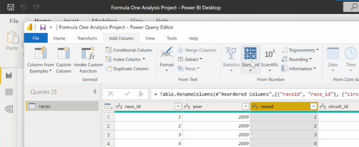

**Prerequisite:** Ensure the selected columns are of a **numerical data type** (e.g., integers or decimals).

---

## Method A: Applying Operations with a Constant Value

You can perform simple arithmetic (**Add, Subtract, Multiply, Divide**) on a column using a fixed number.

- Select the numerical column (e.g., "Round").
- Go to the **Transform tab** (to overwrite or **Add Column tab** to create a new column)
- Click on **Standard**.
- Select the operation (e.g., **Add**).
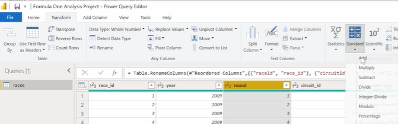

- Enter your constant value (e.g., 10) in the prompt.
- Click **OK**.
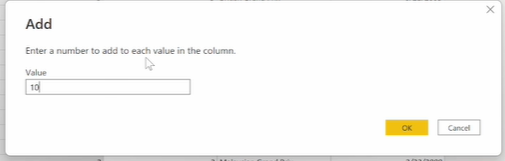

**Result:** The constant value is applied to **every row** in that column.
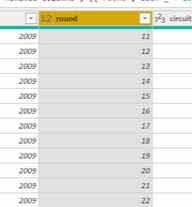

* Lets perform the same operation in Add column Tab.
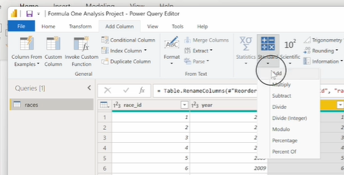
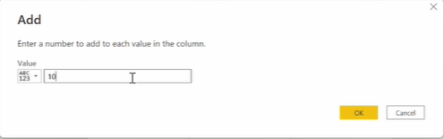
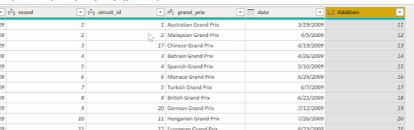

---

## Method B: Arithmetic Between Multiple Columns

You can perform arithmetic operations across **two or more columns** at a row level.

- Select the first numerical column (round).
- Hold **Ctrl (or Cmd)** and select the second numerical column (circuit_id).
- Go to the **Add Column tab**.
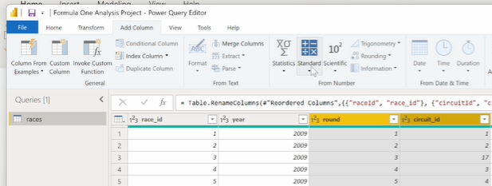
- Click on **Standard -> select your operation** (e.g., Subtract).
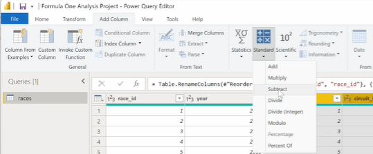

**Result:** The operation is performed **row by row**  
(e.g., Row 1 Value of Col 1 minus Row 1 Value of Col 2).
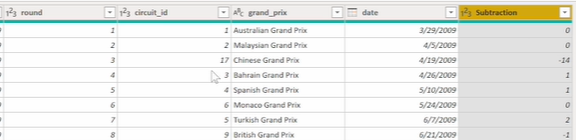

---

## Method C: Statistical Functions (Row-Level vs. Column-Level)

Power Query offers statistical functions like **Sum, Minimum, Maximum, Median, and Average**.  
How these calculate depends entirely on **how many columns you select** and **which tab you use**.

---

### 1. Row-Level Statistics (Multiple Columns Selected)

- Select **two or more numerical columns**.
- Go to the **Add Column tab**.
- Click **Statistics -> select your function** (e.g., Average).
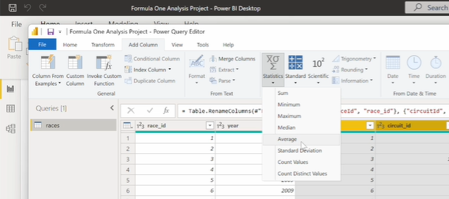

**Result:** Creates a new column calculating the statistic for **each individual row**  
(e.g., Average of Col A and Col B on Row 1).
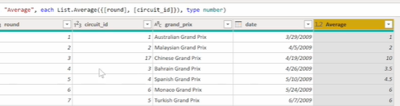

---

### 2. Column-Level Statistics / Scalar Value (Single Column Selected)

- Select a **single numerical column**.
- Go to the **Transform tab**  
  (Note: You cannot perform single-column statistics from the Add Column tab).
  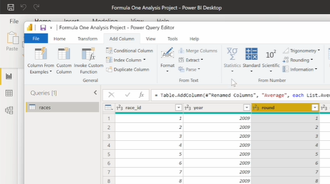

- Click **Statistics -> select your function** (e.g., Average).
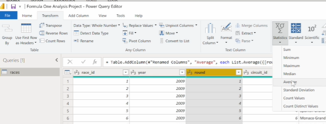

**Result:** The entire table is replaced by a **single scalar value**  representing the statistic for that entire column  (e.g., the overall average of all values in the column).
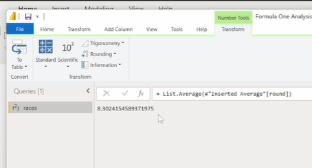

---
---

# Duplicate, Index and Conditional columns 

## 1. Duplicating a Column

Duplicating a column creates an exact copy of the selected column, including its values and data type.

### How to duplicate a column:

- Select the column you wish to copy.
- Go to the Add Column tab.
- In the General section, click Duplicate Column.
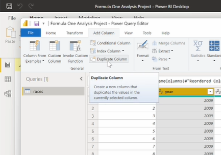

Result: A new column will appear at the end of your table containing the exact same data.
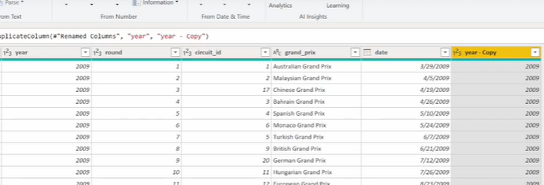

## 2. Adding an Index Column

An Index column adds a new column to your table **containing explicit position values** (row numbers). This is often created to support other advanced transformation patterns or to create a unique ID for every row.

### How to add an Index column:

- Go to the Add Column tab.
- In the General section, click the Index Column dropdown arrow.
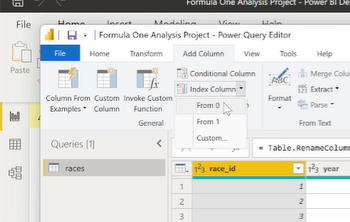

You have three options:

- From 0: Starts the first row at 0 and increments by 1 as it goes down.
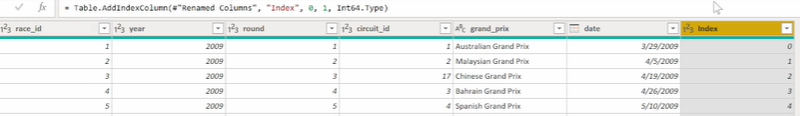

- From 1: Starts the first row at 1 and increments by 1 as it goes down.
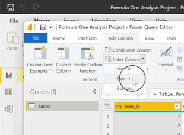
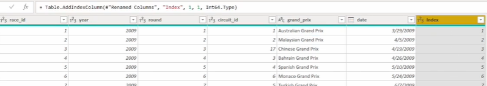

- Custom: Opens a pop-up box where you can specify both the Starting Index and the Increment value.
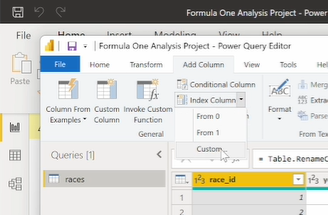

Example: Setting the Starting Index to 10 and the Increment to 100 will number your rows as 10, 110, 210, 310, etc.
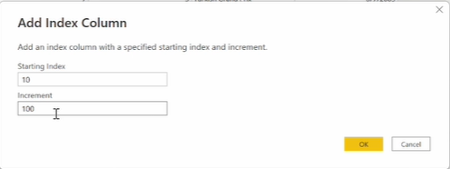
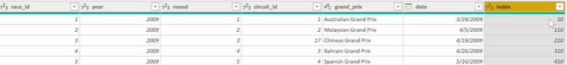

## 3. Adding a Conditional Column

Conditional columns are a powerful way to implement custom IF/THEN/ELSE logic into your data on a row-by-row basis.

### How to create a Conditional Column:

- Go to the Add Column tab and click Conditional Column.
- A pop-up window will appear where you can name your new column and build your logical clauses.
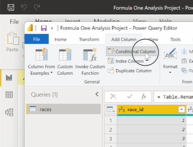
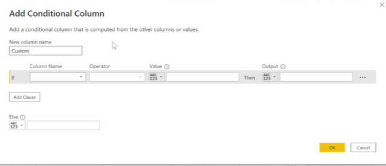

### Example A: The Hybrid Era

Let's say you want to categorize Formula One races based on the year the "Hybrid Era" began (2014).

- New Column Name: Hybrid Era
- If Year is greater than or equal to 2014 Then output Hybrid Era
- Else output Pre Hybrid Era

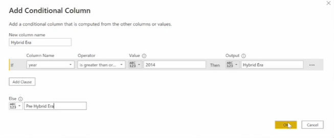
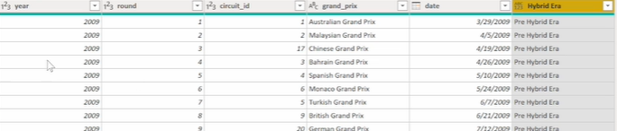

Result: Power Query evaluates every row. Years 2013 and below will display "Pre Hybrid Era", while 2014 and newer will display "Hybrid Era".

### Example B: Assigning Flags/Numbers (Equals)

You can assign specific values based on exact text matches, and you can add multiple clauses using the "Add Clause" button.

- If Grand Prix equals Australian Grand Prix Then output 1
- Else If Grand Prix equals Malaysian Grand Prix Then output 2
- Else output 0

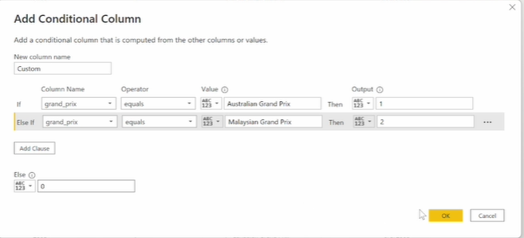
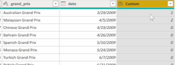

## Concept: The Order of Clauses Matters

When you have multiple clauses in a Conditional Column, they are evaluated from top to bottom.

As soon as a row meets a true condition, Power Query assigns the value and stops evaluating any other conditions for that row.

Example: If Clause #1 says "If Australian Grand Prix, output 9", and Clause #2 says "If Australian Grand Prix, output 1", the output will always be 9. Clause #2 will never trigger because Clause #1 was already satisfied.

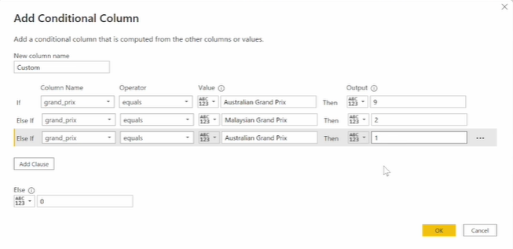
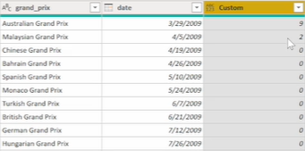

Tip: Always arrange your clauses from the most specific rule at the top, to the most general rule at the bottom.

---
---

# Refreshing Source Data
---

## 1. Rule: A One-Way Relationship

It is crucial to understand that the relationship between the Power Query Editor and your source data file (like a CSV or Excel file on your desktop) is one-way:

- Transformations made in Power Query have **NO impact on the source data itself**. Your original file remains completely safe and unchanged, no matter what you do in Power BI.

- Changes made to the source data **DO impact Power Query**. If you edit and save the original file, those changes will flow into Power BI the next time you refresh the query.

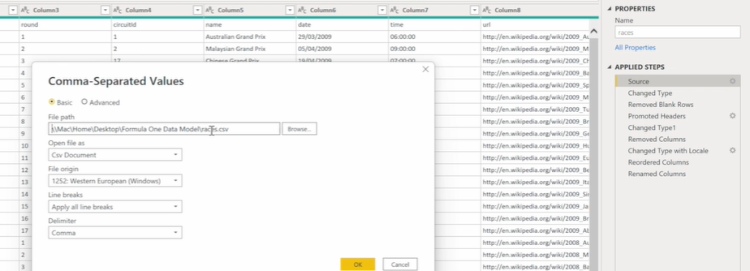
---

## 2. Refreshing Data to Feed Through Changes

When data in your original file is updated, added, or deleted, you must manually tell Power Query to fetch that new information.

### How to refresh your data:

- Open your source file (e.g., the races.csv file on your desktop).
- Make a change to a data value (e.g., change the year 2009 to 2000009).
- Save and close the source file.
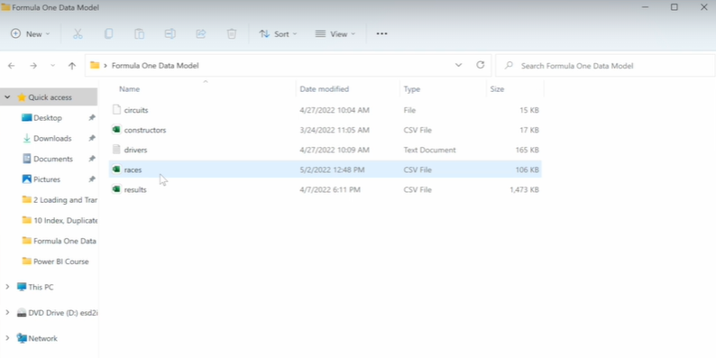
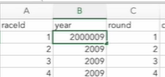

- Go to the Power Query Editor view in Power BI.
- Note that the change has not appeared yet, even if you click on the very first "Source" step in your Applied Steps.

- Go to the **Home tab**.
- Click the **Refresh Preview** button (or click the dropdown and select **Refresh All**).
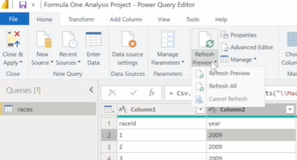
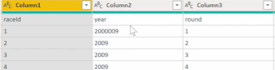

**Result:** Power Query reaches back out to the source file, pulls in the new data, applies all your transformation steps to it, and updates your preview window to show 2000009.

**Fix**: Lets go back to source file and change 2000009 to 2009 and refresh again.

## 3. Best Practice: Remove Blank Rows vs. Remove Top Rows

When cleaning up messy source data that has empty rows at the top, the specific function you choose matters greatly when the source data updates in the future.

### Why you should use "Remove Blank Rows":

- Imagine your initial source file had 9 empty rows at the very top before the column headers began.

- If you use the **Remove Top Rows** function and type 9, Power Query hardcodes the instruction:  
  **"Always delete the first 9 rows."**

### The Problem:

- If the source data is later updated and those blank rows are removed by whoever generated the file, Power Query will still blindly delete the first 9 rows.

- This will accidentally delete your column headers and the first 8 rows of your actual, valuable data!

> Note: We now have 0 blank rows at top in the sourch file, that's why.

- Instead of "Remove Top Rows", go to the **Home tab -> Remove Rows -> Remove Blank Rows**.

**Result:** This dynamically searches for and removes completely empty rows regardless of where they are or how many there are. It makes your query robust and resistant to structural changes in the source file.

---

## 4. Breaking the Query: Changing Column Headers in the Source

While changing data values in the source file flows through smoothly, changing the structure (like column headers) will often break your Power Query transformations.

### Example: The "Column Not Found" Error

- Our last applied step was renaming columns.
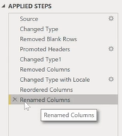

- Let's say you have a column named **raceId** in your source data, and you have several Applied Steps in Power Query that reference it (like "Changed Type" and "Renamed Columns" = raceId -> race_id).

- Open the source CSV file and change the header from **raceId** to **race_number**. 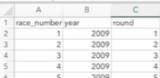

- Save the CSV file.

- Go to Power Query and click **Refresh Preview**.

**Result:** You will get a yellow error message. If you click through your Applied Steps, the error will usually begin at the **"Changed Type"** step.
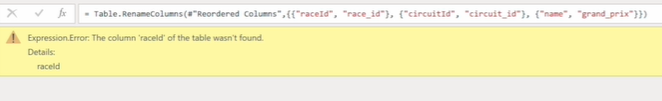
here, {"raceId", "race_id"} is hard coded. it means, the power bi is looking for a column named raceId so it can change it to race_id but since we changed the original column name to race_number, power bi could not find the column. Hence, it raised an error.

### Why this happens (**"Changed Type"**):

- When Power Query performs a step like changing a data type, it hardcodes the exact column name into its formula (e.g., {"raceId", Int64.Type}).

- When you changed the header in the source file to **race_number**, Power Query went looking for the text string **"raceId"** so it could apply the integer data type, couldn't find it, and threw an error.

### How to fix it:

To resolve this, you must either:

- Go back to the source file, change the header back to exactly what Power Query expects (**raceId** with a capital I), save, and refresh.

OR,

- Go into the **Advanced Editor** or formula bar in Power Query and manually update the hardcoded text from **"raceId"** to **"race_number"** in every step that references it.

---
---

# Sorting Data

---

## 1. Basic Single-Column Sorting

The way Power Query sorts the values is directly determined by the data type of the column (e.g., text sorts alphabetically, numbers sort numerically, dates sort chronologically).

### How to sort a single column:

- Locate the column you want to sort.
- Click on the small dropdown arrow located on the right side of the column header.
- Select either **Sort Ascending** or **Sort Descending**.

---

### Example A: Sorting Text (Alphabetical Order)

Let's say you want to sort the **"Grand Prix"** column in alphabetical order so that events beginning with 'A' appear before events beginning with 'B'.

- Click the dropdown on the **Grand Prix** column.
- Select **Sort Ascending**.

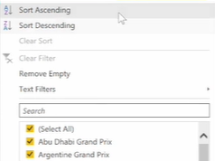

**Result:** The column sorts alphanumerically. **Note that if your text fields contain numbers, digits will always come before letters.** So, any Grand Prix names starting with a number will appear at the very top, followed by the 'A's, 'B's, and so on.

---

## 2. Multi-Column Sorting (Primary & Secondary Sorts)

You can sort your dataset using more than one column.

**Concept: The Order of Sorting Matters**

When applying multiple sorts, the order in which you click the columns dictates the hierarchy. The first column you sort becomes your **"Primary" sort (Priority 1)**, and the second column becomes your **"Secondary" sort (Priority 2)**.

---

### Example B: Sorting by Year, then by Round

Let's say you want to see the most recent races first, and within each year, you want to see the races in chronological order from the first round to the last.

#### Step 1: The Primary Sort (Year)

- Click the dropdown on the **Year** column.
- Select **Sort Descending**.

**Result:** The latest year (e.g., 2020) jumps to the top of the table.

#### Step 2: The Secondary Sort (Round)

- Click the dropdown on the **Round** column.
- Select **Sort Ascending**.
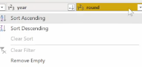
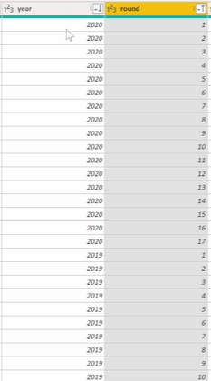

**Result:** The table is now beautifully partitioned. All the 2020 races are grouped together, and their rounds are listed chronologically (1 to 17). Once the 2020 rounds finish, the 2019 group begins, with its rounds sorted 1 upwards.

---

## Visual UI Indicator

When you apply multiple sorts, look closely at the column headers. You will notice a little number next to the sort arrow icon:

- A little **1** appears on the **Year** column (indicating it was the first sort applied).
- A little **2** appears on the **Round** column (indicating it was the second sort applied).

---

## 3. Applying Changes and Saving

### How to apply and save:

- Go to the **Home tab** in the Power Query Editor.
- Click the **Close & Apply** button on the far left of the ribbon.

**Result:** The Power Query window will close, and your structured data will load into the main Power BI Desktop interface.

Finally, be sure to hit **Save (Ctrl+S)** on your main Power BI Desktop file so you don't lose your work!

---
---

# Filtering Values

Just like sorting, filtering options are accessed via column dropdowns, and the specific filtering options available will dynamically change based on the column's data type.

---

## 1. Basic Value Filtering (Checkboxes)

The most straightforward way to filter data is by manually checking or unchecking specific values from a list.

### How to use basic checkbox filters:

- Click on the dropdown arrow next to a column header (e.g., the "Year" column).
- Look at the list of unique values presented in the menu.
- Click **Load more** at the bottom of the list to ensure Power Query fetches every single unique value in your dataset.
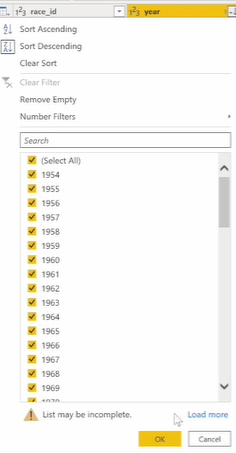

- Uncheck any specific values you want to exclude (e.g., uncheck 2020).
- Click **OK**.
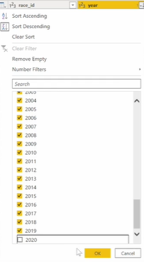
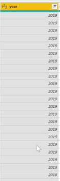

**Result:** All rows containing the unchecked value (2020) are removed from your current view. If you look at the **Applied Steps pane** on the right side of the screen, you will see a new step added called **"Filtered Rows"**. You can delete this step to remove the filter and bring the data back.

---

## 2. Advanced Number Filters

When working with numerical data types (like integers or decimals), Power Query provides advanced logical filters.

### Example A: Filtering Years "Between" Two Dates

Let's say you want to view only the records from the year 2000 up to the year 2020.

- Click the dropdown on the **Year** column.
- Hover over **Number Filters** in the menu.
- Select **Between...** from the list of options.
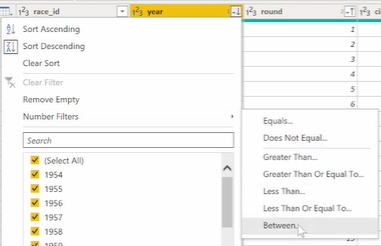

A pop-up window will appear to configure your logic.

- In the top row, ensure the operator is set to **is greater than or equal to** and type **2000** in the value box.
- In the middle, select the **And** logical condition.
- In the bottom row, ensure the operator is set to **is less than or equal to** and type **2020** in the value box.
- Click **OK**.
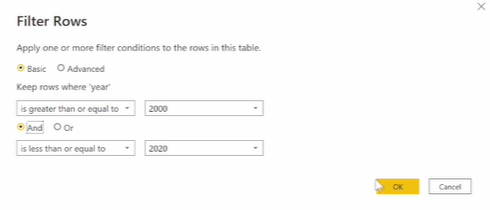

**Result:** Your dataset is now filtered to only show rows where the year falls between 2000 and 2020 inclusively.
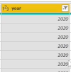  
---

## Concept: "AND" vs. "OR" Logic

In the step above, selecting the correct logical condition is vital:

- **AND:** The row must satisfy both rules to be kept. (e.g., It must be 2000 or newer, AND it must be 2020 or older). 

- **OR:** The row only needs to satisfy one of the rules to be kept. Keep years newer than 2000 or years older than 2020. Since every year in existence fits at least one of those criteria, nothing would be filtered out.

---

## 3. Data Type Specific Filters

### Text Filters

- Click the dropdown on a text column (e.g., the "Grand Prix" column).
- Hover over **Text Filters**.
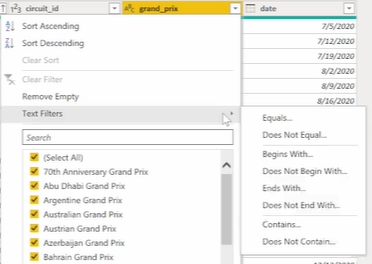

**Result:** Instead of "Greater than", you will see options specific to text, such as **Contains, Begins with, Ends with, or Equals**.

---

### Date Filters

- Click the dropdown on a Date column.
- Hover over **Date Filters**.
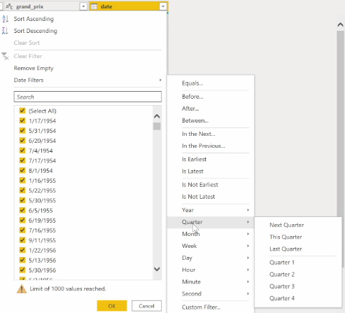

**Result:** You will see highly specific, intuitive chronological options such as **In the Next..., In the Previous..., Year-to-Date, Is Earliest, or Is Latest**.