# Logically Ordering Your Applied Steps

Explore the "Applied Steps" pane in the Power Query Editor. How the top-to-bottom execution order impacts your data, how swapping steps can break your queries.

---

## 1. The Basics of Applied Steps

The "Applied Steps" pane on the right-hand side of the Power Query Editor acts as a chronological recording of every transformation you make.

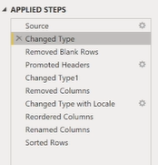
- **Top-to-Bottom Execution:** Power Query evaluates steps strictly from top to bottom.

- **The "Source" Step:** The very first step at the top is usually the "Source" step. Clicking this shows you the raw data exactly as it was pulled from your original file, before any transformations.

---

## 2. Auto-Generated Steps and Deletion

### The Auto "Changed Type" Step

When you load data, Power Query automatically scans it and adds a **"Changed Type"** step to guess the data types (text, whole number, etc.).

### How to disable auto-type detection (Optional):

- Go to **File -> Options and settings -> Options**.
- Select **Data Load**.
- Uncheck the automatic data type detection setting.

### How to delete a redundant step:

If you know you are going to manually change the data types later in your query, an early auto-generated **"Changed Type"** step is unnecessary and can be removed.

- Hover over the step you want to remove in the **Applied Steps pane**.
- Click the **X icon** on the left side of the step name.
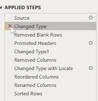

**Warning Prompt:** You will get a warning stating that deleting a step cannot be undone.

- Click **Delete**.

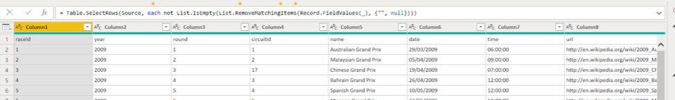

**Result:** The step is removed. If it was truly redundant, your query will continue to function perfectly.

---

## 3. Swapping Steps and Breaking Queries

You can physically drag and drop steps in the Applied Steps pane to reorder them. However, if a step relies on the output of a previous step, swapping them will cause an error.

### Example A: The "Removed Columns" Error

Imagine you have two steps in this exact order:

- **Changed Type:** Changes the data type of the "Time" and "URL" columns to Text.
- **Removed Columns:** Deletes the "Time" and "URL" columns from the dataset.

If you drag **"Changed Type"** so it occurs after **"Removed Columns"**, your query will instantly break and display an error.
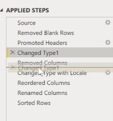
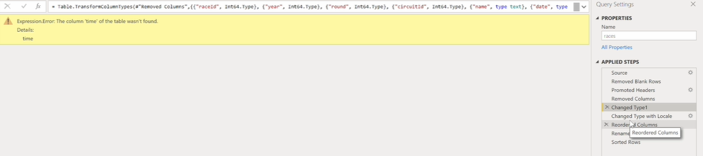

### Why does this happen? (Introduction to M Language)

If you look at the formula bar at the top of the screen, you are seeing **M**, Microsoft's scripting language for Power Query.  
When you swapped the steps, the M code for **"Changed Type"** was still hardcoded to look for the "Time" and "URL" columns to change their text format. However, because **"Removed Columns"** now happened first, those columns no longer exist. Power Query searches for a column that isn't there, resulting in an error.
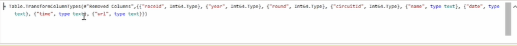
---

## 4. Fixing Errors from Reordering

If you break your query by reordering steps, the easiest way to fix it is to delete the broken step and recreate it in the correct logical sequence.

### How to insert a new step to fix the sequence:

Continuing from Example A, here is how to fix the broken **"Changed Type"** step:

- Click the **X** to delete the broken **"Changed Type"** step.
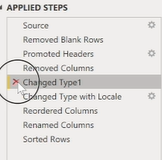

- Select the **"Removed Columns"** step so it is your current active step.
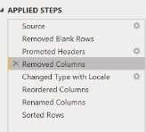

- Select the remaining columns in your table that need data type adjustments.
- Change their data types (e.g., change "Round" to a Whole Number).

**Insert Step Prompt:** Power Query will warn you that you are inserting a step into the middle of your query. Click **Insert**.

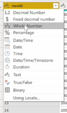

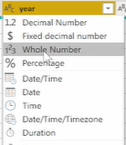

just like this, change round & circuit column's data type to be whole number.

- Continue changing the types for your other columns (e.g., change the "Date" column to Date). These subsequent changes will automatically group into that newly inserted step.

**Result:** Your query is fixed. The types are changed correctly because the logic now respects the fact that the "Time" and "URL" columns were already removed.
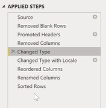

---

## 5. Applying Changes

- Go to the **Home tab**.
- Click **Close & Apply** on the far left.
- Save your main Power BI Desktop file (**Ctrl + S**).

---
---

# Replacing Values

How to find and replace specific text or numbers within data, "scope" of your replacements:

## 1. How to Replace Values

### Example A: Replacing "Grand Prix" with "GP"

Let's say you want to shorten the text in your "Grand Prix" column by replacing the words "Grand Prix" with "GP".

- Select the entire column you want to modify (e.g., the "Grand Prix" column), **or** simply click on a single cell inside that column.
- Go to the **Transform tab** on the ribbon.
- Click on the **Replace Values** button.
- A dropdown menu appears with two options: **Replace Values** or **Replace Errors**. (Since we are changing standard text, not fixing errors, select **Replace Values**).
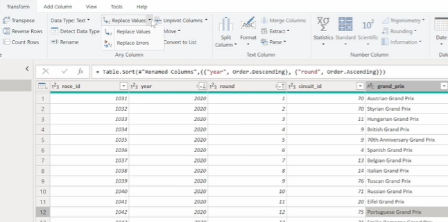

In the pop-up window:

- **Value To Find:** Type Grand Prix.
- **Replace With:** Type GP.
- Click **OK**.
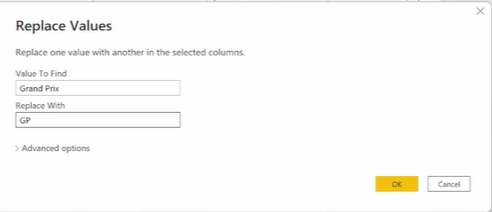

**Result:** Every instance of the exact string "Grand Prix" within that specific column has now been updated to "GP".

---

## 2. Concept: The Scope of Replacement

It is incredibly important to understand that the **"Replace Values"** function only looks inside the column you currently have selected. It does not search your entire table.

### Example B: The "Wrong Column" Mistake

Let's say you want to change the year 2020 to 1010.

- If you accidentally select the **"Grand Prix"** column.
- Click **Replace Values**.
- Set **Value To Find** as 2020 and **Replace With** as 1010.
- Click **OK**.

**Result:** Absolutely nothing happens. Because the number "2020" does not exist inside the "Grand Prix" text column, Power Query finds zero matches.

---

### How to do it correctly:

- You must first click on the **Year** column.
- Click **Replace Values**.
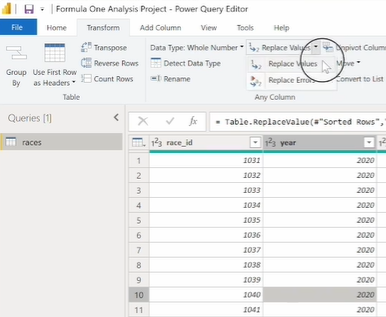

- Set **Value To Find** as 2020 and **Replace With** as 1010.
- Click **OK**.
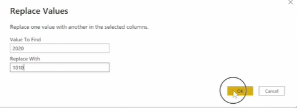
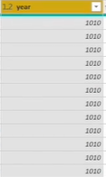

**Result:** Now Power Query looks in the correct column. 

Note : You can select multiple columns if you would like to increase the scope of values to replace.

---

## 3. Applying Changes and Saving

- Go to the **Home tab**.
- Click the **Close & Apply** button on the far left.

**Result:** Your updated, cleaned data loads into the Power BI model.
Remember to **Save (Ctrl+S)** your Power BI Desktop file.

---
---

# Duplicate vs Reference

Two useful operations for copying queries in the Power Query Editor: Duplicate and Reference.

## 1. Duplicating a Query

Duplicating a query creates an exact, independent clone of the original query. Crucially, it copies over every single transformation step (from the Applied Steps pane) that was built into the original.

### How to duplicate a query:

- Look at the **Queries pane** on the left side of the screen.
- Right-click on the query you want to copy (e.g., the "races" query).
- Click on **Duplicate** from the menu.
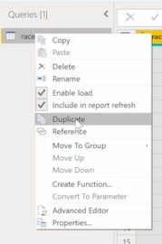
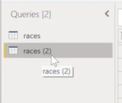

**Result:** A new query (e.g., "races (2)") appears in the list. If you click on it and look at the **Applied Steps** on the right, you will see the entire history of transformations has been perfectly copied over.

- (Optional) Right-click the new query, select **Rename**, and give it a descriptive new name (e.g., "Duplicated").
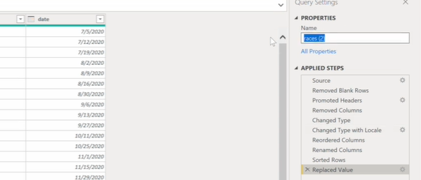

---

## 2. Referencing a Query

While duplicating copies the entire history of steps, referencing a query only copies the final result. It essentially uses the finished output of the original query as its new starting point (its Source).

### How to reference a query:

- In the **Queries pane** on the left side, right-click on the query you want to use as a base (e.g., the "Duplicated" query you just made).
- Click on **Reference** from the menu.
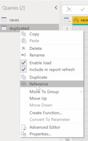
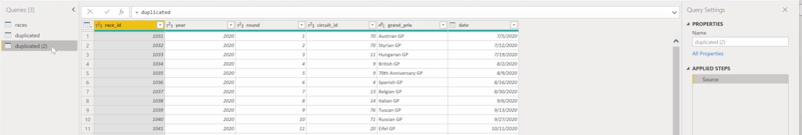

**Result:** A new query appears. If you look at its **Applied Steps** pane, there is only one step: **Source**. 

- (Optional) Rename this new query (e.g., "Reference").

---

## 3. Dependency and Deletion Rules

Because a Referenced query relies directly on the final output of another query, a hard dependency is created between them.

### The Deletion Error:

- If you try to right-click and delete the original base query (e.g., the "Duplicated" table) while the "Reference" query still exists, Power Query will throw an error and stop the deletion.
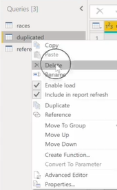

### Why?

- Because the "Reference" query is actively looking at the "Duplicated" query for its data. If you delete the source, the reference query would instantly break.

---

### How to resolve the dependency error:

If you want to delete a query that is being referenced, you must clear out the dependencies first:

- First, locate the query that is doing the referencing (e.g., the "Reference" table).
- Right-click it and click **Delete**.
- Once the dependent query is gone, you can safely right-click and **Delete** the original base query (e.g., the "Duplicated" table) without encountering any errors.

---
---

# Appending Queries

How to combine multiple tables into a single table using the "Append" operation in the Power Query Editor. Appending essentially stacks the rows of one table directly underneath the rows of another table.
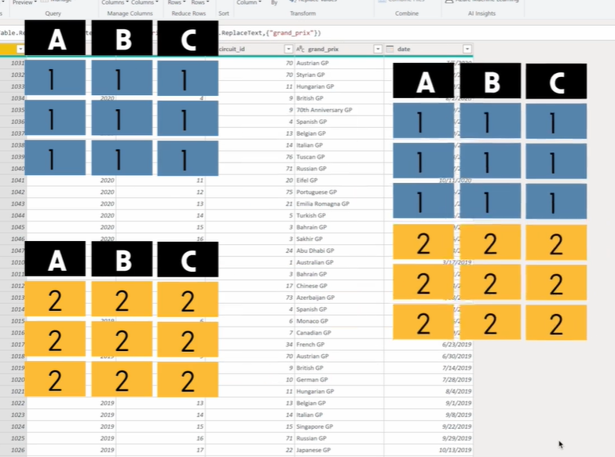

---

* Home Tab : 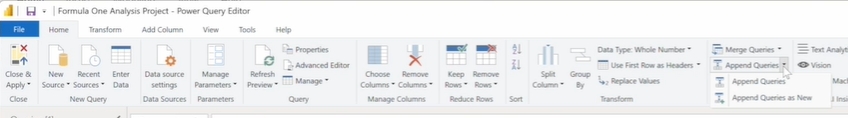

## 1. The Two Types of Append Operations

You can find the Append commands on the **Home tab**, inside the **Combine section**. When you click the dropdown for **Append Queries**, you are presented with two distinct options:

- **Append Queries:** This adds the data from other tables directly into your currently selected query. It adds an **"Appended Query"** step to your **Applied Steps pane**, modifying your existing table.

- **Append Queries as New:** This leaves your original queries completely untouched and creates a brand new query containing the combined data from all the selected tables.

---

## 2. How to Append Queries

For this example, imagine you have three separate queries holding race data for different years: **races_2018, races_2019, and races_2020**.

How to filter for year:
Make duplicate of races query. Under year column's dropdowm menu -> select 2020 ok -> rename to races_2020 [do the same for 2018,2019]
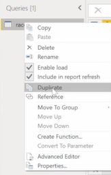
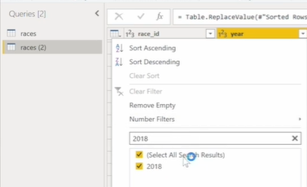
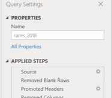
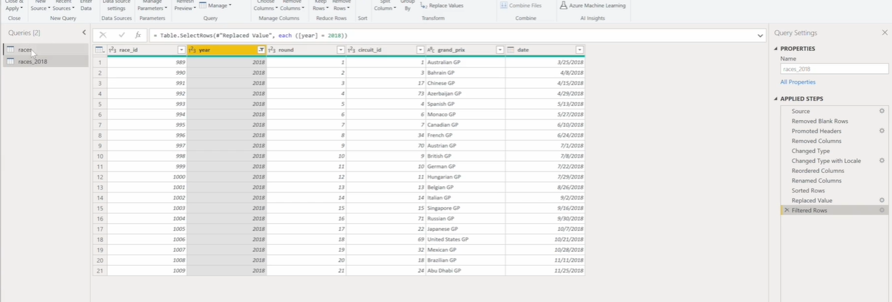

---

### Method A: Append Queries (Modifying an existing query)

- Select the base query you want to add data to (e.g., races_2020).
- Go to the **Home tab** and click **Append Queries**.
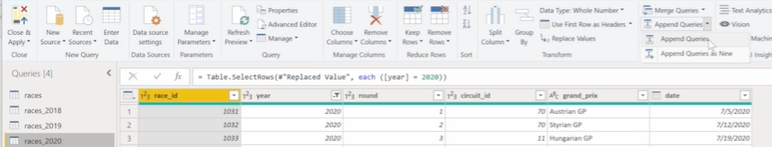

- A dialog box appears. Choose **Two tables**.
- Set the **"Table to append"** as your second table (e.g., races_2019).
- Click **OK**.
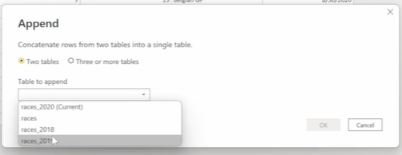
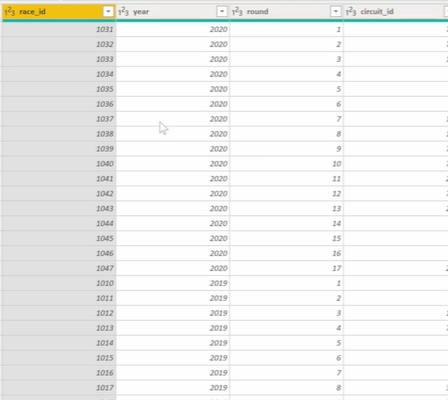

**Result:** The **races_2020** query now contains both the 2020 and 2019 data. A new step appears in the **Applied Steps pane**. You can click the **X** on this step to undo it.

---

### Method B: Append Queries as New (Creating a combined master query)

- Select your primary query (e.g., races_2020).
- Go to the **Home tab**, click the dropdown, and select **Append Queries as New**.
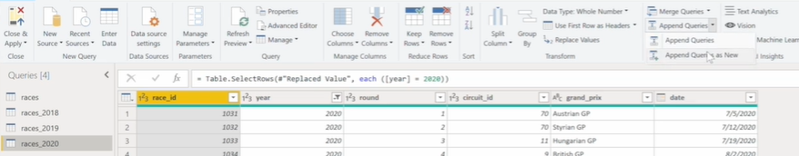
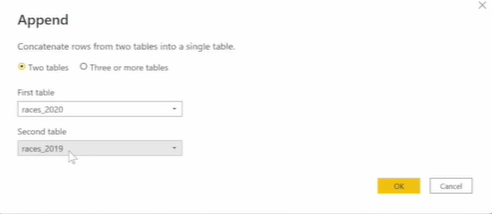
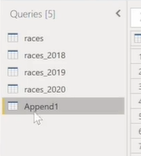

- In the dialog box, choose **Three or more tables**.
- Your currently selected table (races_2020) will already be in the **"Tables to append"** box on the right.
- Select your other tables (**races_2018 and races_2019**) from the **"Available tables"** box on the left, and click the **Add** button to move them to the right.
- Click **OK**.

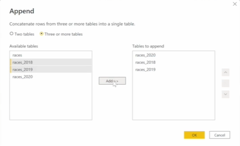
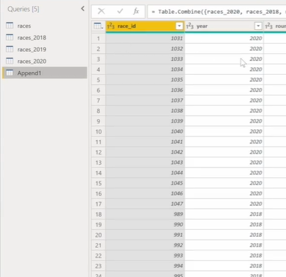

**Result:** A brand new query (named something like **Append1**) is created, containing all the stacked rows from 2018, 2019, and 2020. You can now rename this new master query to whatever you like.

---

## 3. Concept: Matching Column Names

In append1 table -> click on widget next to the Source step (to see the sources of tables.)
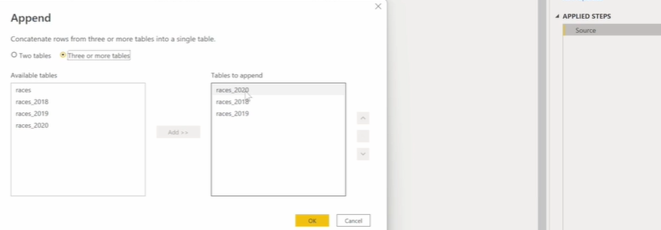 See, first source is 2020.

When you append tables together, Power Query aligns the data based on the **Column Headers**. It is highly recommended that your tables have identical column structures before appending them.

### What happens if column names don't match?

Let's say your races_2020 table has a column named **Round_Number** 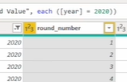 (change round -> round_number), but your 2018 and 2019 tables have that exact same data under a column simply named **Round**.

If you append them together, Power Query will not combine those columns. Instead, it will create both columns in your new appended table:

- The **Round Number** column will have data for the 2020 rows, but will show **null (blank)** for all the 2018 and 2019 rows.
- The **Round** column will have data for the 2018 and 2019 rows, but will show **null** for all the 2020 rows.
The append1 table -> 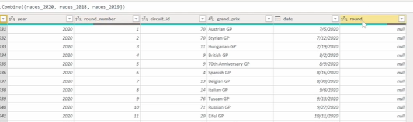

### The Fix:

Before appending, go into your individual queries and use the **Transform -> Rename** feature to ensure all corresponding columns share the exact same name (e.g., change **Round Number** back to **Round**).

---

## 4. Query Renaming & Dependencies

If you use **"Append Queries as New"**, your new master query references your original source queries.

### What if you rename a source query later?

Fortunately, Power Query is smart enough to handle this. If you rename **races_2018** to just **2018**  after you have already appended it, Power Query automatically updates the background references. Your appended master table will not break, and it will continue to pull the data correctly.

verify by clicking on source widget of append1 table (see the source "races_2018" has automatically changed to "2018".)
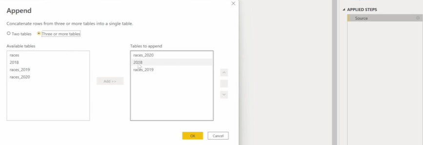
---

---
---

# Removing Duplicates

How to clean your dataset by finding, removing, or keeping duplicate records:

---

## 1. Setting Up the Example Data

To demonstrate this, the lecture creates a temporary table with three columns (A, B, and C) and manually enters the following rows:

- Row 1: 1, 1, 1  
- Row 2: 2, 2, 2  
- Row 3: 3, 3, 3  
- Row 4: 1, 1, 1 (This is a perfect duplicate of Row 1)  
- Row 5: 1, 1, 2 (This shares values with Row 1, but ends in a 2)

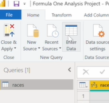
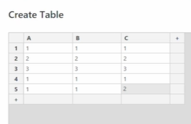
---

## 2. Removing Duplicates (The Scope of Selection)

The behavior of the **"Remove Duplicates"** tool changes dramatically depending on whether you select a single column or the entire table.

---

### Method A: Removing Duplicates Based on a Single Column

If you select only one column, Power Query will delete any row that shares a value in that specific column, regardless of what data is in the other columns.

- Click on the header of **Column A** to select just that column.
- Go to the **Home tab**.
- In the **"Reduce Rows"** section, click **Remove Rows**.
- Select **Remove Duplicates**.

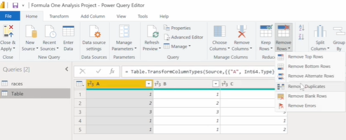
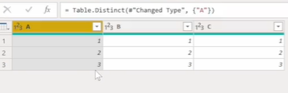

**Result:** Rows 4 and 5 are both deleted. Since Column A had a '1' in rows 1, 4, and 5, it kept the first instance (Row 1) and aggressively deleted the others.

---

### Method B: Removing Exact Row Duplicates (All Columns)

If you want to ensure you only delete rows that are 100% identical across every single column, you must select the entire table first.

- Select all columns in your table (you can click the first column header, hold **Shift** , and click the last column header, or press **Ctrl + A / Cmd + A** inside the table).
- Go to the **Home tab -> Remove Rows -> Remove Duplicates**.

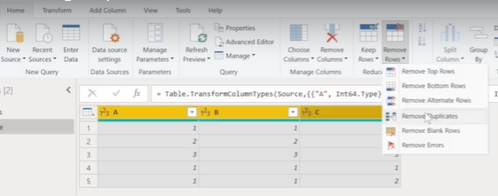
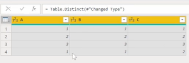

**Result:** Only Row 4 is deleted. Power Query evaluated the entire row as a single unit. Because Row 4 (1, 1, 1) was a perfect match to Row 1, it was removed. Row 5 (1, 1, 2) was kept because the '2' in Column C made the row entirely unique.

---

## 3. Keeping Duplicates

The **"Keep Duplicates"** function is the exact inverse of removing them. It deletes all unique rows and leaves behind only the records that have a duplicate.

### How to use Keep Duplicates:

- Select your target column(s) depending on how strict you want the duplicate check to be (as explained in Section 2).
- Go to the **Home tab**.
- In the **"Reduce Rows"** section, click **Keep Rows**.
- Select **Keep Duplicates**.

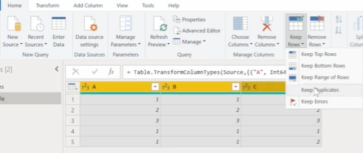
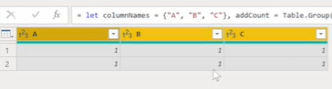

**Result:** Using our example table and selecting all columns, Power Query would delete Rows 2, 3, and 5 because they are unique. It would only leave Rows 1 and 4 on the screen, allowing to easily investigate the duplicated data.

---
---

# Transpose, Reverse rows, Count rows

---

## 1. Setting Up Dummy Data

### How to enter dummy data:

-> Go to the Home tab in the Power Query Editor.
-> Click on Enter Data.
-> Create a simple 3x3 table (e.g., Column 1, 2, 3 with rows numbered 1, 2, 3).
-> Name the table "Table" and click OK.

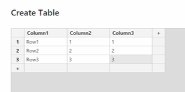
---

## 2. The Transpose Operation

### Theory:

The Transpose operation simply rotates your entire table by 90 degrees. It turns your rows into columns, and your columns into rows. For example, all the data values running down your very first column will be flipped to run across your very first row.

### How to Transpose a table:

-> Make sure your table is selected.
-> Go to the **Transform tab** on the ribbon.
-> Locate the Table section.
-> Click on **Transpose**.

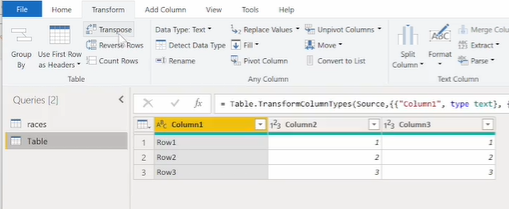

**Result:** Your table is immediately flipped.  

**Tip:** If you click Transpose a second time, it will flip the data another 90 degrees, essentially reverting it back to its exact original layout! 

---

## 3. Reverse Rows

### Theory:

This operation does exactly what it says: it completely reverses the top-to-bottom order of your rows.

### How to Reverse Rows:

-> Go to the **Transform tab** on the ribbon.
-> Locate the Table section.
-> Click on **Reverse Rows**.

**Result:** If your rows were originally ordered 1, 4, 3, 2, they will now be ordered 2, 3, 4, 1.

---

## 4. Count Rows

### Theory:

Unlike most operations that return a modified table, the "Count Rows" function counts the exact number of rows present in your query and returns a single, standalone number (known as a "scalar value").

### How to Count Rows:

-> Go to the **Transform tab**.
-> Locate the Table section.
-> Click on **Count Rows**.

**Result:** Your table view will disappear entirely, and Power Query will return a single scalar value representing the total row count (e.g., simply the number 3).

---
---

# Loading Circuits JSON File

Open Power Query Editor of races :
Home Tab -> New Source -> More -> Under File: JSON -> connect

## Assignment

Be sure to remove the relationship between races & circuits query (in data model view)

---
---

# Lec 27 - Loading the drivers text file & Assignment

The file is Tab delimited.
Home -> Get Data -> Text/CSV

* Assignment

---
---

# Loading the Constructors csv file & Assignment

* Assignment

---
---

# Loading the Results csv file & Assignment

* Assignment

---
---

# Group By

---

## 1. Theory: Grouping and Aggregation

### What is Group By?

Grouping takes values spread across various rows and consolidates them based on the unique values in one or more specific columns.

### What is an Aggregation Function?

An aggregation function is a function where the values of multiple rows are grouped together to form a single summary value. Common aggregations include:

- **Sum:** Adds the values together.
- **Average:** Calculates the mean value.
- **Minimum / Maximum:** Finds the lowest or highest value in the group.
- **Count Rows:** Simply counts how many rows make up that group.

---

### Ex.

Imagine a table with Employee ID, Department, Location, and Salary.

- If you **Group By Department** and aggregate by **Summing the Salary**, Power Query will look at all rows, bundle all the "Finance" employees together, bundle all the "HR" employees together, and return a summary table showing the total combined salaries for Finance and HR.

> Total salary by each department.

> Average salary for each department.

> Minimum salary for each dept.

- If you **Group By Location AND Department**, the summary table will create a unique row for every combination of location & dept. (e.g., UK & Finance, UK & HR, USA & HR) and aggregate the salaries for each specific combination.

#### Multiple Aggregation
> Add a count aggregation that simply counts the number of rows summarized for each grouping .

---

## 2. Where to Find the Group By Tool

access the Group By operation in three different ways within the Power Query Editor:

-> On the Home tab, in the Transform section.

-> On the Transform tab, in the Table section.

-> By Right-clicking on any column header and selecting "Group By..." from the context menu.

---

## 3. Basic Group By (Single Column & Aggregation)

---

use "Results" query.
### Example A: Counting Total Races per Driver (Count Rows)

> Let's perform a count aggregation and count the total occurrences of each driver_id. (find exactly how many races each driver has participated in.)

-> Select the Driver ID column.

-> Go to the Transform tab and click Group By.

-> In the dialog box, ensure Driver ID is selected in the top dropdown. (select the column on which you would like to apply the operation.)

-> Under New column name, type a descriptive name (e.g., 'Count').

-> Under Operation, select Count Rows from the dropdown. (Note: You do not need to select a column to aggregate here, because Power Query is simply counting the rows, not performing math on a specific value).

-> Click OK.  

**Result:** You now have a summarized table with one row per Driver ID, showing their total race count.

let's order the 'count' column in descending order. (Ignore the null - they r drivers with no id)

see, driver_id 8 has count of 332.
---

### Example B: Calculating Total Points per Driver (Sum)

Let's find out the total points scored by each driver.

-> Select the Driver ID column and click Group By.

-> Ensure Driver ID is selected as the grouping column.

-> Under New column name, type Total Points.

-> Under Operation, select Sum.

-> Under Column, select the Points column (this tells Power Query which numbers to add together).

-> Click OK.  

**Result:** The table now shows each unique Driver ID alongside their total summed points.

sort the 'total points' column by descneding order to see which driver got highest points.

---

## 4. Advanced Group By (Multiple Columns & Aggregations)

You are not limited to grouping by just one column or performing just one calculation. The "Advanced" feature lets you combine multiple logic steps.

---

### Example C: Group by Constructor & Driver, Calculate Points & Races

Let's figure out how many points a driver scored, and how many races they drove, for a specific constructor.

-> Click on Group By to open the dialog box.

-> At the top of the window, switch the toggle from "Basic" to Advanced. (to group on more than one column.)

-> Under Group by, select Constructor ID from the first dropdown. (first group by constructor_id)

-> Click the Add grouping button.

-> In the new dropdown that appears, select Driver ID. (then group by driver_id)

-> Under Aggregations, set up your first calculation:

New column name: Total Points  
Operation: Sum  
Column: Points  

-> Click the Add aggregation button to create a second calculation:

New column name: Count  
Operation: Count Rows  

-> Click OK.  

Sort 'Total Points' column in descending order. For example, it will show that Driver 1 driving for Constructor 131 scored 2865 points across 110 races, but Driver 1 driving for Constructor 1 scored 913 points across 156 races.

---
---

# Pivoting and Unpivoting

These tools allow to rotate data from a vertical list into a horizontal matrix, and vice versa.

## 1. Setting Up Dummy Data

### How to enter dummy data:

-> Go to the **Home tab** in the Power Query Editor.

-> Click on **Enter Data**.

-> Create three columns and name them: **Country, City, and Sales**.

-> Enter the following four rows of data:

-> Name the table **"Table"** and click **OK**.

---

## 2. Pivoting Columns

### Theory:

Pivoting takes the **unique values inside a single column** and rotates them 90 degrees to become brand new column headers. It then fills the spaces underneath those new headers by aggregating a **"Values" column** of your choice, essentially creating a matrix (like a Pivot Table in Excel).

---

### Example A: Pivoting the City Column

Let's turn the individual cities into their own column headers to see their sales figures.

-> Click on the header of the **City** column to select it.

-> Go to the **Transform tab**.

-> Click on **Pivot Column**.

-> A dialog box appears asking for a **"Values Column"**. This is the data that will fill the matrix. Select **Sales** from the dropdown menu. (we can select either country or sales)

> You would typically select a numerical column to populate values.

-> Click **OK**.

**Result:** The unique cities (**London, Chicago, Berlin, New York**) are now column headers running across the top.
here, each of the city values is now a column header, and then the sales are the values for each column.

---

### Understanding the Nulls:

For example, at the cross-section of the **"Germany"** row and the **"London"** column, there is a null and no sales data. This makes perfect sense because London is not in Germany; that specific combination of data did not exist in our original table.

---

### Example B: Pivoting the Country Column

Let's try rotating the countries instead.

-> First, look at the **Applied Steps pane** and delete the **"Pivoted Column"** step you just made to reset the table.

-> Select the **Country** column.

-> Go to the **Transform tab** and click **Pivot Column**.

-> Select **Sales** as the Values Column and click **OK**.

**Result:** Now, **"UK", "USA", and "Germany"** are the column headers. The matrix shows the sales for Berlin only falling under the **"Germany"** column, with nulls under the UK and USA columns for that row.

---

## 3. Unpivoting Columns

### Theory:

Unpivoting does the **exact opposite of pivoting**. It takes a horizontal matrix of columns and collapses them down into two simple, vertical columns: an **Attribute column** (which holds the old column headers) and a **Value column** (which holds the intersecting data points).

---

### How to Unpivot your matrix:

Continuing directly from the result of Example B (where **UK, USA, and Germany** are column headers):

-> Select the newly pivoted columns you want to collapse. Click the **UK** column header, hold **Shift**, and click the **Germany** column header to select all three country columns.

-> Go to the **Transform tab**.

-> Click on **Unpivot Columns**.

**Result:** The matrix is collapsed back into a standard list.

- Power Query automatically generates two columns named **Attribute** and **Value**.
- The **null intersections** (like UK and Berlin) are automatically ignored and removed, leaving only the valid data combinations.

---

### Note:

Your table now looks almost exactly like the original dummy data, except the column headers are generic.

-> To clean this up, double-click the **Attribute** column header and rename it back to **Country**.

-> Double-click the **Value** column header and rename it back to **Sales**.

---
---

# Download Part1 Power BI Report

visit (github.com/malvik01/powerbi) -> Click: Formula One Analysis Project Part 1 -> click: Download (617 kb)

Ensure u have the data sources downloaded.

Go to the Query Editor -> modify the Sorce step so that it's pointing to the files in your
local computer. Do this **for all 5 queries**. (bcz that's currently pointing to malvik's local computer.)