No, a Table and a Query are not identical in Power BI. A Query is the set of instructions (Power Query M formula language) used to connect, shape, and transform data, while a Table is the resulting structured data loaded into the data model for analysis and visualization. A single query can produce one or more tables.

# Section 2 - Data Modelling

In this section, we'll work on model view
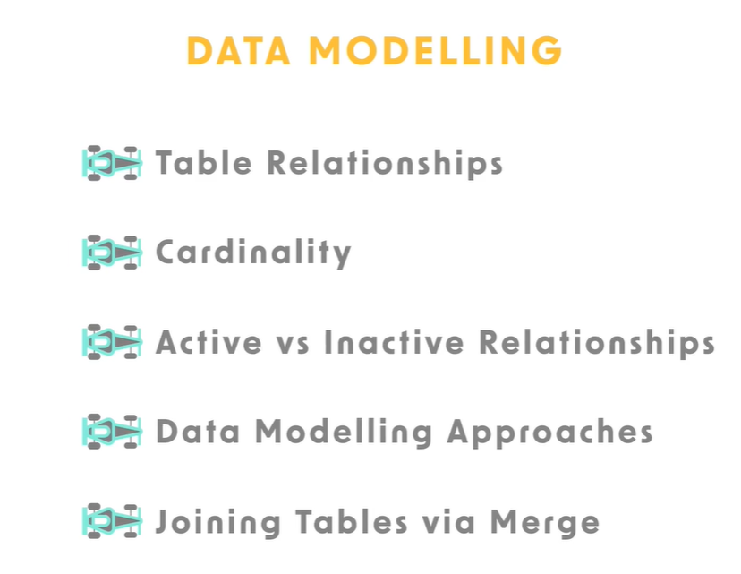

# Lec 33 - Linking Tables via Relationships
# Creating Table Visualizations in Power BI

I want to introduce you on how to create a simple table visualization in the report View of Power bi Desktop. so we can explore how relationships can impact visualizations in PowerPoint.

---
Data model view : 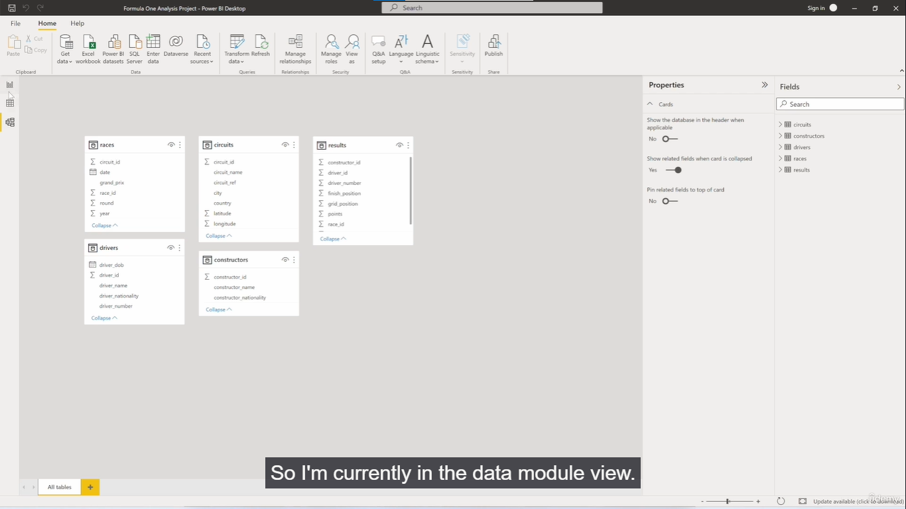

## 1. Navigating the Interface

### **Switch to Report View**
Start by navigating away from the Data Model view. Click on the Report View icon on the left-hand side of the screen.
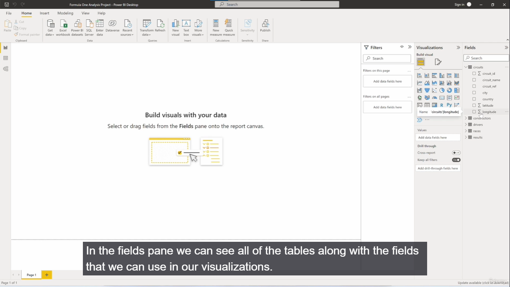

### **The Fields Pane**
Located on the right, this pane displays all available tables and the specific columns (fields) within them that you can use to build visualizations.
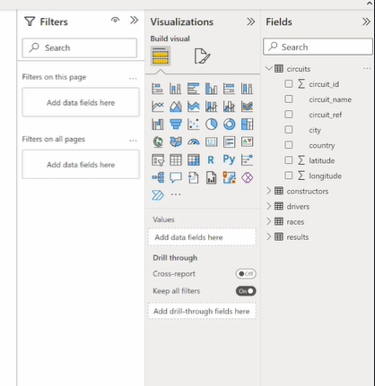

Tables view : 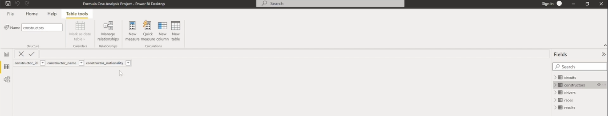

come back to report view.

### **Managing Pages**
- Look at the bottom of the screen to see your report pages (starting with Page 1). You can have multiple pages in a single report.
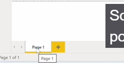

- **Add a new page:** Click the + icon at the bottom, or go to the ribbon and click Insert > New Page > Blank Page.
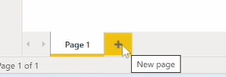
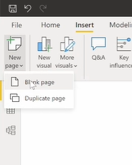

- **Duplicate a page:** Click Insert > New Page > Duplicate Page to create an exact copy of your current page.
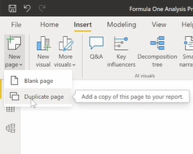

- **Delete page:** click on x sign on the page name. (at top-right)
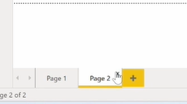

- **Rename a page:** Double-click the page tab at the bottom and type a new name. For this exercise, name the page **"Relationships"**.
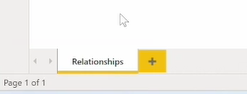
---

## 2. Managing Visualizations

### **Insert a Visual**
Go to the Visualizations pane and click on an icon (e.g., the Table visual). A blank placeholder will appear on your canvas.
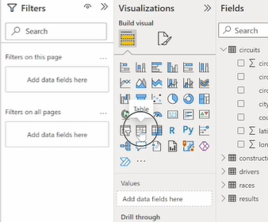
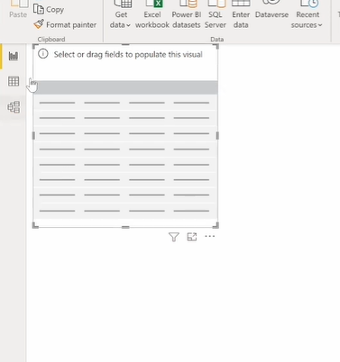

or Insert > New visual (automatically selects a visual).
 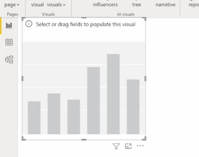

click on a different one, it will change.
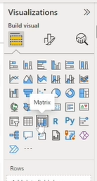 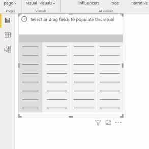

I'll select table.
 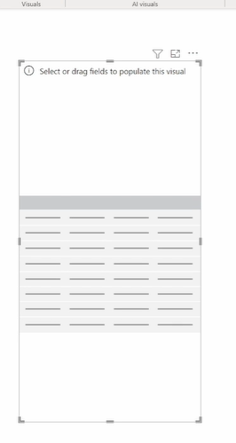

### **Adjust the Visual**
Click and drag the visual to move it around the canvas, and use the edges to resize it.

### **Change Visual Type**
With a visual selected on the canvas, click a different icon in the Visualizations pane (like a Stacked Column Chart) to instantly change its type.

### **Delete a Visual**
Click the ... (three dots) on the top right of the visual and select Remove.
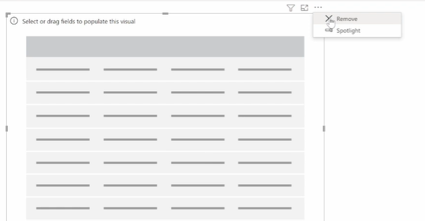

### **Visualization Tabs**
Every visual has specific configuration tabs in the Visualizations pane:
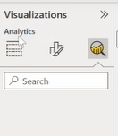

- **Build visual:** Used to add data fields to the chart.  
- **Format visual:** Used for styling.  
- **Analytics:** Used for reference lines and forecasting (depending on the visual).  
(on the build visual, Depending on the type of chart or visualization you're doing, you'll see different options here. ???)
---

## 3. The Experiment: How Relationships Impact Data

To understand why data modeling is crucial, build three separate table visuals to observe how they interact.

---

### **Table Visual 1: Combining Fields from Unrelated Tables**

> I want my visualization to show the driver name as well as the total points.

- Click an empty space on the canvas and insert a Table visual.  

- From the Fields pane, expand the **Drivers** table and drag **Driver Name** into the visual.  (drag & drop) 
  *(Note: This is a categorical field made of text labels).*  

- Expand the **Results** table and drag **Points** into the visual.  
  *(Note: This is a numerical field).*  

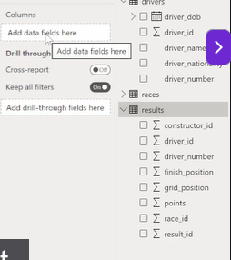
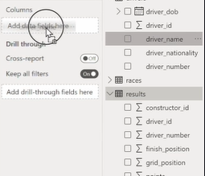  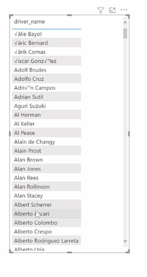
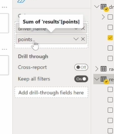  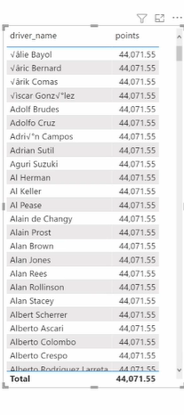
Note: it says sum of results 'points'

If i click on the dropdown : 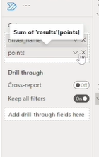
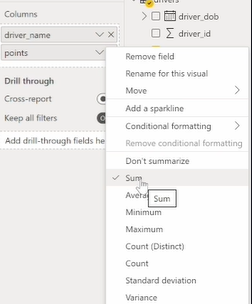
see, currently it's summings the aggreagation. If you click Don't summarize, we will get error.

because for each driver there are multiple values consisting of points and you need to perform an aggregation.

#### **Observe the Output**
Look at the total points for every single driver. You will see the exact same number: **44,071.55**.

#### **Why this happens**
Because there is currently **no relationship defined** between the Drivers table and the Results table in the Data Model, Power BI does not know how to distribute the points per driver. Instead, it calculates the **grand total** of all points in the entire database and simply duplicates that massive total across every single row.

---

### **Table Visual 2: Using Two Fields from a Single Table**

- Click an empty space on the canvas and insert a second Table visual.  

- From the **Results** table, drag **Driver ID** into the visual.  

- From the **Results** table, drag **Points** into the visual.  

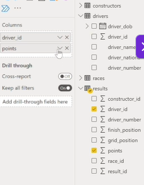
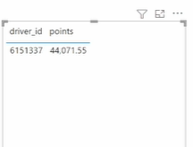

Note : The aggregation is on sum.
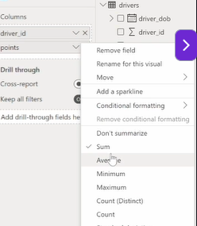

> In the Field List in Power View, some fields have a sigma symbol next to them. These values can be aggregated(i.e. summed, averaged, etc.)

#### **Fix the Aggregation**
Because Driver ID is a number, Power BI will automatically try to sum it up (indicated by a sum symbol). Click the dropdown arrow next to the Driver ID field in the Build Visual pane and select **Don't Summarize**.
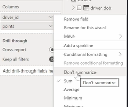

#### **Observe the Output**
The points are now accurately calculated per driver (e.g., Driver_id 1 shows **3,778 points**, Driver_id 3 shows **1,594.5 points**). The grand total at the bottom correctly reads **44,071.55**.
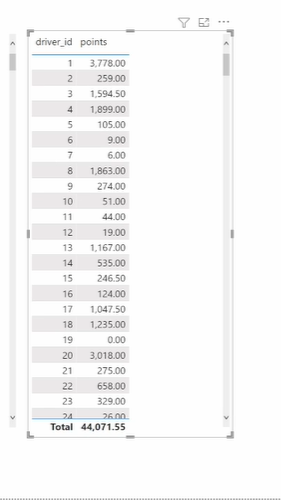

#### **Experiment with Aggregations**
Click the dropdown next to the Points field:

- Change it from **Sum** to **Average** (e.g., Driver 1 averages **14.2 points per race**).  
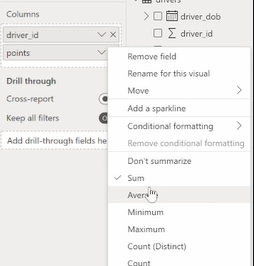
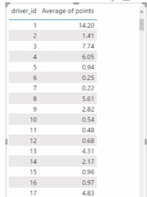

- Change it to **Minimum**.  
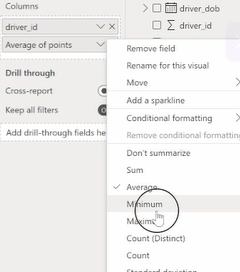'
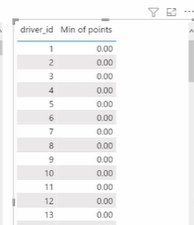

- Change it to **Count** to see the total number of races driven (e.g., Driver 1 has driven **266 races**).  
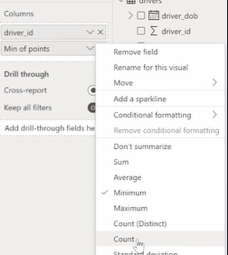
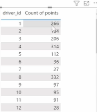

#### **Why this works**
Because both fields come from the **exact same table**, Power BI naturally performs a **"Group By"** operation behind the scenes, grouping the data by Driver ID and accurately summarizing the points. Leave this field set to **Sum** for the next step.

---

### **Table Visual 3: Testing Cross-Filtering**

- Click an empty space and add a third Table visual.  

- From the **Drivers** table, drag both **Driver ID** and **Driver Name** into the visual.  
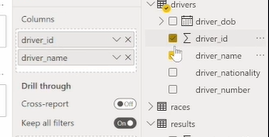

click on visualization, to see (in fields) which fields are used in that visualization.

#### **Test the Filter**
In this third table, scroll down and click on **Driver ID 117 (Alain Prost)**.

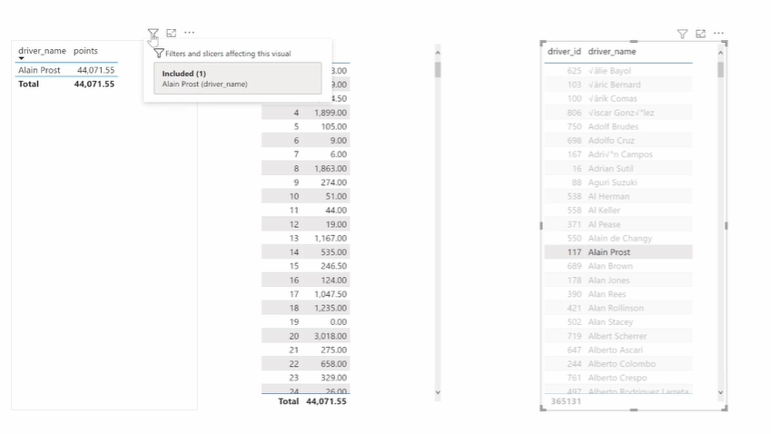

#### **Observe the Impact**

- **Table 1 filters:** The first table updates to only show Alain Prost. However, because the tables are unrelated, it still shows his points incorrectly as **44,071.55**.  

- **Table 2 does not filter:** The second table completely ignores the filter and does not isolate Driver 117.  

#### **Why this happens**
Table 1 and Table 3 share the exact same **Driver ID** field from the Drivers table, so filtering one affects the other. Table 2 uses the Driver ID field from the Results table. Because Power BI doesn't know these two tables are connected, they cannot talk to each other.

---

### **The Actual Value**

If you manually scroll through Table 2 to locate **Driver ID 117**, you will see Alain Prost's correct, actual points total is **798.5**.

# pt2

# Fixing Visualization Errors by Creating Relationships in Power BI

This guide explains how to fix the visualization errors from the previous exercise by actively building a relationship between the Drivers and Results tables in the Data Model view.
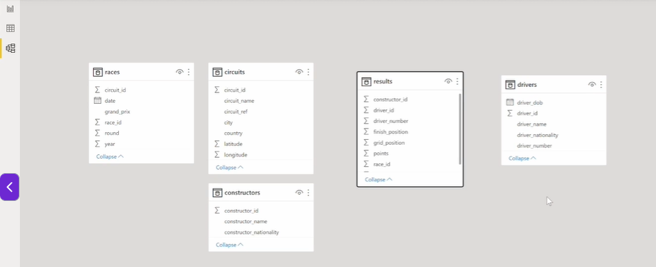
---

## 1. Understanding the Data Structure

Before connecting the tables, it is important to understand how their data relates to one another.

### **Navigate to the Data View**
Look at the actual data inside your tables to understand their structure.

### **The Drivers Table (Unique Values)**
In this table, the **Driver ID** field contains exclusively **unique values**. Each driver only appears once in this table, meaning there are no duplicate IDs or names.

### **The Results Table (Repeating Values)**
In this table, the **Driver ID** field contains **repeating values**. This makes logical sense because a single driver will compete in many different races over time, generating multiple result records.

### **The Goal**
Both tables share the common **Driver ID** field. You will use this common field to bridge the two tables together.

---

## 2. Method 1: Creating a Relationship via Drag-and-Drop

The fastest way to connect two tables is directly on the Data Model canvas.

### **Switch to Data Model View**
Click the Data Model icon on the left-hand side of the screen.

### **Locate the Fields**
Find the **Driver ID** field in the Drivers table and the **Driver ID** field in the Results table.

### **Drag and Drop**
Click and hold the **Driver ID** field in the Drivers table. Drag your cursor over to the Results table and drop it directly on top of its **Driver ID** field.
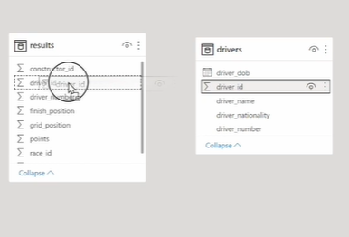

### **Warning**
Be very careful to drop it exactly on the correct field. Dropping it on the wrong field will establish an incorrect relationship.

### **Observe the Line**
A physical line will instantly appear connecting the two tables.
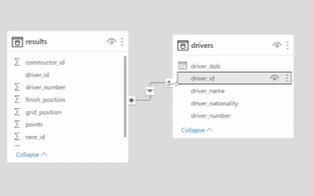

### **Note on Symbols**
You will see a **1**, an asterisk (**\***), and an arrow on this line. These represent the **"Cardinality" (One-to-Many)** and the **"Cross-filter direction."** (These concepts will be covered in detail in a later lesson).

delete the relationship : right click on line -> delete
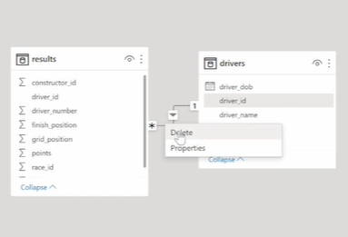
---

## 3. Method 2: Creating a Relationship via "Manage Relationships"

If you prefer a more menu-driven approach, or if you have a highly complex model, you can use the ribbon.

### **Open the Manager**
Navigate to the Home tab on the ribbon and click **Manage Relationships**.
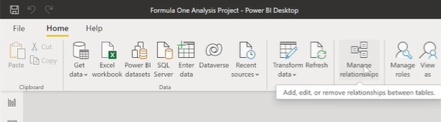

### **Create New**
A dialog box will appear. Click the **New...** button.
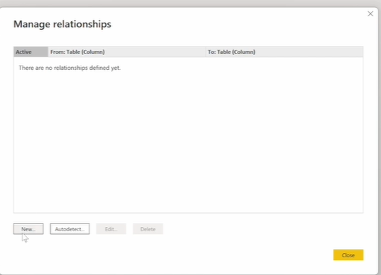

### **Configure the Tables**

- **Table 1:** Select the **Drivers** table from the top dropdown, then click on the **Driver ID** column header to highlight it.  
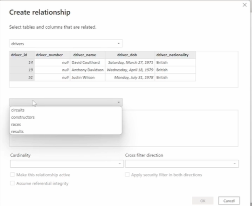

- **Table 2:** Select the **Results** table from the bottom dropdown. Power BI will likely auto-detect and highlight its **Driver ID** column for you.  
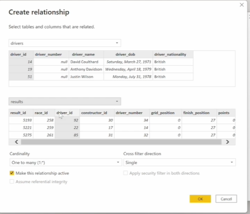

### **Verify Settings**
Ignore the **Cardinality** and **Cross-filter direction** dropdowns for now. Just ensure the checkbox labeled **"Make this relationship active"** is ticked.

### **Finalize**
Click **OK**, and then click **Close** on the main dialog box. The relationship line will now be visible on your canvas.
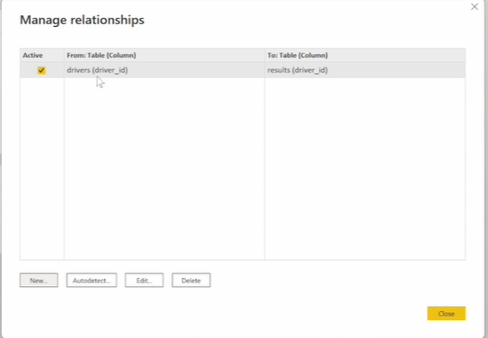
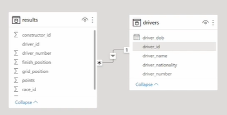
---

## 4. Observing the Impact on the Report

Now that the Data Model knows how these tables are connected, you can see the immediate fix in your visualizations.
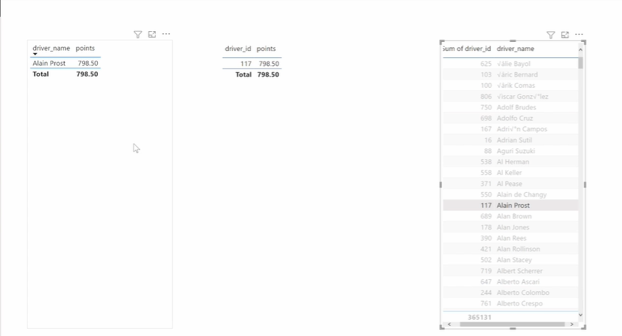

### **Switch to Report View**
Click the Report View icon on the left-hand side.

### **Check Table 1**
Look at the first table you built previously (which combined **Driver Name** and **Points**).

### **The Fix**
The total points no longer show the duplicated error value of **44,071.55**. Instead, each driver shows their correct individual points total.

### **Example**
If you filter by **Alain Prost (Driver ID 117)**, his points accurately read **798.5**.

### **Why this works**
Behind the scenes, Power BI is now using the relationship like a **lookup tool**. It takes the **Driver Name**, matches its internal **Driver ID** to the Results table, and accurately extracts and distributes the exact points for that specific driver.

---

## 5. Deleting a Relationship

If you make a mistake or need to remove a connection:

- Go to the **Data Model view**.  
- Right-click directly on the physical line connecting the two tables.  
- Select **Delete** from the context menu.  
- Confirm by clicking **Yes**.  

### **Note**
If you delete the relationship and return to the Report view, your Table 1 visual will immediately break again, returning to the duplicated **44,071.55** total.

---
---

# One to Many Cardinality & Cross Filter Direction

---

# Data Modeling: One-to-Many Relationships & Cross-Filtering

## 1. Understanding the One-to-Many Relationship
A one-to-many relationship occurs when one table contains unique values and another table contains repeated values for the same key.
* **"One" Side (Drivers Table):** Contains unique `Driver ID` values. 
* **"Many" Side (Results Table):** Contains repeated `Driver ID` values because a single driver can compete in multiple races and have multiple results.

* Data View -> Click Drivers table (verify unique values) -> Click Results table (verify repeated values)

## 2. Creating and Managing Relationships
* **Setup:** In the Data Model view, go to **Manage Relationships** > **New**. Link the `Driver ID` from the Drivers table to the `Driver ID` in the Results table. 

One to many relationship: The driver ID from the driver's table is on the one side and the driver I.D. from the results table is on the many side.

* **Visual Indicators:** In the Data Model view, the relationship line displays a **`1`** on the unique table side (Drivers) and an **`*`** (asterisk) on the repeated table side (Results).
* **Cardinality:** "One-to-Many" and "Many-to-One" are functionally identical; the naming simply depends on which table is selected first in the relationship dialog box.

## 3. Transforming Data (Renaming Columns)
* You can rename columns in the Transform Data view (e.g., changing `Driver ID` to `Drivers.Driver ID` and `Results.Driver ID`). 
* Renaming columns **does not break** existing relationships. The data model automatically updates to reflect the new column names while maintaining the link.

close & apply

## 4. Visualizing the Data
Go to Report View.

* When adding `Driver ID` from both tables to a table visual, the values may initially appear as single, summarized rows.

* To see the "Many" side in action, add a granular column (like `Race ID`) from the Results table. Ensure it is set to "Don't summarize" to reveal the repeated rows for drivers who competed in multiple races.

Add Race ID -> Set to Not Summarized

now we can see the repeated driver_id (bcz results table containts many driver_ids.)

## 5. Cross-Filter Direction
The cross-filter direction dictates how tables interact with and filter each other in report visuals.

* **Single Direction (Default):** The arrow points from the Drivers table to the Results table. The "One" side (Drivers) can filter the "Many" side (Results), but clicking a value in the Results table will *not* filter the Drivers table.

double click on line to get :

verify single direction:

* **Both Directions:** By changing the cross-filter direction to **Both**, the tables can filter each other interchangeably.

>Note: Cardinality is many to one.

That's just because the top table is the many side, and the bottom table is the one side.

So many to one and one too many are essentially the same. It's just the ordering of the columns in this relationship.

---
---

# Many to Many Cardinality

open power query editor
Home Tab -> Transform data

## Data Preparation: Duplicating and Transforming Tables

## Steps Performed
1. **Duplicate Queries:** Right-click the original `races` table and select "Duplicate" to create `races2`.

rename races (2) to races2

2. **Remove Unnecessary Columns:** * In `races`: Remove the `Grand Prix` column.

   * In `races2`: Keep only `race`, `circuit ID`, and `Grand Prix`. click : Home -> remove columns -> remove other columns
   
   

3. **Rename Columns:** Prefix column names with their respective table names (e.g., rename `circuit ID` to `races.circuit ID` and `races2.circuit ID`).

4. **Apply Changes:** Click "Close & Apply" to load the transformed tables into the Data Model.

## Why This Matters
Cleaning and clearly labeling your columns in Power Query ensures that when you build relationships or drag fields into visuals, it is immediately clear which table the data is coming from.

Note : automatics relationships r created, delete them

# Understanding Many-to-Many Relationships

## Overview
A many-to-many (*:*) relationship occurs when you join two tables on a column where the key values repeat in **both** tables. 

## Key Characteristics
* **The Scenario:** Go to the Data view. see that circuit_id column in both the (races & races2) tables are repeating. so if i want to connect both tables based on circuit_id columns, it will be many to many relationship.

drag & drop : races.circuit_id to races2.circuit_id. Ignore the warning (valid in some specific scenarios)

Look at the cross filter direction.
* **Cardinality:** Power BI will automatically lock the cardinality to "Many to many." If you attempt to force "Many to one," it will fail due to the duplicate values.
* **Cross-Filter Direction:** You must specify how filters flow (e.g., `races` filters `races2`, `races2` filters `races`, or `Both`). 

---

## Go to report view.

Make new one

If i add one more column: 'races2.race_id'

Ensure it is not summarized (to see the values are repeating)

---

# Resolving Relationships with Bridge Tables

To avoid the pitfalls of many-to-many relationships, data modelers use a "Bridge Table" (or dimension table). This table contains a single, unique list of the shared IDs and is used to filter the other fact tables.

## Steps to Create a Bridge Table
1. **Delete Existing Relationships:** Remove the many-to-many relationship between `races` and `races2`.

2. **Create the Bridge in Power Query:**
   * Go to Power query editor.
   * Duplicate the `races2` table and name it `races_bridge`.
   
   * Keep only the key columns (e.g., `circuit ID` and `Grand Prix`).
   Remove races2.race_id column in 'races_bridge' table.
   
   * Select the `circuit ID` column and click **Remove Duplicates**. This ensures every `circuit ID` appears exactly once.
   

3. **Establish New Relationships:**

Delete the auto. relationship.

   * Drag `circuit ID` from `races_bridge` to `circuit ID` in `races` (creates a 1:* relationship).
   
   * Drag `circuit ID` from `races_bridge` to `circuit ID` in `races2` (creates a 1:* relationship).

## The Result
Instead of a direct many-to-many link, both tables are now filtered by the unique `races_bridge` table. we have a bridge table that's able to filter both of these tables. 

---
---

# One to One Cardinality

lets delete the relationship of bridge table with races & races2 table.

"A 1-to-1 relationship occurs when you link two tables using a column where every single value is completely unique in *both* tables." 

here, `races` & `races2` table via the `race ID` creates this exact scenario, because no race ID is repeated in either table.

### Create 1:1 relationship.
drag races.race_id and drop on races2.race_id

see the cross filter direction:

**Rule for 1:1 Relationships:** The "Cross-filter direction" must always be locked to **Both**. Because there is a perfect, exact match between the rows in each table, filtering one table will inherently filter the exact corresponding row in the other. If you attempt to force the direction to "Single," Power BI will immediately throw an error.

## 2. Reverting to the Base Data Model 
Lets clean up the workspace and return to the original, stable data architecture. 

**The Cleanup Sequence:**
1. **Delete Test Relationships:** Remove the active 1:1 relationship between the tables in the Data Model view.

2. **Remove Experimental Tables:** Open the Power Query Editor and delete both the `races_bridge` table and the `races2` duplicate table.

3. **Restore the Original Data:** In the main `races` query, go to the "Applied Steps" panel and delete the step where columns were previously removed. This restores the table to its full, original state.

4. **Finalize:** Click "Close & Apply" to push the cleaned data back to the model, delete any leftover test visuals from the report canvas, and save the file.

---
---

# Creating Relationship for our data model

---
---

# Autodetect & Active Relationships

## 1. Active vs. Inactive Relationships
In Power BI, just because a relationship exists between two tables doesn't mean it is currently filtering your data. Relationships can be toggled on (Active) or off (Inactive) depending on your modeling needs.

### The Setup and Behavior
To illustrate this, imagine a simple table visualization using `races.circuit_id` from the **races** table and `circuit_ref` from the **circuits** table. 

* **When Active:** The visual populates perfectly. The `circuit ID` column in the **circuits** table successfully filters the **races** table, linking the data together.

* **When Inactive:** If you turn the relationship off, the visual breaks. Even though the structural link still exists in the background, Power BI stops passing filters between the two tables.

now, it turns into dotted line (it means, there is a relationship but it is inactive.)

so, the visual is broken

### How to Toggle Relationship States

You can manage the state of a relationship in the Data Model view:

1. **The Visual Indicator:** In the Data Model view, an active relationship is represented by a solid line. An inactive relationship is represented by a **dotted line**.

2. **Method 1 (Properties):** Double-click the relationship line between the two tables. In the Edit Relationship window, check or uncheck the box labeled **"Make this relationship active"**.

3. **Method 2 (Manage Relationships):** Click the **"Manage Relationships"** button in the ribbon. Find the specific relationship in the list and simply check or uncheck the box in the "Active" column, then click Close. 

now, the visual is back.

---

## 2. The Auto-Detect Relationships Feature
When importing new data or accidentally deleting a relationship, you don't always have to rebuild the connections manually. Power BI has a built-in engine that can scan your tables and figure out how they should be linked.

lets delete pre existing relationship

### How Auto-Detect Works

If you completely delete the relationship between the **races** and **circuits** tables, you can use Auto-Detect to easily restore it:

1. Open the **"Manage Relationships"** dialog box from the top ribbon.

2. Click the **"Auto-Detect"** button.

power query is able to automatically detect relationships based on existing tables and columns.

3. Power BI will scan your entire data model, looking for columns with matching names and compatible data types. 

4. A prompt will appear stating "Found 1 new relationship." Power BI will successfully identify that `circuit ID` connects the two tables and will automatically restore the relationship with the exact same cardinality and cross-filter settings you had previously.

**Why this is useful:** While manual relationship building gives you total control, Auto-Detect is a massive time-saver for standard, straightforward data models where primary and foreign key columns share the same names.

double click on the relationship & verify.

---
---

# Data Modelling Approaches - STAR and SNOWFLAKE

## 1. Fact vs. Dimension Tables
To build an effective data model, you must classify your tables into two specific categories based on the data they hold:

### Dimension Tables (The "Who, What, Where, When")
* **Purpose:** They store attributes and descriptive information used to filter, group, and label your data.
* **Characteristics:** They contain unique "Key" columns (like `Driver ID` or `Circuit ID`) and descriptive text columns. 
* **Example:** Tables containing the Driver's Name, Nationality, Date of Birth, or the Circuit Name.

### Fact Tables (The "Numbers and Events")
* **Purpose:** They store the actual observations, events, or measurable data. 
* **Characteristics:** A fact table contains dimension key columns that relate to dimension tables, and it also contains numeric columns that can be summarized. These columns are also called measures.
* **Example:** Finnish position in which the driver finished each race or the number of points they scored and so on.

here, the results table contains columns which can be used as keys such as the constructor ID, driver ID and race I.D. but it also contains measurements and observations such as the number of points scored and the finishing position. So this is a fact table.

The other tables contain attributes that are descriptive. For example, the name of the Grand Prix or the circuit name or the circuit reference or the driver's date of birth and nationality. So the remaining tables are all dimension tables.

---

## 2. Managing Redundancy: Normalization

* **Normalization:** The process of splitting data into multiple tables to remove redundant, repeating information. 
  * *Example:* Instead of listing "Human Resources" next to 50 different employees in one massive table, you create a separate "Departments" table and just link them with a `Department ID`. This saves storage space.
* **Denormalization:** The opposite approach. It combines data from multiple tables into fewer, wider tables. While it takes up more storage, it can sometimes make querying the data faster because the system doesn't have to jump through as many relationships.

so, normalization is better for storage, and denormalization can be more efficient when performing queries on your data model because there's less complexity.

---

## 3. Modeling Approaches: Star vs. Snowflake Schemas
How you choose to normalize your tables determines which schema you are building.

### The Star Schema

* **Structure:** You have a fact table that is surrounded by dimension tables. The fact table has relationships to each dimension table. 
* **Relationships:** The Fact table links directly to each Dimension table (usually a 1-to-Many relationship).
* **Characteristics:** It may contain slight data redundancy within the dimension tables, but it is highly efficient for analytical queries and is generally the preferred best practice in Power BI.

### The Snowflake Schema

* **Structure:** Similar to the Star schema, but the Dimension tables are broken down (normalized) even further into sub-dimension tables. 
* **Relationships:** The Fact table links to a Dimension, which then links to *another* Dimension. 
* **Example:** A `Results` (Fact) table links to a `Races` (Dimension) table, which then links out further to a separate `Circuits` (Sub-dimension) table.

we normalized the races table even more to split it into another table called circuits. So this is the dimension table as well.

# difference:
In star schema, we had some redundant data with the snowflake schema. There is no redundancy and the tables are fully normalized.

### The Trade-off: Which is better?
There is no absolute right answer; it depends on your specific system constraints:
* **Choose Snowflake** if your priority is strictly saving storage space and eliminating all redundant data.
* **Choose Star** if your priority is faster query performance and a simpler, easier-to-understand model (this is usually the recommended path for Power BI).

---
---

# Merging Tables - Join Types

## What is a Merge?
In Power BI, **Merging** (also called **Joining**) is the process of combining two different tables into one wider table. To do this, both tables must share a common column—often an ID or key. 

* **The Setup:** Imagine two tables. 
  * **Left Table:** Contains `Driver ID`, `Name`, and `Nationality`.
  * **Right Table:** Contains `Driver ID` and `Date of Birth (DOB)`.
* **The Goal:** We want to bring the `DOB` column into the Left Table by matching up the `Driver ID`s.

How Power BI handles the rows that *don't* perfectly match depends on the **Join Kind** you select.
Note: merge and join are going to be used interchangeably.
---

## 1. The Standard Joins

### Left Outer Join (Left Join)

* **How it works:** Keeps **ALL** rows from the Left Table, and brings in data from the Right Table *only* where the IDs match. 
* **Result** All rows from the left table will be returned where they match or not. But only matching rows from the right table are returned.

### Right Outer Join (Right Join)

* **How it works:** The exact opposite. Keeps **ALL** rows from the Right Table, and brings in data from the Left Table *only* where they match.
* **Result** If a `DOB` exists in the Right table for an ID that isn't in the Left table, it is kept, but the `Name` and `Nationality` will be `null`.

### Full Outer Join

* **How it works:** Keeps **EVERYTHING**. It returns all rows from both tables, whether they have a match or not.
* **Result** You will see `null` values scattered throughout the resulting table wherever data was missing from either side.

### Inner Join

* **How it works:** We return only records that match from both tables. Unmatched records are not returned from either table. (It **ONLY** keeps rows where the `Driver ID` exists in *both* tables perfectly.)
* **What happens to unmatched rows?** They are completely deleted from the final result. No `nulls` are created.

---

## 2. The Exclusion Joins (Anti-Joins)
Anti-joins are used to find missing data or discrepancies between tables.

### Left Anti Join

* **How it works:** Returns **ONLY** the rows from the Left Table that **DO NOT** have a match in the Right Table.
* **Use Case:** "Show me a list of all drivers who *do not* have a Date of Birth recorded in the system."

### Right Anti Join

* **How it works:** Returns **ONLY** the rows from the Right Table that **DO NOT** have a match in the Left Table.
* **Use Case:** "Show me all the Date of Birth records that belong to a Driver ID we don't even have in our main system."

---

## 3. Important Note: Handling Duplicates
When merging, Power BI looks for matches. If the matching column has duplicate values, it will duplicate the rows in your final table to account for every possible combination.

* **Example:** If the Right Table accidentally has *two* rows for Driver ID #1 (maybe two different DOBs were entered by mistake), performing a Left Join will cause Driver ID #1 to appear *twice* in your final merged table so it can display both DOB records.  (Both records from the right table are matched.)
* **Best Practice:** Always try to ensure your ID columns have unique, non-repeating values before merging unless you intentionally want this multiplying effect.

---
---

# Merging Tables

## 1. Initiating the Merge
Let's merge the races and circuits table together using the common field which is circuit ID, using the **Merge Queries** feature in the Power Query Editor.

* **Select the Base Table:** The table you currently have selected will act as your **Left Table** (e.g., `races`).
* **Open the Merge Dialog:** Go to the Home tab and click **Merge Queries**.

* **Configure the Join:**
  1. The top dropdown shows your Left Table (`races`).
  
  2. In the middle dropdown, select your **Right Table** (`circuits`).
  
  3. Click the shared column in *both* table previews to establish the link (e.g., click `circuit ID` in both).
  
  4. Select your **Join Kind** (e.g., Left Outer).
  

**The Match Estimator:** At the bottom of this dialog box, Power BI gives you a live preview of how many rows will successfully match before you even execute the merge. This is incredibly helpful for spotting missing data (e.g., seeing that only 74 out of 79 circuits found a match).

* Join Kind

left outer join : (in the context of races table):

right outer join : (in the context of circuit table):

full outer join : (description of the matches on both tables)

inner : (contains the same information as full outer, but it will only return the records which match on both tables.)

left anti (because we know in the left table all of the rows match. We don't return any records.):

right anti (we can see that five records will not be matched. So we'll return five rows.)

Select left outer join -> ok

The merge is applied in the races table:
We get a new column called Circuit, which is the name of the table that we've joined along with.

---

## 2. "Merge Queries" vs. "Merge Queries as New"
When you click the Merge button in the Home ribbon, you have two options, and they behave very differently:

* **Merge Queries:** This alters your current Left Table. It adds the new data directly to the end of the table you currently have open as a new "Applied Step."
* **Merge Queries as New:** This leaves your original tables completely untouched and creates a brand new, third query (e.g., `Merge1`) that contains the combined data.

---

## 3. Expanding the Merged Data
Immediately after merging, you won't see the new columns right away. Instead, you get a single new column with the name of the merged table, filled with values that just say `[Table]`.

* **The Expand Icon:** Click the small icon with two diverging arrows in the header of this new column.
The icon here can expand if you click on it.

* **Select Columns:** A menu will appear allowing you to select exactly which columns from the Right Table you want to bring in. 
* *Best Practice:* Always uncheck the matching ID column (e.g., `circuit ID`) during this step, as you already have it in your base table and don't need it duplicated.

---

Undo the merge, by removing these two steps.

---

Perform above steps using Merge Queries as New Option.

we can create a folder for the source tables which are races and circuits.
So right click -> new group -> name: Source -> ok

And then we get another folder called other queries.

drag 'races' & 'circuits' table onto source folder.
 

Right click on both tables of source folder & disable load.

Rename merge1 table to 'races_circuits'
In 'races_circuits' table:

Close & Apply.

> Report view
we got relationship of races_circuits table as before (on the race_id column)

Now, we created Star schema (it was Snowflake schema before)
lets prefer snowflake schema for the project.

## Extra:

## 4. Query Organization and Schema Impact
If you use "Merge Queries as New" to create a master combined table (e.g., `races_circuits`), you no longer need the original, separate tables cluttering up your report.

* **Disabling Load:** Right-click the original `races` and `circuits` queries and uncheck **Enable Load**. The text will turn italicized. This keeps the data in Power Query for the merge to reference, but prevents it from loading into your front-end Data Model, saving performance.
* **Organizing with Groups:** You can right-click in the Queries pane to create new Groups (folders), like a "Source" folder, to tuck these unloaded tables out of the way.
* **The Schema Shift:** By merging `circuits` directly into `races`, you just transformed a normalized **Snowflake Schema** (separated tables) into a **Star Schema** (one centralized fact table).

---

## 5. Reverting the Changes
Lets prefer the Snowflake schema for this specific project, the final step is to undo the merge experiment:

open power query editor.

1. Delete the new `races_circuits` merge query.

2. Re-check **Enable Load** on the original `races` and `circuits` queries.

drag them out of source folder.

3. Delete the temporary "Source" folder.

4. Click **Close & Apply** to return the standard, separated tables back to the main Data Model.

If there are pending changes -> apply them.

---
---

# Download Part 2 power bi report

download the Power BI desktop file for part two : (github.com/malvik01/powerbi)

find formula one analysis project part 2 folder

download
