# Visualization & Report Basics

Report page is also known as canvas.

# Creating and Managing Visuals

## Build visual pane
- Click anywhere on the blank canvas and select a chart type from the Visualizations tab.
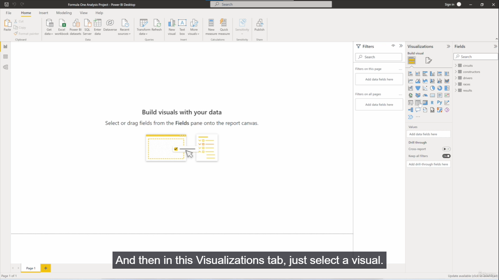
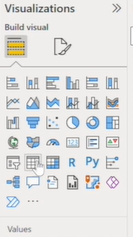

- Drag, drop, and move the newly generated visual anywhere on the report page.
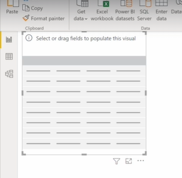

- Use the Build visual tab to populate the chart by adding data columns (e.g.,In fields pane, selecting "Driver Name" from the Drivers table and "Points" from the Results table).
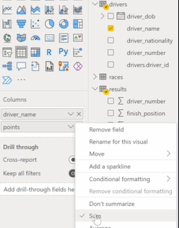
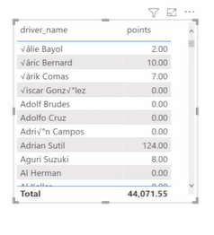
here, 'points' are aggregated.
Data values are often aggregated automatically (e.g., summing up the total points).

- Sort the visual quickly by clicking on the column headers (e.g., clicking "Points" to place the driver with the highest points at the top).
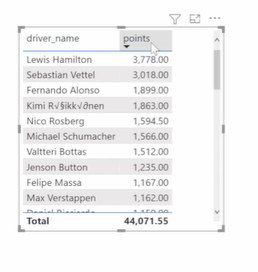

- Copy visuals by right-clicking and selecting Copy -> Copy visual, then holding Ctrl and clicking the canvas to paste. (here's a visual on top of first) Alternatively, use standard Ctrl + C and Ctrl + V keyboard shortcuts.
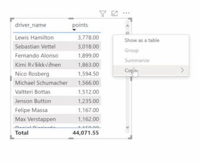

- Changing a visual's chart type (e.g., from a table to a bar chart) will change how it looks and the specific formatting options available to it.

# Formatting Visual Data (Format Visual Pane)

## format visual pane
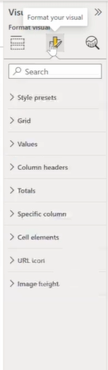

- **Style Presets:** Apply quick visual themes from a dropdown list (e.g., Default, Minimal, or Sparse but first select the visual).
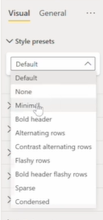
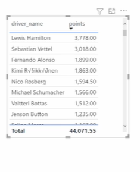

- **Grid Lines:** Toggle horizontal and vertical grid lines on or off.

Remove grid lines
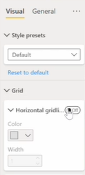
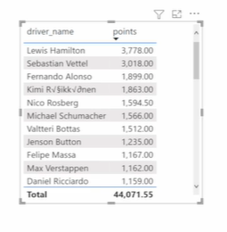

Customize their specific color and line width.
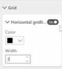
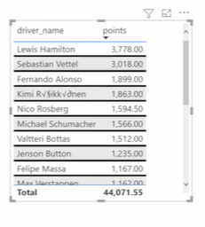

Add vertical grid lines.
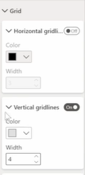
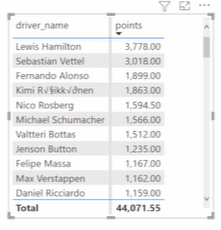

- **Borders:** Add distinct borders to the top, bottom, left, or right of the visual elements (e.g., adding a red border with a width of 2).
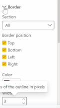
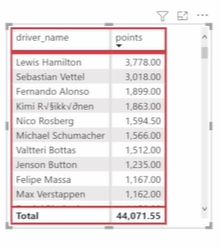

- **Values:** Customize the data rows by altering the font type, text size, text color, and background color.
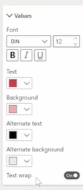
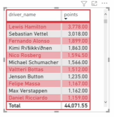

- **Column Headers:** Adjust the font and size of the top header text independently from the values.
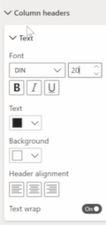
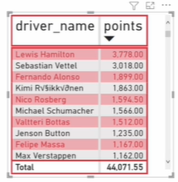

- **Totals:** Toggle the bottom totals row on or off. 
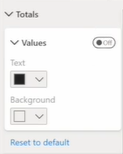
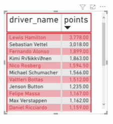

You can rename the label (e.g., "Total Points"), change the font size, apply italics, and adjust text color.
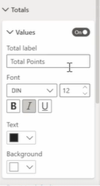
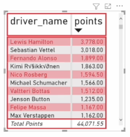

- **Specific Columns:** Format columns individually. For example, select the "Points" column to 

adjust display units (e.g., showing as thousands), 
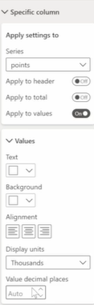
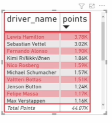

change decimal places (e.g., setting it to 0), 
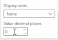
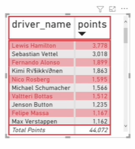

or change the text alignment.
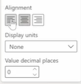
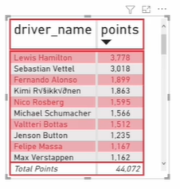

- **Renaming Fields:** In the Build visual tab under Columns, right-click a field to rename it purely for presentation (e.g., changing "driver_name" to "Driver"). 
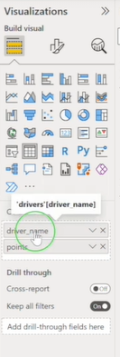
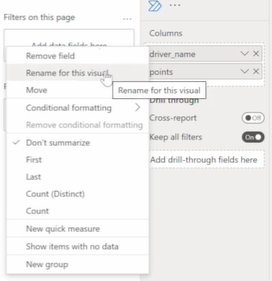
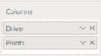
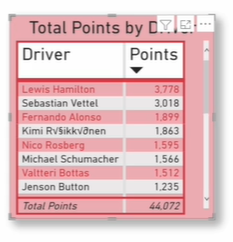

This updates the visual but leaves the underlying dataset entirely unchanged.
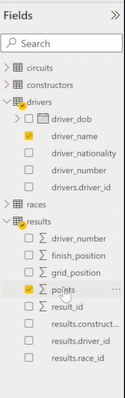

---

# General Settings & Global Formatting

**General Tab:** Located inside the format pane for overall container customizations.
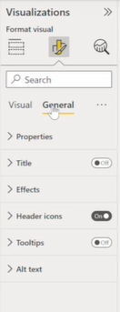
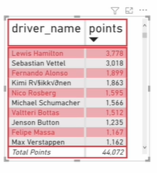

- **Title:** Turn the chart title on, input custom text (e.g., "Total Points by Driver"), and modify the font size (e.g., changing from 30 to 20), italics, alignment (center), and background color.
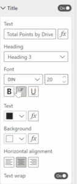
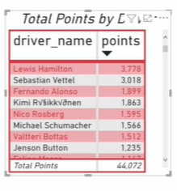

- **Effects:** Apply a visual border to the entire chart container or add a drop shadow.

bg color
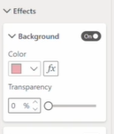
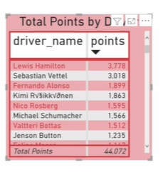

visual border
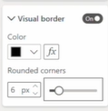
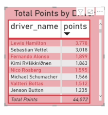

shadow
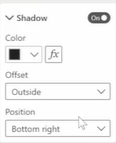
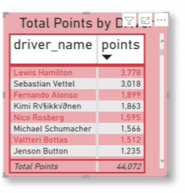

- **Analytics Tab:** Automatically generates data insights. Note that this feature is only available for certain chart types, not all basic visuals.
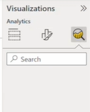

# Canvas and Page Formatting

**Format page tab**
Access page formatting by clicking on any empty, blank area of the canvas and opening the Format page tab under Visualizations.
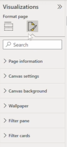

- **Page Information:** Rename the specific report page (e.g., changing "Page 1" to "Driver Analysis").
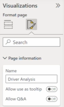

- **Canvas Settings:** Alter the aspect ratio and overall dimensions of the report page.

- **Canvas Background:** Change the background color of the report. You must set the transparency level to 0% to make the color fully visible.

- **Images & Wallpaper:** Upload images to act as the canvas background or add a wallpaper to surround the report.

---

# View Tab, Selection Pane, and Alignment

## View Tab

click : selection

- **Selection Pane:** It manages all elements on the screen and features two distinct ordering systems: Layer order and Tab order.

- **Layer Order (Z-axis):** Determines which visuals are stacked on top of each other. Dragging a visual to the top of the list will ensure it overlaps everything beneath it.

current

If I take one visual and place it on top of other visual,

you can see that currently the layer order in this table which have moved to 'Total points by driver' is at the top.

If I change the ordering to the bottom, you can see now this visual, is on top.

- **Tab Order:** Dictates the exact sequence in which report elements are highlighted when a user navigates the dashboard using the Tab key.

current order

Click somewhere else on the screen and I just press tab

that's the first visual that gets selected.

 
That's the second visual

then the other.

-> change the order

press tab to see the order is different now.

- **Format Painter:** 
If you want all elements to have the same format in your report.
Click a fully formatted visual -> Home -> Format Painter icon -> click an unformatted visual to instantly duplicate all styling and formatting.

- **Themes:** Access the View tab dropdown to select from a Theme Gallery.

we can customize the current theme, browse your computer for theme files, and save custom themes.

---

## Format Tab
Copy the formatting and make all 3 visuals same.

- **Alignment Tools:** Select multiple elements, go to Format -> Align, and arrange them perfectly (e.g., Align Top, Distribute Horizontally, Distribute Vertically). This operates identically to PowerPoint.

Under Format, use actions like "Send backward", "Bring forward" to manually arrange overlapping visuals.

---

- **Gridlines & Snapping:** Turn on canvas gridlines to manually align objects. Enable "Snap to grid" to force visuals to lock precisely into grid intersections rather than moving freely.

-> Add Gridlines
View -> Tick Gridlines

this can help to align objects as well using these grid lines

Tick 'snap to grid'

- **Lock Objects:** Toggle this feature on to freeze all report elements in place, preventing accidental moving or resizing when clicking around the canvas.

---

# Table and Matrix Visuals

lets create a new page & rename it to 'Tables and Matrix' (by double clicking)
 

# Preparation & Layout

Before building visuals, it is helpful to set up canvas for easy alignment:

- Go to the View tab.
- Turn on Gridlines and select Snap to grid. This makes arranging and aligning multiple visualizations much easier.

# Table Visualizations

- **Creating a Table:** Click the Table icon in the Visualizations pane.

- **Adding Data:** Drag fields into the Columns section. For example: Constructor Name (from Constructors table) and Points (from Results table). Note that numeric fields like "Points" default to the Sum aggregation.

The table shows - number of points by each constructor 

- **Sorting Data:**
  - * Quick Sort: Click directly on a column header (like "Points") to alternate between ascending and descending order.

  first time click on 'points' column.
  

  first time click on 'points' column.
  

  - Menu Sort: Click the three dots (...) at the top right of the visual -> Sort descending or Sort ascending -> Choose the specific field to sort by.

  

- **Adding More Columns:** You can add additional fields, like Driver Name, and rearrange their order in the Build visual pane (e.g., Constructor > Driver > Points).

# Matrix Visualizations

drag 'driver_name' from columns to rows.

## Compare two Tables:

Tables display two-dimensional, flat data. Duplicate values are shown row by row rather than being grouped together.

A Matrix is more advanced than a standard Table. It makes it easier to display data meaningfully across multiple dimensions. The matrix automatically aggregates the data and enables you to drill down.

- **Hierarchy & Drill-down:** Matrices support a stepped layout. If you place Constructor Name and Driver Name in the Rows field, the matrix automatically groups the data. You can click the plus icon (+) next to a constructor (like Ferrari) to "drill down" and see the specific drivers (like Sebastian Vettel) and their individual points.

Meaning : Names of the drivers who've driven for that constructor. So you can see Sebastian Vettel has got the most points for Ferrari.

* Move driver_name from rows to columns. we now have a matrix.

We have drivers across the columns,  and construct_name down the rows, and the intersection would be the number of points for that constructor and that driver.

- **Cross-Tabulation:** If you move Driver Name to the Columns field and keep Constructor Name in Rows, the matrix creates a grid. The intersection of a row and column will show the points for that specific constructor-driver combination.

move driver_name back to rows again.

---

# Conditional Formatting

You can highlight specific values in your Tables or Matrices to make data easier to read at a glance.
(Format values to just select the column containing the values we'd like to format.)

-> **How to Apply:** Right-click the value field (e.g., Points) in the Build visual pane -> select Conditional Formatting.

- **Background Color:** Format cells based on rules or gradients.

-> Format cells based on their values.
select format style to 'Rules'.

**Example** If value is >= 500 and < 1000, set background to a specific color. 

- **Font Color:**
Format the Font Color : Higher the value -> Darker the color.

To remove conditional formatting:
Just right click on 'points' column -> remove conditional formatting.

- **Data Bars:** Similar to Excel, this adds an in-cell bar chart that visually represents how comparatively large the values are.

Right click on 'points' column -> Conditional formatting -> Data bars

- **Icons:** Adds symbols (like traffic lights or arrows) based on value thresholds.

- **To Remove:** Right-click the field -> Remove conditional formatting -> choose the specific format to clear.

---

# Sparklines

Sparklines are tiny charts shown directly within the cells of a Table or Matrix. That make it easy to see and compare trends quickly.

- **How to Add:** Right-click the value field (e.g., Points) -> Add sparkline.
  
  

Lets create a mini line show over time showing the points.

- **Setup:** You need a Y-axis (the value, like Points) and an X-axis (a date/time field, like Race Date).

This will show the value of the points arranged by date.

- **Result:** This creates a miniature line chart in the row. For example, you can visually compare when Alain Prost accumulated his points versus when Fernando Alonso started accumulating his, based on the shape of their individual sparklines.

here, Alain Prost raised a little bit earlier than Fernando Alonso because you can see that his points have been accumulated before Alonso start to accumulate points.

We got 'points by date' column created.

If you remove this, the sparkline will also disappear.

---

# Practice Assignment & Solution

## The Assignment:

- Create a Table showing Total Points (descending order) by Constructor Name and Driver Nationality.

- Create a Matrix visualization with the exact same columns.

- Add an appropriate title to both charts and rename the columns cleanly.

- Add conditional formatting (Icons) to the Points column in the Table based on these rules:

  - Red icon: Below 500 points.

  - Yellow icon: >= 500 and < 800 points.

  - Green icon: >= 800 points.

## Solution Steps:

- **Setup Visuals:** Swap out the Driver Name field for Driver Nationality in both the Table and the Matrix.

- **Observe the Matrix Advantage:** In the Matrix, you can sort Total Points in descending order while still keeping the data cleanly grouped by Constructor (e.g., seeing the point split of nationalities under Mercedes or Ferrari).

- **Rename Titles:** Go to Format visual -> General -> Title. Turn it on and rename to "Points by Constructor and Driver Nationality". Use the Format Painter to easily copy this title styling to the other visual.

- **Rename Columns:** In the Build visual pane, right-click the fields and rename them for presentation: "Constructor", "Driver Nationality", and "Total Points". (Note: Ensure the aggregation is set to Sum, not Average).

- **Apply Conditional Formatting:**
  - * Right-click Total Points on the Table -> Conditional Formatting -> Icons.

  - Crucial Step: Change the rule type from Percent to Number.

  - Enter the thresholds:

    - < 500 = Red

    - >= 500 and < 800 = Yellow

    - >= 800 (up to a very high maximum number) = Green.

---

# Bar and Column Charts

# Overview

Bar and Column charts are standard visualizations in Power BI used to compare specific numerical values across different categories.

- **Bar Chart:** Categories are arranged vertically (on the Y-axis), and the bars stretch horizontally.

- **Column Chart:** Categories are arranged horizontally (on the X-axis), and the columns stretch vertically.

(Note: Switching between a Bar chart and a Column chart simply rotates the visualization by 90 degrees).

# Types of Bar/Column Charts

When you look at the Visualizations pane, you will see several variations of these charts. Here is how they differ:

## 1. Stacked Bar Chart

In stacked bar chart, the rectangles are stacked on top of each other.

1) Add a stacked bar chart to the canvas.

2) X-axis: Constructor Name, Y-axis: Points
  
  
  

3) We can sort the chart in ascending or descending order of any specific fields.

4) add a data field to the legend

- **How it works:** This chart breaks down a single total value into sub-categories. The sub-categories are placed (stacked) on top of each other within a single bar or column.

- **Adding a Legend:** With a legend, we can add another categorical column, and the chart will update the visual to show the categories as per the legend.

To create the "stack," you must add a categorical field to the Legend section in the Build visual pane.

- **Example:**
  - * X-axis: Constructor Name
  - Y-axis: Points
  - Legend: Driver Nationality
  

- **Result:** You see one large bar representing Ferrari's total points (e.g., 9,292), but that single bar is divided into colored segments showing how many of those points were scored by Brazilian, British, or Italian drivers.

from (total ferrari)

to (shows the split by each different nationality, but the total should still be the same)

# Formatting the Legend

When you add a field to the Legend section to split your data:

- Go to the Format visual pane -> Legend.
  

- You can change the **position of the legend** (e.g., move it from the default position to the "Bottom Center" of the visual).
  
  

- You can adjust the text size, font, and color of the legend labels.

(Note: Concepts like Filtering, Tooltips, and Small Multiples apply to many different chart types, including Bar/Column charts, and are generally covered as standalone topics).

## 1.2 100% Stacked Bar Chart

Lets transform this chart to a 100% stacked bar chart.

all the rectangles for the constructors are the same size. This is because it shows the relative percentage of multiple data series in stacked Bar Charts with a total of each category equals 100%.

- **How it works:** Instead of showing the absolute raw numbers (like total points), this chart shows the relative percentage (or proportion) of the sub-categories.

- **Visual Difference:** Every single bar or column in the chart will be the exact same height/length, representing 100% of that category's total.

- **Example:** Using the Ferrari data above, the bar still shows the nationality split, but instead of showing raw points, it shows that "just under 13%" of Ferrari's points were scored by Brazilian drivers.

## 2. Stacked Column Chart

Change the chart to stacked column chart:

here, categories go along the bottom instead of the top. It just rotates at 90 degrees.

## 2.2. 100% Stacked Column Chart

## 3. Clustered Column Chart

clustered column chart just has the rectangles side by side as per the legend. Which is driver_nationality.

To make this clearer, we can apply sort.

click : apply filter

- **How it works:** Instead of stacking the sub-categories on top of each other, this chart places them side-by-side for each constructor.

- **Visual Difference:** If Ferrari had points scored by drivers of three different nationalities, you would see three separate, thinner columns grouped (clustered) together over the "Ferrari" label on the axis.

## 3.1 Clustered Bar Chart

---

# Practice Assignment & Solution

## The Assignment:

- Start with a blank canvas. Create either a Stacked Bar Chart or a Stacked Column Chart.

- Show the total count of races held in each country.

- Split the data by the specific name of the Grand Prix event.

- Arrange the visual in descending order of the total number of races.

- Ensure columns are renamed appropriately and the chart has a title.

## Solution Steps:

- **Select the Stacked Column Chart** from the Visualizations pane.

- **X-axis (Category):** Drag the Country field from the Circuits table into the X-axis. Rename the field in the visual pane to "Country" (capitalized).

- **Y-axis (Value):** We need to count the races. Drag the Grand Prix text field from the Races table into the Y-axis.

- **Key Concept:** Because Grand Prix is a text field, Power BI automatically defaults to a Count aggregation (you cannot Sum or Average text). Rename this field to "Total number of races".

- **Legend (Split):** To see the breakdown of the specific events within each country, drag the Grand Prix field into the Legend section as well. Rename it to "Grand Prix".

- **Sorting:** Click the three dots (...) -> Sort descending -> By Total number of races.

- **Result Analysis:** You should see that Italy has the most total events (~100). The Italy column will be stacked with segments showing the breakdown: roughly 71 occurrences of the Italian GP, 26 of the San Marino GP, and 1 of the Pescara GP.

- **Title:** Power BI usually auto-generates a title like "Total number of races by Country and Grand Prix," which is accurate, but you can customize it in the Format visual pane if desired.

---

# Legends

When using legends in your visualizations, you must be careful when selecting a column that contains a high number of unique (distinct) values. Legends have a strict, finite limit on the number of items they can display.

# How the Limitation Behaves

The legends can only show a certain number of values.

When a field is added to the Legend, Power BI loads the values sequentially. If the number of unique values in that column exceeds the visual's hidden limit:

- The legend will display items up to its maximum capacity.

- Once the limit is reached, it simply stops displaying any remaining values.

- The visual will silently drop the data associated with those omitted legend items, making your totals look incorrect or missing, even though the underlying data is fine.

# Real-World Example

Imagine a Column Chart showing the Total Number of Races (Y-axis) by Country (X-axis). The base totals are:

- Italy: 100 races

- Germany: 79 races

- UK: 75 races

## Scenario A: Safe Legend (Grand Prix)

If you add the Grand Prix column to the Legend, 

Convert visual converts to a Stacked Column Chart.

- The UK total remains a perfect 75 (split accurately into 1 occurrence of the 70th Anniversary GP, 71 of the British GP, and 3 European GPs).

- **Why it works:** The Grand Prix column only has 48 distinct values, which is well under the legend limit.

## Scenario B: Exceeding the Limit (Circuit Name)

If you swap out Grand Prix and put Circuit Name into the Legend instead, Italy and Germany might still look normal, but the UK's column will suddenly shrink, missing a massive amount of data.

- **Why it fails:** The Circuit_Name column has 79 distinct values. This exceeds the legend's maximum allowance. The specific circuits located in the UK happened to fall outside of that limit, so Power BI completely omitted them from the visual. Removing the legend immediately restores the UK's true total of 75. (Circuit's column has got more distinct values than the grand_prix column.)

# How to Verify Distinct Value Counts in Power Query

If you suspect a column is breaking your visual due to this legend limitation, you can check its exact number of unique values using the Transform Data menu.

## Steps to count distinct values:

- Open the Power Query Editor by clicking Transform Data.

- Navigate to the relevant table and select the column in question (e.g., Grand Prix in the Races table or Circuit Name in the Circuits table).

- Go to the Transform tab on the ribbon.

- Click Statistics, then select Count Distinct Values.

Power BI will return a single scalar number (e.g., showing 48 for Grand Prix and 79 for Circuits), confirming if you are dealing with a high-cardinality column.

(Note: Remember to delete this "Calculated Distinct Count" step from your Applied Steps pane to return to your normal data view!)

---

# Interactions (Cross-Highlighting & Cross-Filtering)

By default, all visualizations on a single Power BI report page are connected. When you click a data point (like a specific bar) on one visual, it automatically impacts all other visuals on that same page.

1) Add a Simple bar chart (stacked column chart)

2) Copy the visual & paste on right side

X : driver_name, Y : Points

- **Cross-Highlighting (Default behavior):** 

-- click on a constructor by selecting a bar in this visual

If you click "Mercedes" on a Bar Chart showing Points by Constructor, a second chart showing Points by Driver will dim all the unrelated data. The proportion of points that belong specifically to Mercedes drivers will remain in a solid, darker shade, allowing you to see their contribution relative to the whole.

- **Cross-Filtering:** Instead of just highlighting the proportion, the second visual completely filters out all unrelated data, resizing its axes to only show the drivers and points related to Mercedes.

# Editing Interactions

You can manually change how a specific visual reacts when you click on another visual.

## Steps to Edit:

- Select the "Source" visual (the one you will be clicking on) Ex. left side

- Go to the Format tab on the ribbon and click Edit interactions.

- Look at the top right corner of all the other visuals on the page. You will see three small icons appear:

  - **Filter (Funnel icon):** Changes the visual to filter out unrelated data completely.
  
  
  So now, instead of highlighting the points for drivers that are related to Mercedes, it actually filters for those specific drivers and for the points that they've scored for Mercedes.

  - Click Edit interactions again to hide the icons when you are finished setting your rules.

  -> You can check which filters are currently affecting a visual by hovering over or clicking the small filter icon that normally sits in the visual's header.

  - Click on the filter icon (right side) 
  
  here, see the filter that's affecting this visual - Mercedes (constructor name).

  - **Highlight (Pie chart icon):** Changes the visual to dim unrelated data and highlight the proportion (this is usually the default).

  - **None (Circle with a line icon):** Stops the interaction entirely. The visual will not change at all when you click the source visual.
  The (right side) visual is no longer affected by any selections made to this (left side) visual.
  

## Add filters into Report page

we can also use this interactivity to add filters into the report page.

> Lets filter the visualizations based on the construct_nationality.

1) Add a table visual

2) Click on British & see it highltghs all other visuals

See both visuals have the options for filter, highlight, none.
filter :

 
# Using Slicers

A Slicer is another way of filtering. A Slicer is a specific type of visual designed entirely for filtering a report page. It narrows the portion of the dataset shown in all other report visualizations.

> here, we can actually make multiple selections by 

1) Go to 'Format your visual'

2) Slicer settings -> Selection -> Multi select with Ctrl

With the slicer, you only have the option to filter, you can't highlight with the slicer.

- **Key Difference:** Unlike standard charts, Slicers only filter data; they cannot cross-highlight.

> We can change the layer.
list: 
dropdown : 

here, differnt field will have different options. we get different options depending on the type of the field.
> lets change conctructor_nationality with date :

list of unique dates : 

or select dropdown
1) select between range (where we get a slider and then we can select some ranges)

2) select a relative date

3) from list

4) from dropdown

-> click on - clear selections

- make selection

- click clear selections icon

## Customize Slicers

lets add driver_name

list view: (its going all the way down)

Go to: Visualizations -> Format your visual -> Slicer settings -> set Orientation : Horizontal

Resize chart

# Slicer Formatting & Types

Depending on the type of data field you drop into the Slicer (Text, Date, Number), you get different layout options by clicking the down arrow on the Slicer header or looking in the Format visual -> Slicer settings pane.

## Text Fields (e.g., Nationality, Driver Name):

- **List:** A standard vertical checklist.

- **Dropdown:** A compact menu that drops down when clicked (great for saving space).

- **Horizontal (Tile) Layout:** Go to Format visual -> Slicer settings -> Orientation and change it from Vertical to Horizontal. This creates a grid of clickable buttons.

- **Multi-Select:** By default, clicking a new item replaces the previous selection. You must hold Ctrl while clicking to select multiple items.

## Date Fields (e.g., Race Date):

- **Between / Range:** Provides a slider bar with start and end dates.

- **Relative Date:** Allows selections like "Last 30 days" or "This Year."

- **List / Dropdown:** Standard specific date selection.

- **Clearing Selections:** Click the small eraser icon located on the top right of the slicer to clear all active filters.

# Syncing Slicers Across Pages

If you want the same filter to apply across multiple different pages in your report (e.g., filtering for "Alain Prost" on Page 1 automatically filters Page 2 as well), you need to sync the slicers.

## How to Sync:

- Copy an existing slicer (Ctrl + C or Right-click -> Copy visual).

- Go to a different page ('Bar and Column') and paste it (Ctrl + V).

- A prompt will immediately pop up asking if you want to "Sync visuals".

It asks if we want to sync (the copied slicer will sync with the original slicer)
So when I make a selection on any of the two slicers, they'll both automatically ensure that they have the same selection selected.

  - **Click Sync:** If you select "Alain Prost" on Page 1, the slicer on Page 2 will automatically update to "Alain Prost," and the data on Page 2 will be filtered accordingly.

  - **Click Don't Sync:** The slicer will be pasted as an independent visual. Selecting "Alain Prost" on Page 1 will have zero effect on Page 2.

(Note: You can manage all synced slicers in detail by going to the View tab and opening the Sync slicers pane).