# Drilldowns & Hierarchies

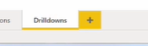

# Setting Up a Hierarchy in a Visual

You can create a drill-down experience on almost any chart by adding multiple fields to a single axis.

- Add a bar chart
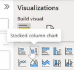

- **How it works:** In the Build visual pane, drag multiple columns into the X-axis (e.g., add Constructor_Name, then drag Driver_Name directly underneath it). Add points in the Y column (sum of the points)
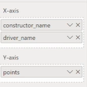
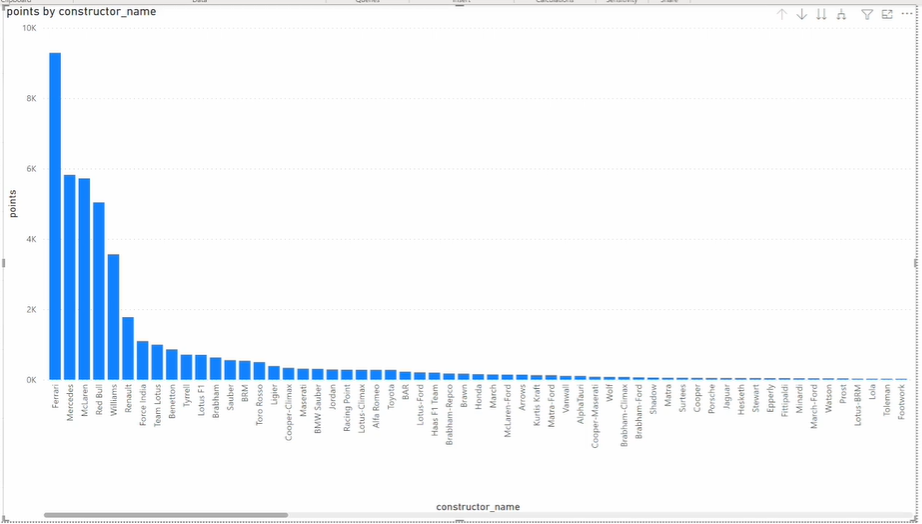

Right now, we can only see the constructor name along the x axis.
If I want to see the driver name, I have to move it to the top.

- **Hierarchy Order:** The order of the fields dictates the drill-down path. The field at the top of the list is what is displayed by default (highest granularity). You typically want to go from higher granularity (broad category) to lower granularity (specific detail).

- **Swapping:** If you drag Driver Name above Constructor Name, the chart will instantly update to show Drivers first, and you would drill down into the Constructors they drove for. (we can do drill down the categories or drill up)
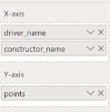

# The Drill-Down Icons Explained

Whenever you have multiple fields on an axis, a set of arrow icons will appear in the top right corner of the visual. 
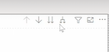

You can also access these features via the Data/Drill tab on the ribbon. (This will appear once you select the visual and actually have an hierarchy - multiple columns on x axis)
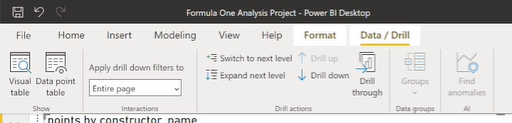

Here is exactly what each icon does:

current:
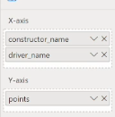
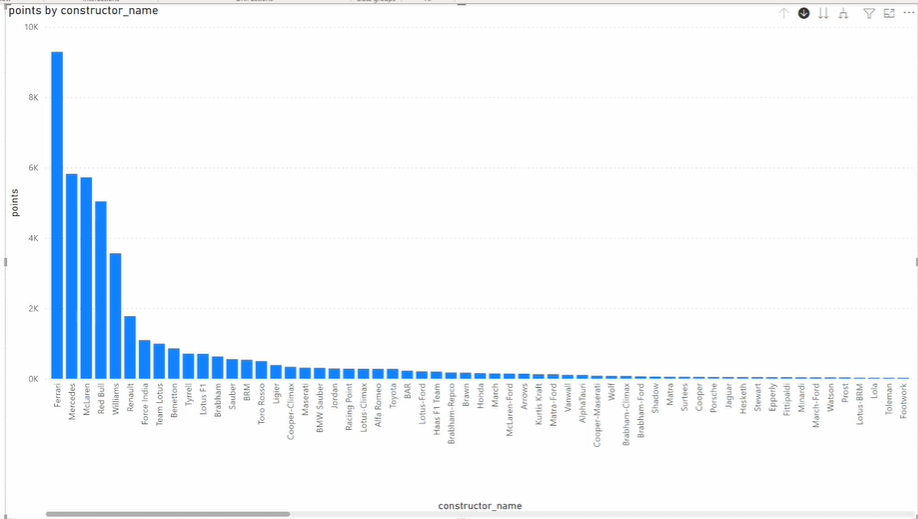

## Single Down Arrow (Drill Down Mode)

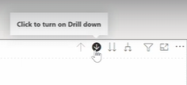 or 
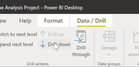

- * Click this icon to turn on "Drill Down" mode (the icon gets highlighted).

- Now, if you click on a specific bar (when you make a selection) in the chart (e.g., Ferrari), the chart will drill down to the next level (Drivers) AND apply a filter. It will only show the drivers for Ferrari.
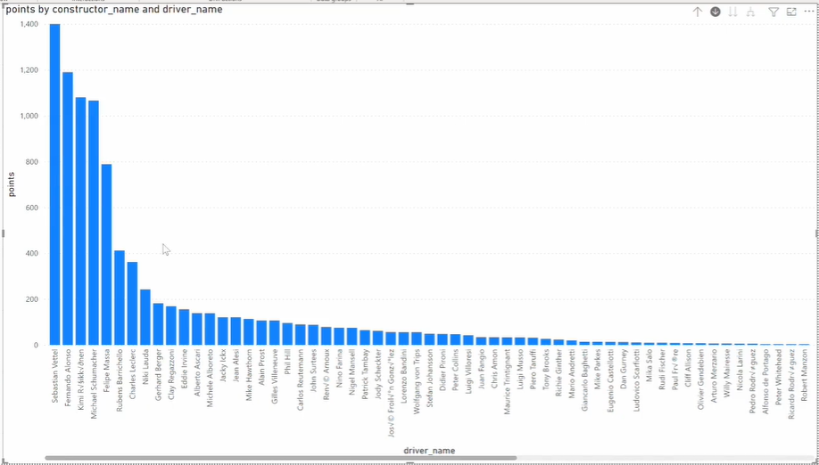
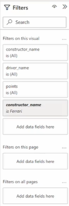
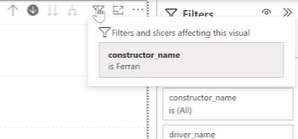

- So it's drilled down from constructor name to driver name and it's also applied the filter.

## Upwards Arrow (Drill Up)

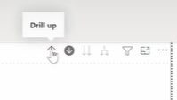
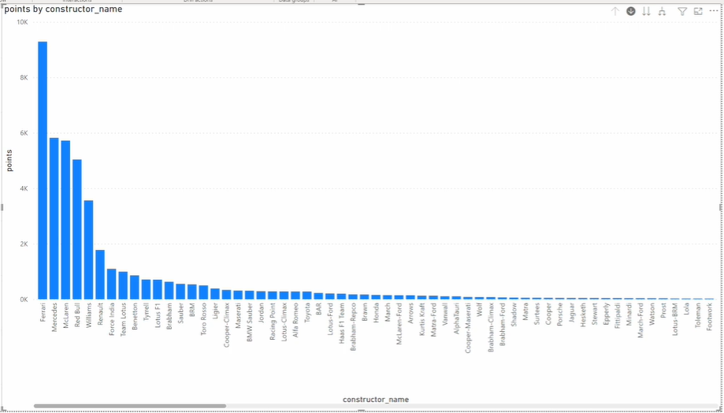

- * Takes you back up one step in the hierarchy (e.g., from Drivers back to Constructors).

Swap x-axis around.
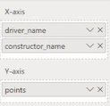
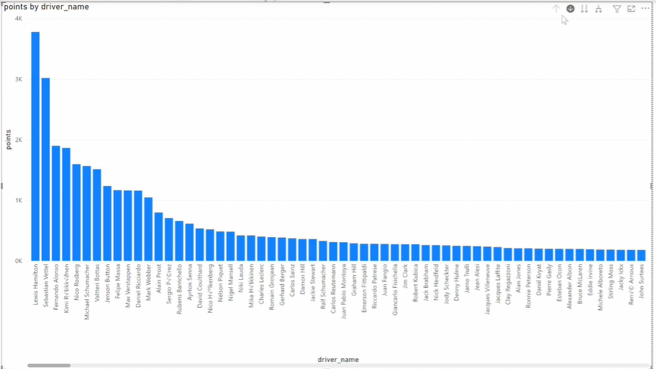

-> select drill-down & select 'Lewis Hemilton' driver
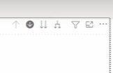
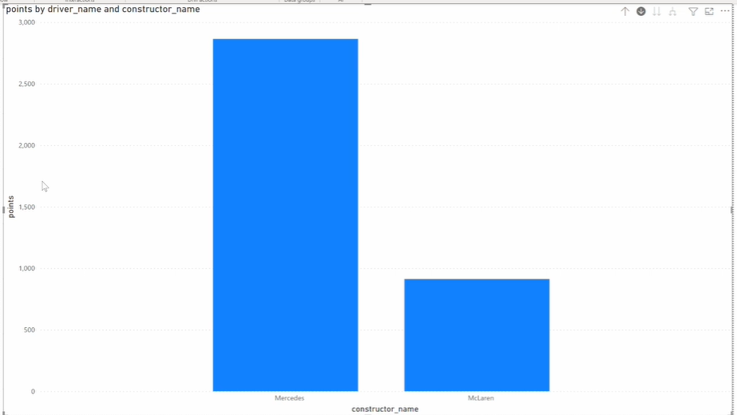
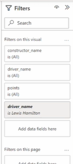

we can see the constructors that Lewis has raced for.

> Typically if you want a hierarchy, you'll go from higher granularity to lower granularity.

deselect drill down.
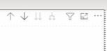

clear the filters
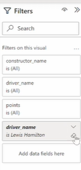

put constructor_name first
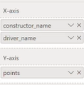

## Double Down Arrow (Go to Next Level)

click 'double down' -> right now it is 'constructor_name' so it goes to 'driver_name'

click 'drill up' -> its back to constructor name

- * Drills down to the next level of the hierarchy for the entire chart without applying any filters.

- If you click this while looking at Constructors, the chart simply changes to show all Drivers for all constructors combined.

## Forked Arrow (Expand All)

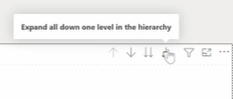
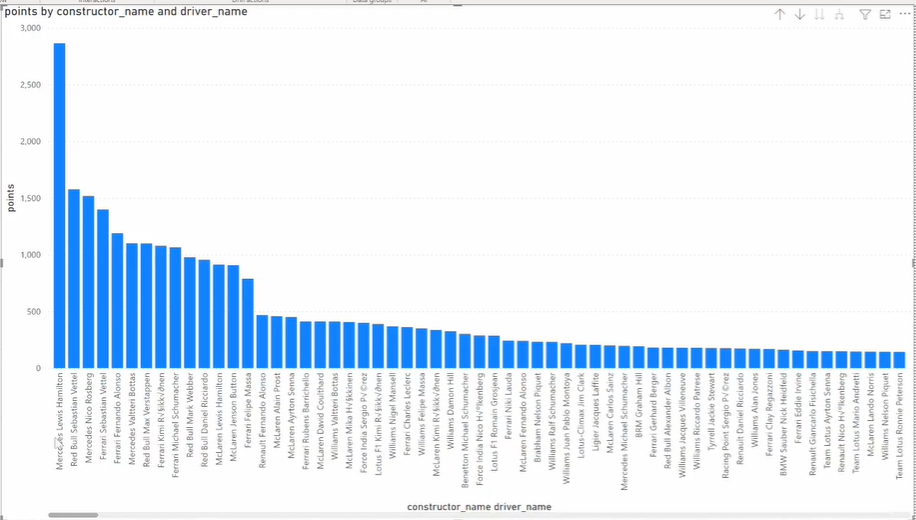

Now we have the constructor_name driver_name

lets swap the order -> click : expand all
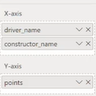
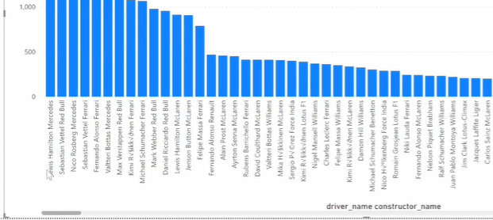
driver_name constructor_name

- * Expands all levels of the hierarchy simultaneously, showing every combination of your fields on the X-axis.

- For example, instead of just showing "Lewis Hamilton," it will show "Lewis Hamilton Mercedes","Lewis Hamilton McLaren" etc.

- Note: The behavior of the Expand All feature can look slightly different depending on the specific type of chart you are using.

click : drill up to go back.
current
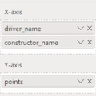

# Creating Custom Hierarchies in the Data Pane

Instead of manually stacking columns in the X-axis every time, you can permanently group related columns together into a saved Hierarchy directly in your data model.

## How to create a custom hierarchy (e.g., Country -> City):

- Go to the Data pane (Fields tab) on the right side of the screen.

- Find the highest-level column you want (e.g., Country in the Circuits table).
  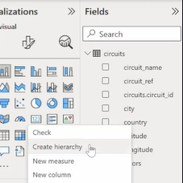

- Right-click the column and select Create hierarchy. A new item will appear with a hierarchy icon.
  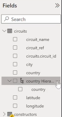

- Right-click the newly created hierarchy to Rename it (e.g., "Country-City").
  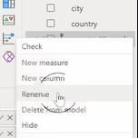
  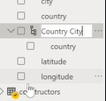

- To add the next level, find the lower-level column (e.g., City), right-click it, select Add to hierarchy, 
  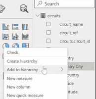

  and choose your new "Country-City" hierarchy.
  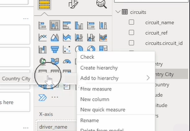

  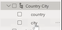
  now we have city and country

X axis: Add the created hierarchy to the x axis.
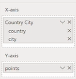
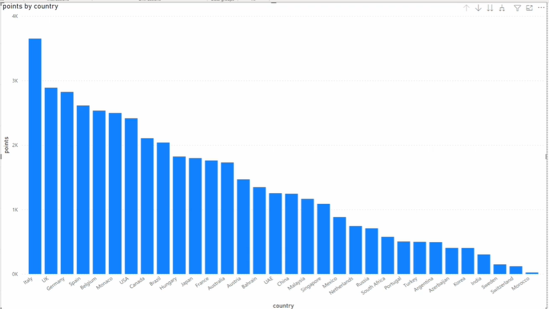

now, click : drill down -> select a bar
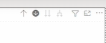
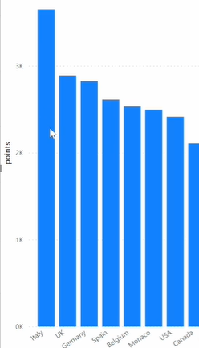

(go to the next level)
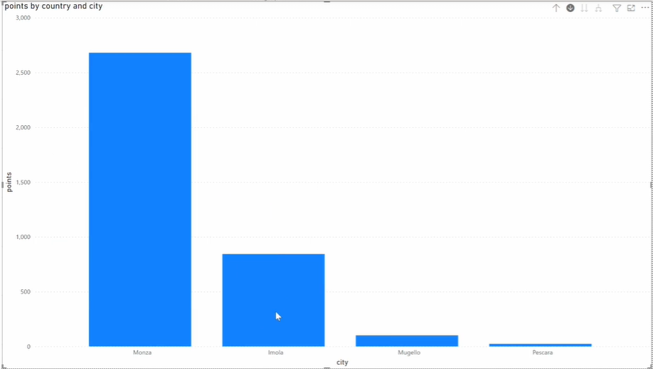

click : drill up

# Notes

- When you add a created hierarchy to a visual, it automatically brings all its nested columns with it in the correct order.

- The columns inside a saved hierarchy are essentially duplicates of the original columns.

- If you delete the custom hierarchy, you will not lose the original Country or City columns in your dataset; you only lose the grouped shortcut.

click on three dots -> delete from model
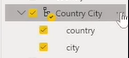
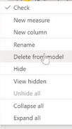
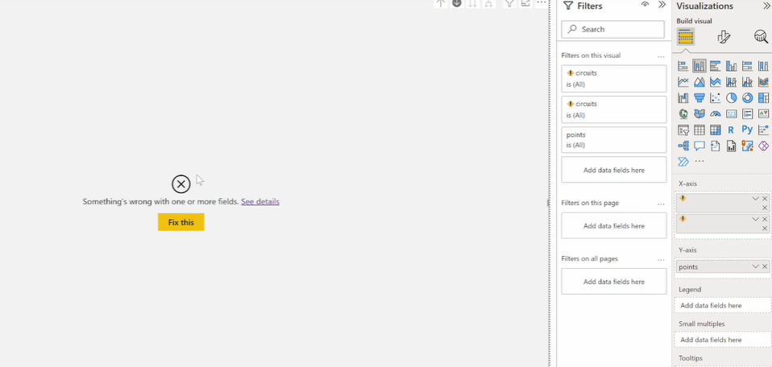

Original
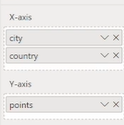
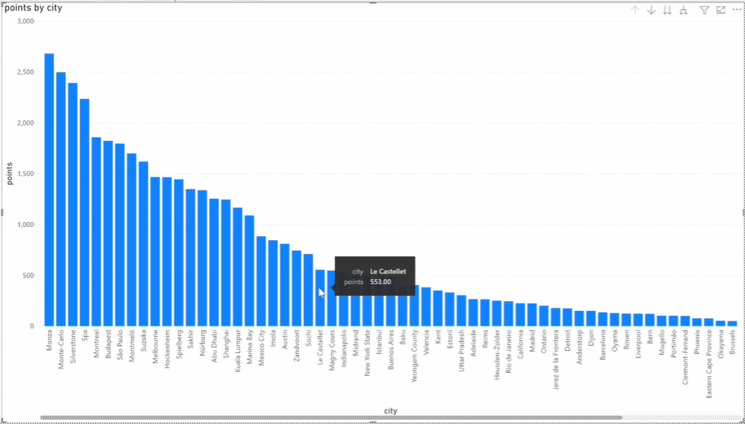

---

# Filter Pane

On 'Tables and Matrix' Page, we have two options in filter pane.
1) Filters on this page
2) Filters on all pages

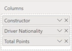
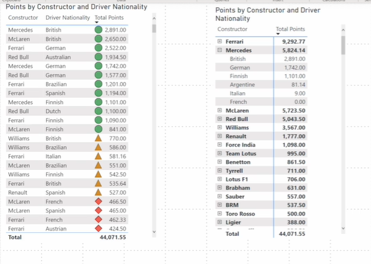
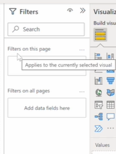

## Overview

The Filters pane is an expandable/collapsible menu on the right side of the screen. It allows you to restrict the data shown in your report by dragging and dropping data columns (dimensions or measures) into specific filter buckets.

There are three distinct levels of filtering:

- **Filters on this visual:** Only appears when you click on a specific chart. It filters only that selected visualization. It will automatically list all the columns currently used in that chart, but you can also drag additional fields here.

- **Filters on this page:** Appears when you click on an empty space on the canvas. Any filters applied here will affect every visualization on that specific report page.

- **Filters on all pages (Report level):** Affects the entire Power BI file, filtering every visual across every single tab/page in your report.

# Types of Filtering Options

The options available in the filter card change depending on the data type of the column you are filtering (Text, Numbers, or Dates).

## 1. Basic Filtering

Provides a simple checklist of all the unique values in that column.

- You can scroll through the list or use the search bar to find and select specific values (e.g., searching for and checking "Lewis Hamilton").

- Practical:

drag & drop 'driver_name' column.
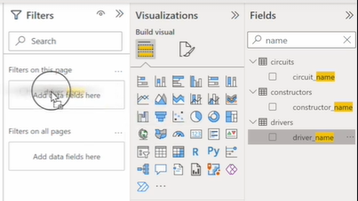

Then you have Basic & Advance filter options.

-> we can select certain drivers on the basic options. And the options you have will depend on the type of the column you drag in.

Ex. driver_name is 'Alain Prost'

the page has been reflected for the driver that I've selected

## 2. Advanced Filtering

Allows you to build custom logical rules using conditions like Contains, Does not contain, Is, Is not, Starts with, etc.

- **Logical Operators (AND / OR):**

  - **OR:** If you set a rule where Driver Name contains "Ham" OR contains "Prost", Power BI will return results for both Lewis Hamilton and Alain Prost (Note: Text filters are not case-sensitive).

  - **AND:** Both conditions must be true simultaneously. If you set Driver Name contains "Ham" AND contains "Prost", you will get zero results because no single driver has both strings in their name.

  - Practical:
  > contains Ham and contains Lew
  
  

  Select the left visual
  
  

  Add driver_name to the visualization.  (to verify the name is 'Lewis Hamilton')
  
  

  > contains Ham or contains Prost (which is not case-sensitive)
  
  

  -> Remove the filter by clicking x
  

- **Numeric Options:** If you use advanced filtering on a numbers column (like Points), the conditions change to math-based rules (e.g., Is greater than, Is less than).

- Practical:

drag points column & drop it to 'filters on this page' in the filter pane.

- In the 'basic filtering', we get to select unique values.

- In the 'advance filtering', we have - less than, etc..

-------> **Filters on this visual**
When we click on a visual (ex., left), we get 'filter on this visual' option.

here, we can see the existing columns on the specific visual: constructor, driver nationality, driver_name, and total points.

We can add additional data fileds here as well

## 3. Top N Filtering

This option is excellent for finding the highest or lowest performers.

- Example: To find the Top 10 Drivers by Points.

- Select Top N from the dropdown -> type "10" in the value box -> drag the Points field into the "By value" data well -> ensure the aggregation is set to Sum -> click Apply filter.

- Practical:

-> Lets filter the driver_name:

Ex., top ten drivers by points

filter type: top N
show items : top 10
by value : points (make sure it's aggregated by sum)

Result: which becomes clearer when we remove 'constructor'

On left visual, we see top 10 drivers by points

Remove filter:

## 4. Date Filtering

If you drag a Date field into the filters pane, you unlock specialized time-based filters.

- You can use basic filtering for specific dates, but you also gain access to Relative date and Relative time options (e.g., filtering to show only data from "the last 30 days" or "this year").

- Practical:
Different columns and data types will have different options

Ex.
Add 'date' column (from races table) 

we see different option for the type of filtering

remove the filter

--->
Filter on this visual -> driver_name -> Basic filtering -> Lewis Hamilton

click on the filter icon (and see the filter affecting the visual)

# Managing End-User Filter Visibility (Locking & Hiding)

When you publish a report for consumers to view, you may want to restrict how they interact with your applied filters. Every filter card has a few toggle icons at the top right:

## Hide Filter (Eye icon with a slash)

- * If you apply a filter (e.g., filtering the page to only show Mercedes) and then click Hide, the filter will continue working, but it becomes invisible to the end-user.

- Even if the user hovers over the visual's filter tooltip icon, it will say "There are no filters applied," masking the background logic you set up.

- Practical:

--> Hide filter
we have 'hide filter' option.

when we click hide

and then click the filter icon

It says, there are no filters applied right now, but it's still impacting the visualization because we can see it clearly filtered by Lewis Hamilton.

So this is a handy feature if we **don't want our end user to see any pre-applied filters**.

## Lock Filter (Padlock icon)

- If you click to Lock a filter, consumers will be able to see that a filter has been applied, but they will be completely blocked from modifying, clearing, or changing it. Click it again to unlock it.

- Practical:

--> Lock filter

**Consumers who are viewing your report are not able to change the filter**.

click it again to unlock.

## Clear Filter (Eraser icon)

- Removes the specific filter conditions you set up without deleting the column from the filter bucket entirely.

### Summary

That's filtering on the page level, the report level and the visualization level..

Filters on this page will just affect this page along filters on all pages will affect the entire report and filters on this visual will just affect the visuals that it's been applied to.

---

# Small Multiples

The Small multiples feature is an option available on many standard visualizations. It takes your single chart and splits it into multiple mini-versions of itself, presented side-by-side in a grid. The data is divided across these versions based on chosen dimension or category.

# How to apply it (Step-by-Step):

- Prepare your workspace by duplicating your current report page(drilldowns) 
right-click the page tab -> Duplicate page and renaming the new tab to "Small multiples".

- Select an existing visual on your canvas (for example, a chart currently plotting data by City and Country).
current: 

- In the Build visual pane, drag the 'Country' field (from x-axis) into the Small multiples data field.

- **The Result:** Now we have a chart for each country. (It splits the chart into each value for this column.) 
The visual instantly splits, generating a separate, individual mini-chart for each specific country.

# Formatting Small Multiples:

Once your chart is split, you can customize the grid layout by going to the Format visual pane. You will find two new specific options:

- **Small multiple title:** This controls the text header that appears above each mini-chart (e.g., the specific name of the country). You can toggle this on or off depending on how clean you want the visual to look.

toggle on:

toggle off:

- **Small multiple grid:** This allows you to control the exact layout of the charts. You can adjust the number of Rows and Columns to dictate how many visualizations fit into your current view at once.

---

# Line & Area Charts

Line charts is a series of data points that are represented by dots and connected by straight lines. They have an X and Y axis and are the standard choice when you want to visualize **trends over a period of time**. The X-axis is usually a categorical **date** variable that is evenly spaced (days, weeks, months, years).

# Setting up the visual:

- Create a new page and name it "Line and Area".

- Add a Line chart to the canvas.

## The X-axis (Dates):

- Drag a Date column (e.g., from the Races table) into the X-axis.

- **Note on Date Hierarchies:** Notice that Power BI automatically creates a hierarchy (Year, Quarter, Month, Day). This happens automatically for any column formatted as a "Date" data type in the Power Query Editor.

here, 'Date' column has an arrow. when we click it, we get a date hierarchy here. It consists of year, quarter, month and date. So from higher granularity (Year) to lower granularity (Day)

(So for certain data types, there are specific behaviors and operations that are performed automatically.)

- Select just Year from this hierarchy to view the data annually.

## The Y-axis (Values):

- Drag Points to the Y-axis (ensure it is set to Sum).

# Extracting Insights from the Line Chart:

This line chart shows us the total points awarded to all drivers competing in each year of the competition.
Looking at the total points awarded to all drivers per year, you will see some major spikes:

- **2002 to 2003:** Total points jumped from 442 to 624. This is because the scoring system changed (points were previously awarded to the top 6 drivers, but changed to the top 10).
   

- **2009 to 2010:** Another massive jump. The scoring system changed again, awarding the winner 25 points instead of 10.

- **2015 vs 2016:** A smaller variation occurred here. This was simply due to the number of races held (19 races in 2015 vs. 21 races in 2016).

# Adding a Secondary Y-Axis

To visually prove that the 2015/2016 point difference was due to the number of races, you can use a secondary Y-axis. (So I could add a count to the number of races.)

- Drag any column from the Races table (like Race ID) into the Secondary Y-axis field and set the aggregation to Count.

- This creates a second axis on the right side of the chart, overlaying the race count trend right on top of the points trend, confirming the 19 vs. 21 race difference. (You can remove this field after checking).

Note: when I add a secondary Y-axis, we get a Y-axis on the right. And a Y-axis on the left.

# Legends and the Data Limit Warning

Next, drag Driver_Name into the Legend to split the line chart by individual drivers.

- The chart will become extremely busy and messy.

- You will also notice a small warning icon in the top corner ('i'): "Showing significant data points. Click to see details." As we know (the legend is only able to show a certain number of unique values), the Legend has exceeded its maximum limit for distinct values because there are too many drivers.

- **The Fix:** We can filter the drivers (Top 50 drivers by points )

Go to the Filters pane -> filter: Driver_Name using Top N -> set it to the Top 50 drivers by Total Points.

The warning icon('i') will disappear.

Note: 
1) If we change to filter top 60 drivers, the 'i 'returns. (the limit sits somewhere between 50 and 60 items).

2) In line chart, we have range. & can know when someone dominated.

# Converting to an Area Chart

An area chart emphasizes the magnitude of change over time and it can be used to draw attention to the **total value across a trend.**

- To make this busy chart easier to read, click the Area chart icon in the visualizations pane to convert it.

- **Insight:** Instead of just messy lines, the filled-in areas make it easier to see who dominated during specific eras (e.g., the black area shows Michael Schumacher's era of dominance, while the dark purple shows Lewis Hamilton's).

# Converting to a Ribbon Chart

Ribbon charts are highly effective at showing rank change. (Regardless of the data,) The highest value is always displayed on top for each time period.

- To get an even clearer view of rankings, click the Ribbon chart icon.

- **Purpose:** To see the periods of dominance so you can see who the most dominant driver was and then the second most dominant driver and the third two in each period.

- **Insight:** The Ribbon chart beautifully visualizes exactly who the 1st, 2nd, and 3rd most dominant drivers were in any given year, clearly showing the shifts in power between Schumacher, Alonso, Vettel, and Hamilton.

here, most dominant driver (during 2018)

second most dominant driver (during 2018) (top -> bottom)

# Assignment

- Create a ribbon chart that shows the points over year by driver nationality.

## Solution:

- Stay on your existing Ribbon chart visual.

- Remove Driver Name from the Legend and replace it with Driver Nationality.

Note: we have the "Top 50" filter 

- Clear the "Top 50" filter we applied earlier. we won't get a warning icon this time because there are far fewer nationalities than drivers, meaning it safely fits within the legend limit.

- **Insights:** Following the thickest ribbons at the top of the chart, you can easily track the eras where German drivers (they've scored the most points during this range. left -> right)

Finnish drivers
 

---

# Combo Charts & Cross Filter Direction Revisited

## Combo Charts

A Combo chart is a single visualization that combines a line chart and a column chart. This is incredibly useful for comparing two different measures (like Points and Number of Races) that have entirely different scales, all within the same visual space.

In the Visualizations pane, you will see two options: 
1) Line and stacked column chart and 

2) Line and clustered column chart.

## Setting up the Combo Chart:

- Create a new page and name it "Combo chart".

- Select the Line and stacked column chart icon and expand it on your canvas.

**EX.** : I want to create a combo chart where the columns show the number of points scored by each driver, and the line shows the number of races completed by that same driver, with the chart sorted in descending order of points.
(build a single visualization that lets you compare a driver's performance (their total points) against their opportunity/experience (the total number of races they've driven in) all in one place.)

### axis

- X-axis (Shared): Drag Driver Name here.

- Column y-axis: Drag Points here. (Ensure the chart is sorted in descending order of points).

- Line y-axis: We want to show the number of races completed by that driver. Drag Race ID (or any column from the Races table without blanks) into this field, and ensure the aggregation is set to Count.

### The Problem: Incorrect Line Data

When you look at your newly created chart, the line will likely look flat and completely wrong. If you hover over the line for any driver, the tooltip will say "1035" races. This is the total number of races in the entire dataset (between 1950 and 2020), not the specific number of races for that individual driver.

This happens because of an issue with the Cross-filter direction in your data model.

## Investigating and Fixing Cross-Filter Direction

To understand why this is happening, you need to go back to the Data Model view (the relationship canvas).

- **The Issue:** The Drivers table is able to filter the Results table to get the points (you can see the relationship arrow pointing from Drivers to Results). However, the cross-filter direction between the Results table and the Races table is currently set to Single. This means the Results table cannot flow backwards to filter the Races table. Because it can't filter it, Power BI simply returns the grand total of all races for everyone.

(the results table can't fill to the drivers table, nor can it filter the races table.)
We can use the driver_name to get the number of points (from results) that thaey scored. But we cannot get the results table to tell us how many races that driver has completed (from races).

### The Fix:

1. Double-click the relationship line connecting the Results table and the Races table.

2. In the Edit Relationship window, change the Cross filter direction from Single to Both. Click OK.

3. Go back to your report page. The line chart will now accurately reflect the correct number of races for Lewis Hamilton and every other driver.

we can see the number of races that Lewis Hamilton has been involved in. As well as all the other races.

### Action Step:

- To prevent this from happening as you build more complex visuals, go through your Data Model and change all of your table relationships so the cross-filter direction is set to Both. Be sure to save your report after doing this!

### Adding a Legend to the Combo Chart

Now that the data is accurate, let's analyze it further by adding constructors.

- Drag Constructor Name into the Column legend field.

- Because there are so many unique constructors, the chart will exceed the legend limit, and you will see the warning icon ("Showing significant data points...") pop up in the corner.

- **The Fix:** Open the Filters pane -> filter Driver_Name using Top N -> set it to the Top 50 drivers by Points -> Apply filter. The warning icon will disappear, and your combo chart will be fully functional and clean.

# Extra:

Question : "If the constructor legend is the thing hitting the limit, why not just filter the constructors?"* 

The reason we filtered the **Driver Name** instead of the **Constructor Name** comes down to the primary goal of the chart and how data reduction works in Power BI.

### **1. The Primary Focus of the Chart**
The main subject of  Combo Chart (the X-axis) is the **Drivers**. The goal is to see the highest-performing drivers, how many points they scored, and how many races they completed. The constructor is just secondary information (the legend) used to color-code those drivers. If we want to analyze the "best of the best," we need to filter the top drivers, not the top constructors.

### **2. The "Ripple Effect" (Implicit Filtering)**
In Power BI, filtering the X-axis naturally filters the Legend. 
When we filter the chart to only show the **Top 50 Drivers**, Power BI looks at the data and says, *"Okay, these specific 50 drivers only ever raced for about 15 different constructors combined."* Because the number of unique constructors tied to those 50 drivers is so small (well under the 60-item limit), the legend fixes itself automatically. You solve the legend error while keeping the focus exactly where you want it: on the best drivers.

### **What happens if you filter Constructors instead?**
Let's imagine we decided to filter the legend directly by setting it to the **Top 10 Constructors**. 
* The legend error would disappear.
* **However**, our X-axis would become an unreadable mess. 

Ferrari, McLaren, and Mercedes (the top constructors) have employed hundreds of different drivers since 1950. If we only filter the constructors, Power BI will try to plot every single driver who *ever* sat in one of those cars on your X-axis. we would end up with a squished, unusable chart filled with low-performing drivers, defeating the purpose of the visualization. 

**Rule:** Always filter the primary category on our axis (what you actually want to analyze) to reduce the data noise, and let the secondary categories (like the legend) naturally shrink down with it!

---

# Scatter Chart

A scatter chart always uses two value axes to display data. It plots one set of numerical data along the X-axis (horizontal) and another set of numerical data along the Y-axis (vertical).

- **Purpose:** It displays data points at the exact intersection of those two numerical values. It is the best chart for finding potential relationships (correlations) between values and identifying outliers in our dataset. It's a particularly useful plot if we want to show data where each instance has at least two metrics.

## Building a Scatter Chart

## Setup:

- Create a new page and name it "Scatter".

- Click the Scatter chart icon in the Visualizations pane and expand it.

## axis

- X-axis (Value 1): We want to see the number of races. Drag Race ID from the Races table into the X-axis and ensure the aggregation is set to Count.

- Y-axis (Value 2): We want to see the points. Drag Points into the Y-axis and ensure the aggregation is set to Sum.

- Legend (The Data Points): To tell Power BI what each dot should represent, drag Driver Name into the Legend field. (each data point here is a driver)

# Initial Analysis:

- Every single dot on the chart now represents an individual driver. When you hover over a dot, the tooltip reveals their total races completed and their total points scored. Their position on the scatterplot is relative to those data points. Their position on the grid shows a very broad correlation: as drivers compete in more races, they generally earn more points.

# Converting to a Bubble Chart

We can add a third dimension of data to your scatter plot by changing the physical size of the data points. (we can also size our data points too based on a measure)

- Drag the 'Points' field into the Size well in the visual pane (ensure it is set to Sum).

- The dots will instantly change in size relative to the total number of points that driver has scored. This variation in point size is what turns a standard scatter chart into a Bubble Chart.

# Changing Aggregations & Data Context

To look at the data differently, go to your Y-axis and change the aggregation of Points from Sum to Average. Now the chart plots the Count of Races against the Average Points per Race.

# Analyzing the New Correlation:

- The correlation here looks similar, if not a bit stronger. Because in general, you'd expect drivers who completed more races to score a better average number of points per race. Due to the highly competitive nature of Formula 1, if a driver lasts a long time in the sport (high race count), it is usually because they are a top-tier driver (high average points).

# Important Data Caveat (The Formula 1 Scoring Change):

- If you look closely at this specific chart, the data is slightly skewed. If you hover over Michael Schumacher, his average points are just over 5. Meanwhile, Lewis Hamilton is at 14.2 and Sebastian Vettel is at 11.7.

- **Why?** Schumacher primarily raced before 2009. Hamilton and Vettel raced heavily after 2009. The F1 scoring system changed drastically during this time (the maximum points awarded to a winning driver jumped from 10 points in 2009 to 25 points in 2010).

- **Note:** This chart is currently just for illustration purposes to learn the visual; this data discrepancy will be corrected later!

# Formatting the Visualization

To clean up the look of our scatter or bubble chart, head over to the Format visual pane and look for the Markers section:

- **Size:** We can globally adjust the relative size of all the markers (e.g., making all the bubbles smaller so they don't overlap as much - from 10 to 15).

- **Shape:** We are not restricted to dots/bubbles. we can change the shape of the data points to squares, diamonds, triangles, etc.

- **Colors:** We can fully customize the colors of the markers to fit our report theme.
