# Treemaps

Tree maps are designed to display hierarchical data using a series of nested rectangles. This visual approach is excellent for seeing part-to-whole relationships across different levels of categories.

- **Logic of the Layout:** Each level of hierarchy is represented by a colored rectangle. Inside those are smaller rectangles representing sub-categories.

- **Size and Order:** The size of each rectangle is dbased on a specific measure (like a count or a sum). Power BI automatically arranges these from the top-left (largest value) to the bottom-right (smallest value).

# Building and Nesting Data

Create a new page titled "Tree Maps" and add the Tree Map visual to the canvas, expanding it to fill the page.

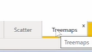
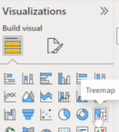

- **Defining the Top Level:** Drag the' Country 'field into the 'Category' well and count of 'Grand_Prix' events into the 'Values' well.
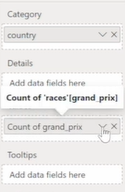
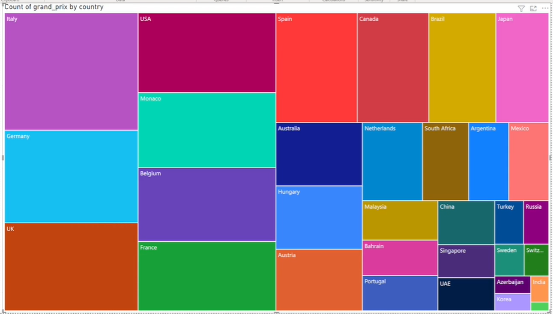

This tree map shows the rectangles arranged in size. The size is based on the number of times the Grand Prix event has occurred.

- **Observation:** See Italy as the largest rectangle in the top-left, followed by Germany and the UK, as they have hosted the most events.
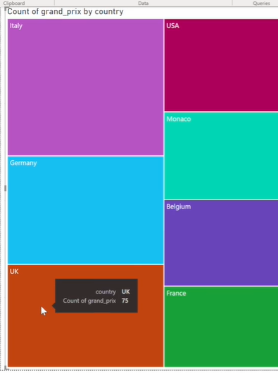

- **Adding the Second Level (Details):** To see a deeper breakdown, drag the 'City' field (from circuits) into the Details well.
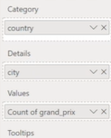

- **Result:** The country rectangles (like Italy) stay in place but are now filled with nested smaller rectangles for cities. For example, inside Italy's purple area, you will see Monza (70), Imola (28), and small boxes for Mugello and Pescara.
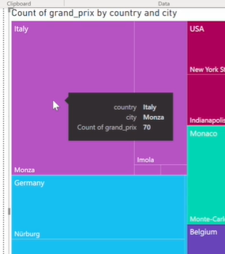
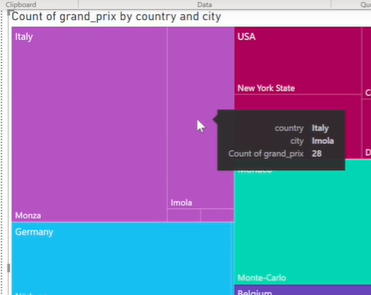

# Interactive Hierarchies and Formatting

Instead of just showing all the boxes at once, you can create a structured path for exploration:

- **Enabling Drill Down:** Move the City field directly beneath the Country field in the Category well. This creates a formal hierarchy.
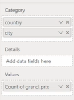

- **Navigating Levels:** Use the "Single Down Arrow" icon in the visual header to turn on Drill Down mode. Now, if you click on "Italy," the chart will instantly transition to show only the cities within Italy. Use the "Up" arrow to return to the global country view.

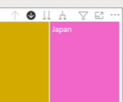
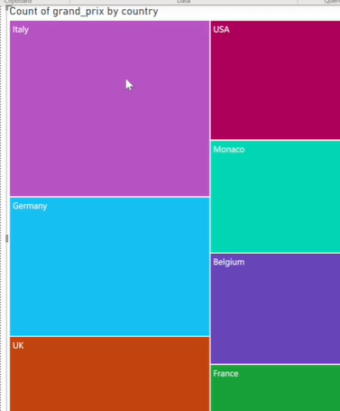

Result
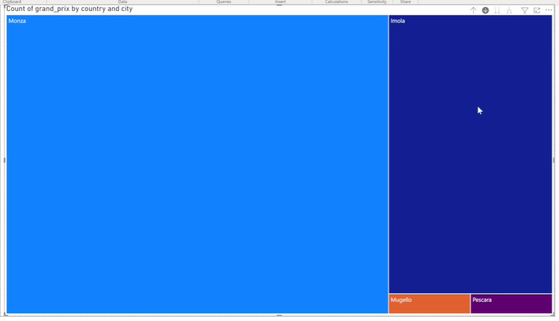
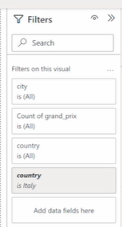
We actually drill down to the next layer filtered for the country Italy, so we can see the cities that represent Italy.

drill up
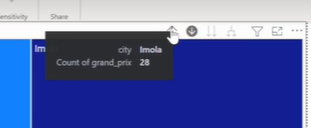

- **Adding Clarity with Labels:** To make the chart intuitive at a glance, go to the Format visual pane and toggle Data labels to "On." This displays the exact count of races directly on the rectangles. You can further customize the font size and colors here to ensure the data is easy to read.
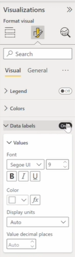

---

# Cards

Cards are arguably the most heavily used visuals in high-level dashboard reporting. They are perfect for **summarizing and emphasizing a single figure** (like Total Revenue, Total Points, or Total Races).

In the Visualizations pane, there are two distinct icons:

- Card (Standard single-value card)
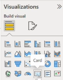
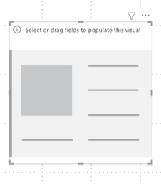

- Multi-row card
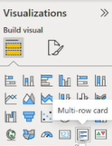

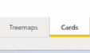

# 1. Standard Cards

- **Purpose:** Displays exactly one value at a time.

- **Setup:** Click the Card icon and drag a measure like Points into the Fields well. It will instantly calculate and display the total sum of all points in the dataset.
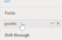
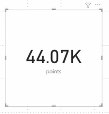

- **Formatting Options:** Go to the Format visual pane to adjust how the number is displayed. You can change the Display units (e.g., changing it to show in Thousands) and adjust the Decimal places (e.g., setting it to 0).
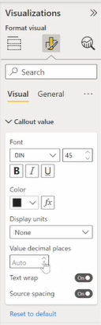
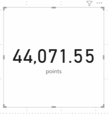

no decimal places
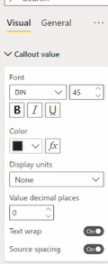
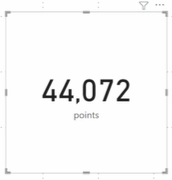

It's great at showing high level numbers and we use this a lot in our reports.

- **Limitation:** If you try to drag a second field (like Year) into the Field well of a standard card, it will simply replace the existing value (e.g., it will swap from showing Total Points to showing the Sum of Year). It cannot display a breakdown.
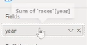
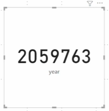

# 2. Multi-row Cards

The difference with multi cards is you can add a dimension and you can see the total points by each unique value in that column.

- **Purpose:** Allows you to display a measure (like Points) split by one or more dimensions (like Driver Name and Year). It creates a repeating list of mini-cards.

- **Setup & Splitting Data:**

  - Click the Multi-row card icon.

  - Drag Points into the Fields well (the number will initially look much smaller than the standard card because it is preparing to split the data).
  
  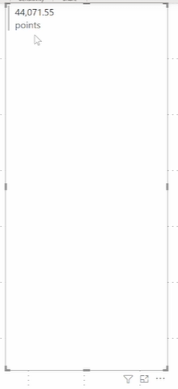

  - Drag a dimension like 'Driver_Name' into the Fields well. The visual will now create a separate row showing the total points for each specific driver.
  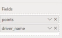
  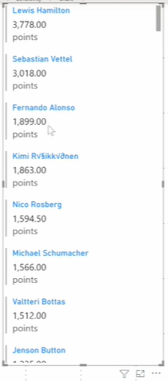

-> Result : The points are split by driver_name

- **Adding Multiple Dimensions:**

  - * You can break the data down even further by adding a second dimension, like Year (from the Races table).

  - **Crucial Step:** Because "Year" is a number, Power BI might try to sum it up by default. You must click the dropdown arrow next to the Year field and select Don't summarize.
  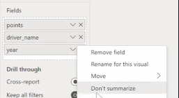

- **Result:** The card will now show specific combinations, such as Lewis Hamilton's points for 2019, followed by Lewis Hamilton's points for 2018, etc.
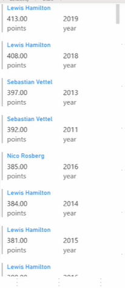

with cards, You can **add a dimension** and you can **see the measure** for **each unique value in that dimension**.

# Formatting Multi-row Cards

Multi-row cards have extensive, specific formatting options to control their look and feel. In the Format visual pane, you can adjust:

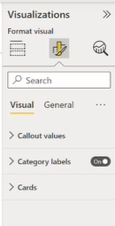

- **Callout values & Category labels:** Change the text color, font style, and size.
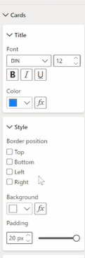

- **Card settings:** Adjust the internal padding of the cards so the text isn't cramped.

- **Accent bar:** Toggle the colored bar on the left side of each individual row on or off, and change its specific color and width to match your report's theme.
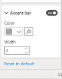

---

# Data Categories and Maps

## Assigning Data Categories

By default, Power BI might just see text or numbers when it looks at geographical data. You need to explicitly categorize these columns so Power BI knows exactly how to treat them when you build map visuals.

## How to categorize data (in the Data View):

- Go to the Data view on the left-hand menu and select the table containing your geographical data (e.g., the Circuits table).

- Click on a specific column (like City).

- Look at the top ribbon for the Column tools tab.
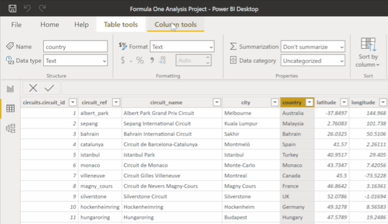

- Find the Data category dropdown (it usually defaults to "Uncategorized").

- Select the appropriate geographical tag from the list (e.g., categorize the City column as City, Country as Country, Latitude as Latitude, etc.).
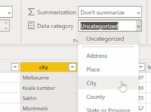
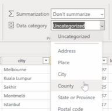
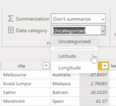
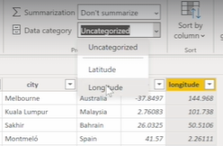

- **The Result:** Once categorized, you will notice a small globe icon appears next to the column name in the Fields pane. This tells you Power BI successfully recognizes it as geographial data.
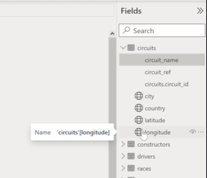

Categorizing columns is quite important so that power bi knows how to treat them when we use visuals.
here, we created 4 geographical columns so we can then use them in geographical visualisations and power bi will know how to treat them.

## Enabling Map Visuals (Crucial Step)

Before you try to build a map, you must ensure the feature is actually enabled in your settings, or the visual will remain blank.

- Go to File -> Options and settings -> Options.

- Under the Global section, click on Security.

- Ensure the box for "Use map and filled map visuals" is checked.

## Building the Map Visualization

- Create a new report page and name it "Map".
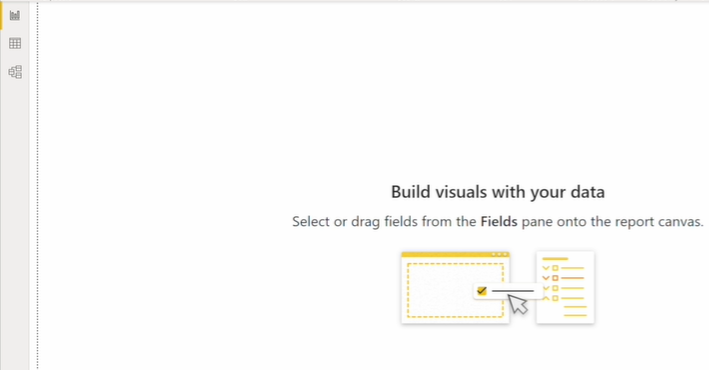
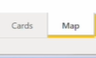

- Click the Map icon in the Visualizations pane and expand it.

### Plotting the Data:

You have two ways to plot the locations:

- **Method A (Latitude & Longitude):** Drag your Latitude and Longitude columns into their respective fields. Note: This is the safest and most accurate method because coordinates pinpoint exact locations without any ambiguity.

- **Method B (Location Field):** Drag Country or City into the Location field. Warning: If your text data formatting isn't perfect, Power BI's Bing Maps integration might get confused (e.g., plotting the UK in Switzerland or the US). If using this method, ensure your text data is flawlessly formatted.

### Adjusting Bubble Size:

- To see which circuits host the most events, drag Grand Prix (from the Races table) into the Bubble size field and ensure it is set to Count. The map will now display larger bubbles for high-frequency locations and smaller bubbles for rare ones.

## Tooltips and Formatting

Once your map is plotted, you can refine how the data is presented to the end-user.

### Tooltips:

- If you plotted using Lat/Long, hovering over a bubble only shows those raw coordinates, which isn't very helpful for a reader. Drag the City column into the Tooltips field. Now, when someone hovers over a bubble, the tooltip will explicitly state the city name (like "Silverstone"). Remember to right-click and rename it in the visual pane so it says "City" instead of "First City".

### Map Styles:

- Go to the Format visual pane -> Map settings -> Style. You can change the base map from the default "Road" view to "Aerial" (satellite), "Dark" mode, or toggle street labels on/off.

### Color Gradients:

- To make the highest-volume events stand out even more, you can apply conditional formatting to the bubbles. Go to the Format pane -> Bubbles -> Colors -> click the conditional formatting button (fx). Set up a color gradient based on the Count of Grand Prix events (e.g., light blue for the lowest values, dark blue for the highest).