# Power BI Online
Power BI Service
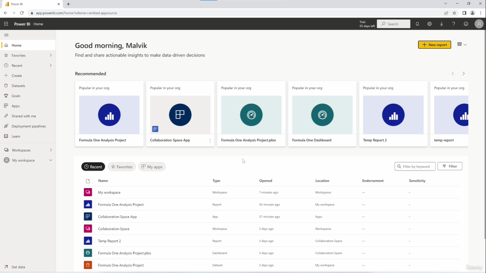

While Power BI Desktop is used for building data models locally, the **Power BI Service** is the cloud-based counterpart where the actual teamwork happens. It is designed specifically for hosting and distributing your work over the web.

It is on the cloud and a great way to collaborate and share your reports, apps and dashboards.

## Capabilities
Moving your local files to the cloud unlocks several high-level features:
* **Collaboration:** Work alongside others on the same datasets and workspaces.
* **Sharing:** Distribute finished, interactive **Reports** and **Dashboards** to specific users.
* **Apps:** Package multiple related dashboards and reports together into a single, polished "App" for your target audience to navigate easily.

## Access Requirements
To register for and use the Power BI Service, Microsoft requires an **organizational email address** (such as a work or university/college email). Standard personal domains (like `@gmail.com` or `@yahoo.com`) are not accepted.

# Overview

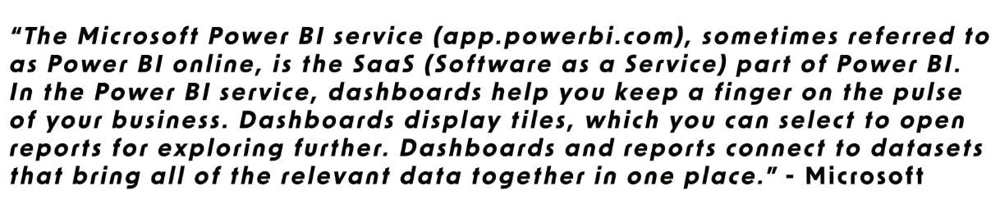

1. **Power BI Online (SaaS):** This is the Software as a Service component of Power BI, specifically designed for large-scale sharing and collaboration.

2. **Licensing Tiers:**
    * **Power BI Pro:** Geared toward small to medium-sized businesses.
    * **Power BI Premium:** Designed for large enterprises, offering increased maximum storage and advanced capacity features.

3. **Power BI Desktop vs. Online:**
    * **Desktop:** A local application used for building projects on your machine. It lacks collaboration capabilities.
    * **Online:** The cloud environment where you publish local projects. It enables you to share, collaborate, and distribute content.

4. **The Collaboration Workflow:**
    * Build the project locally in Power BI Desktop.
    * Publish the project to Power BI Online.
    * Create datasets and connections within a shared workspace.
    * Allow other developers to contribute or publish the final project to the broader organization.

## 2. Administrative & Account Requirements
Key details regarding account creation and access:

1. **Email Requirements:** Accessing Power BI Online requires an official organizational or school email address. Standard personal emails are not supported.
2. **Cost:** The service is not free, though a trial version ("Try Free") is available.

---
---

# Power Bi Pro Interface

* Top-right
Profile:
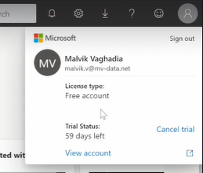

Get help:
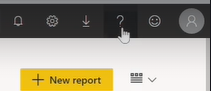
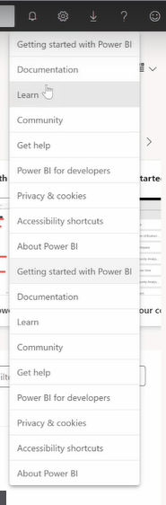

Notifications:
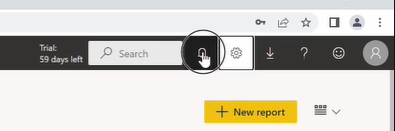
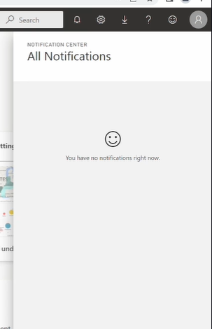

* **The Core Components:** The Power BI Online environment revolves around five main elements: Datasets, Reports, Dashboards, Workspaces, and Apps.

* **Dashboards vs. Reports:** * A **Dashboard** is a single-page canvas that acts as an executive summary, telling a story through key visualizations.
It's limited to a single page and you can pin visualizations from multiple reports into this dashboard.
It's meant to be like an executive summary of the most important findings.
Dashboards are exclusive to Power BI Online; they cannot be created in Power BI Desktop.

* **Workspace Types:**
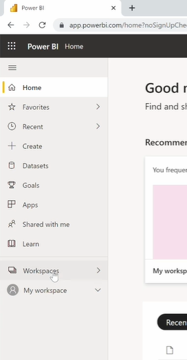
    * **My Workspace:** My workspace is your personal workspace. You can import datasets, workbooks, reports, and create dashboards here.
    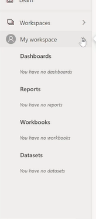
    * **Workspaces:** Shared environments designed for organizational collaboration, allowing multiple users to manage access and work on datasets and reports simultaneously.
    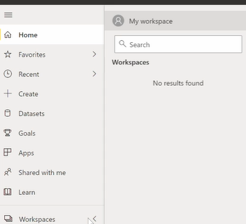

Bottom-left
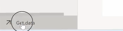
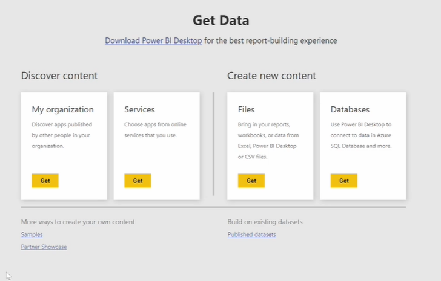
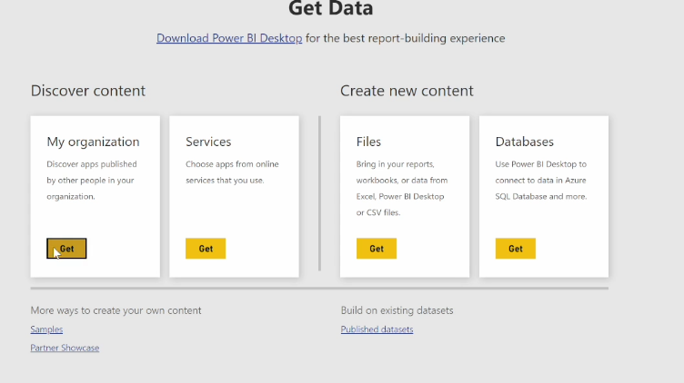

* **Apps:** An App is a packaged bundle of reports, datasets, and/or dashboards that can be easily published and shared across an organization. 

These will be all apps that are published to your organization.
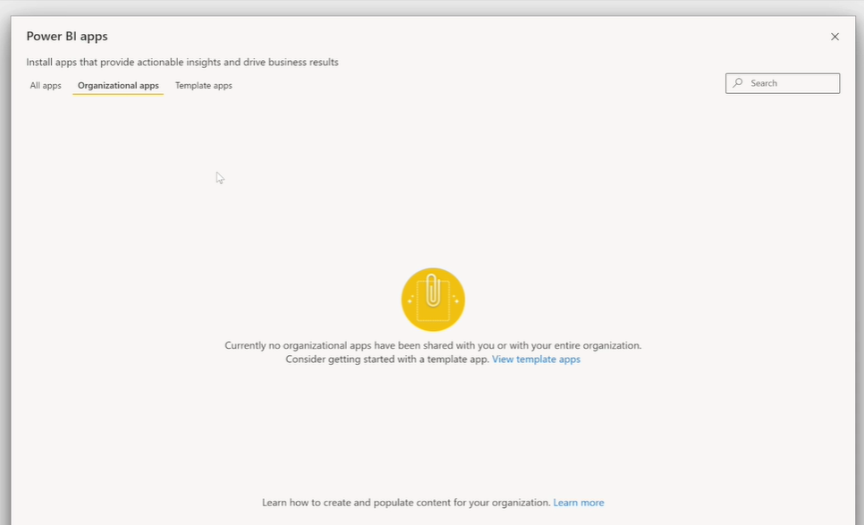
Template Apps
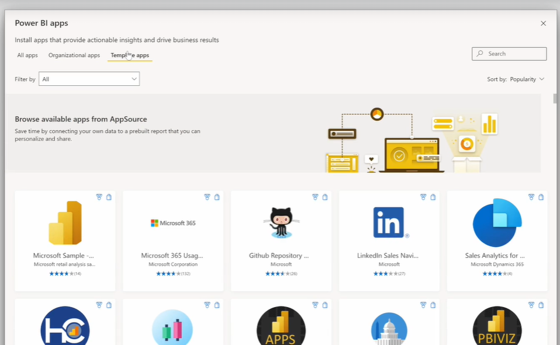

You can install apps. for ex., app is essentially a packaged report dataset or dashboard that you can share with others and publish.
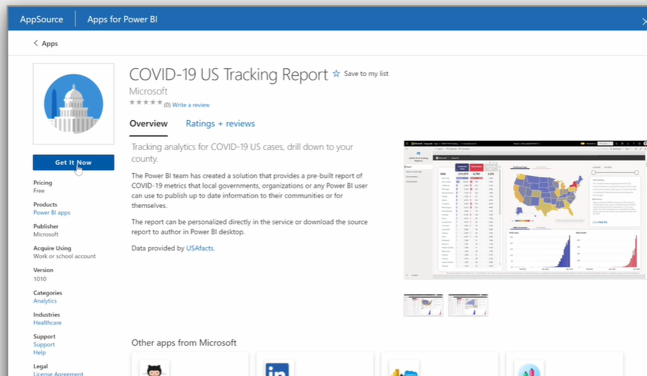

click : Get it now
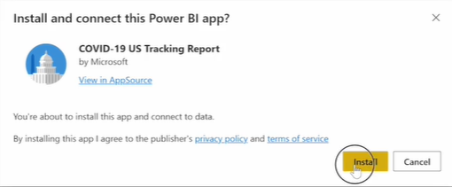

We are taken to apps page.
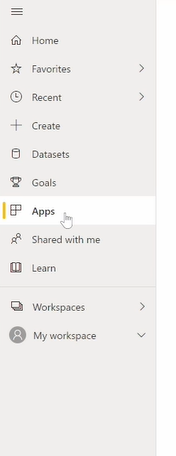
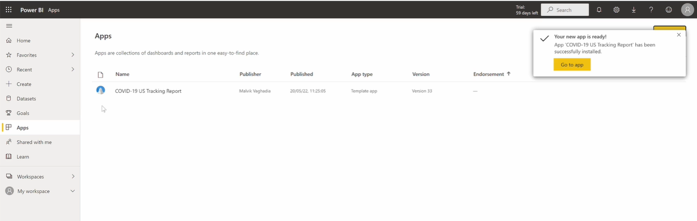

we can see the report related to the app that we've installed.
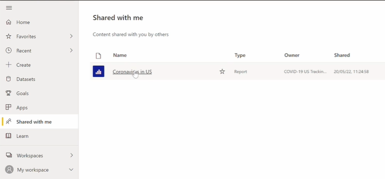

---

* And then on datasets, we have the underlying dataset for the app that we installed and then create.
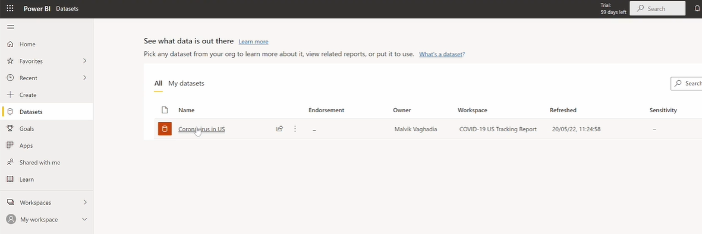

We can manually enter data:
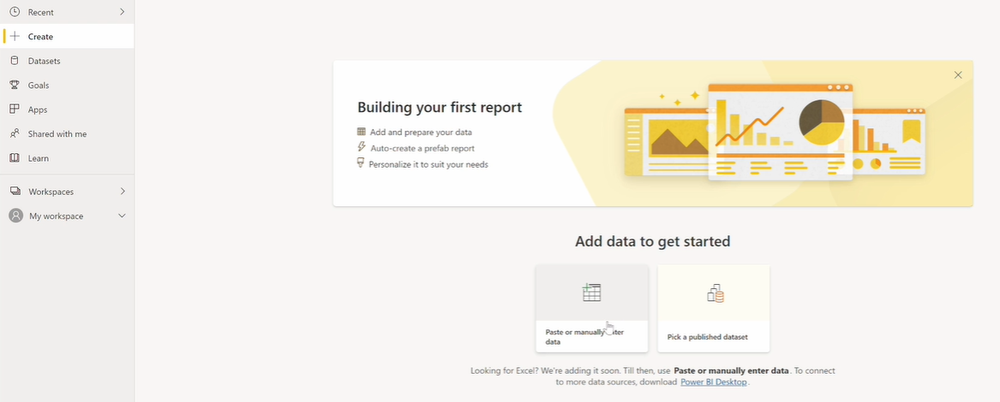
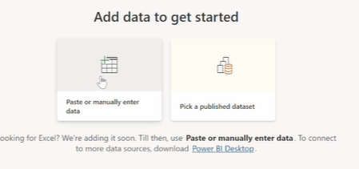
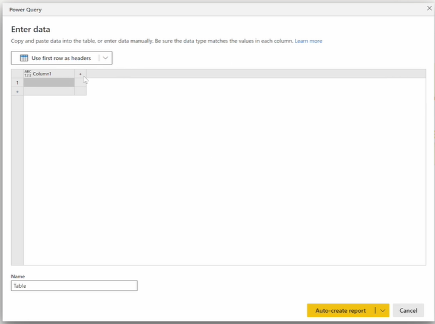

Or we can pick a published dataset so I can select this coronavirus dataset and then click Create.
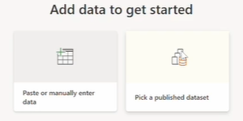
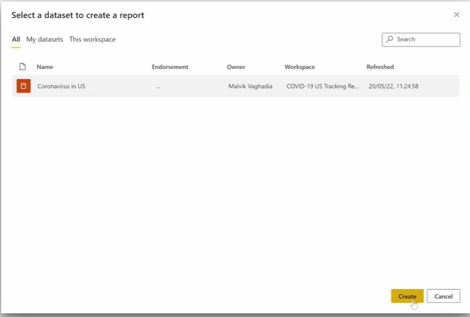

you're taking to a report view where you can add visualizations and use the dataset that we installed from the app.
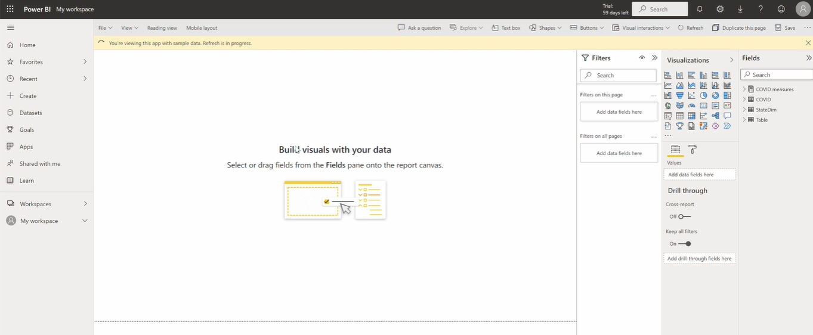
Note : Unlike Power BI desktop, this doesn't have a power query editor or a modelling view.

---

all of your data sets appear here.
You can select a dataset. And then you're taken to this view.
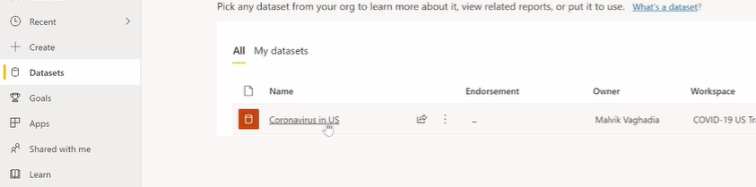
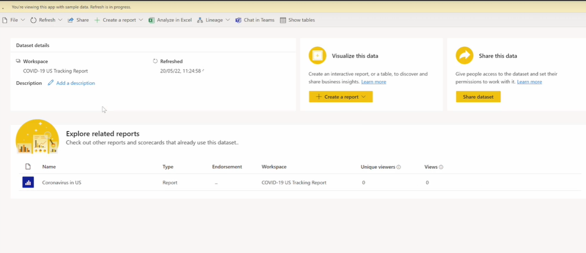

open lineage view
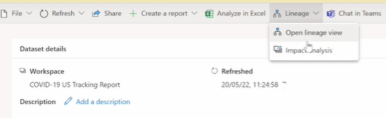
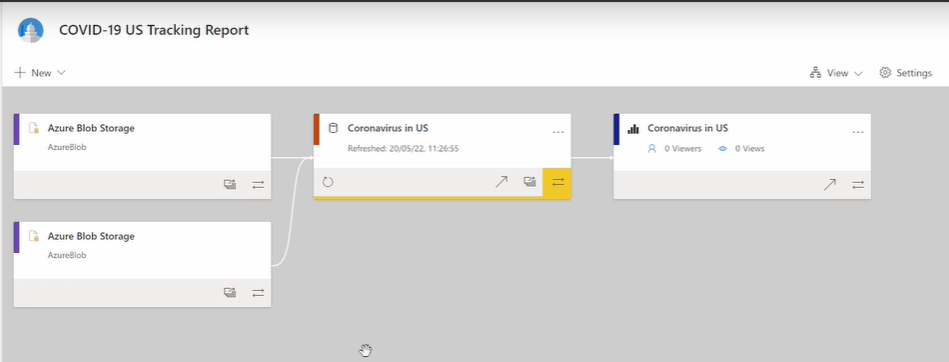
* **Lineage View:** A visual tool in the interface that displays the data flow from its origin (Source Data $\rightarrow$ Dataset $\rightarrow$ Report).

---

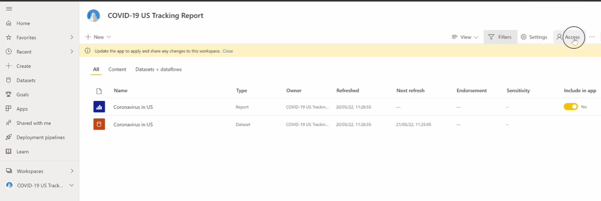
click on access, you can provide access to other members in your organization to this workspace.
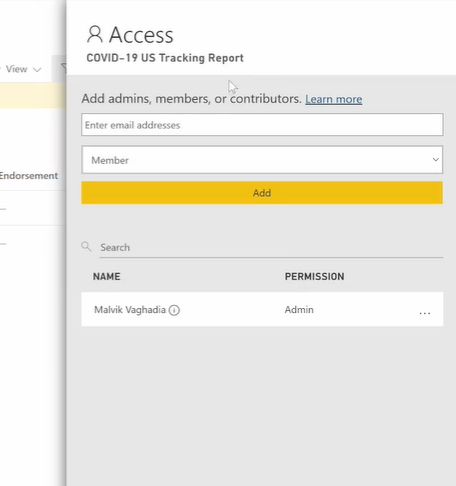

ou can also adjust settings for this workspace.
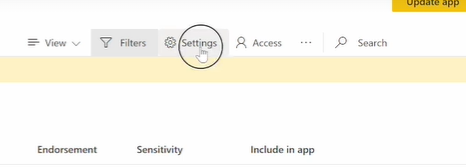
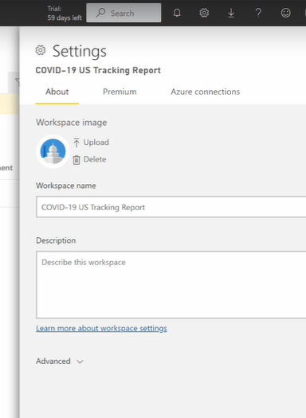

---

bottom-left
click : get data
You can also add content in the forms of files from your local file connecting to OneDrive, SharePoint and other ways to click on Get Data.
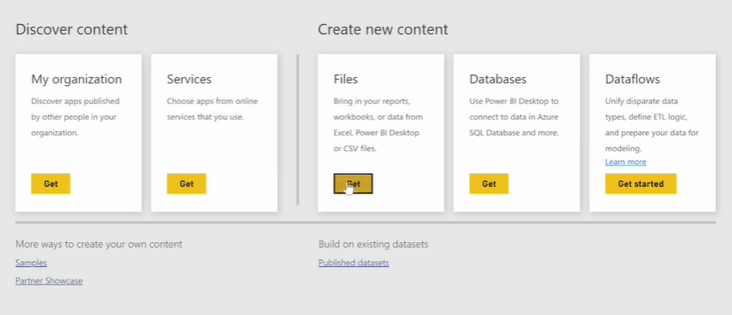
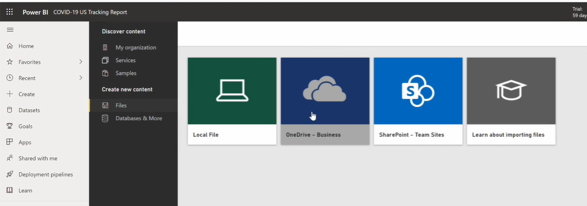

you can connect to data from databases.
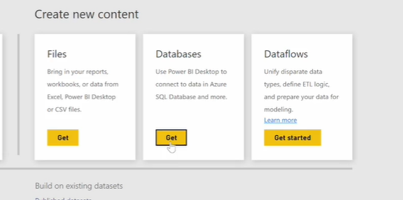
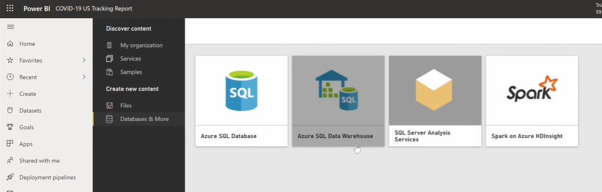

* **Power BI Online Limitations:** When creating a report directly in Power BI Online from a published dataset, you only have access to the Report View. It lacks both the Power Query Editor and the Modeling view found in Power BI Desktop.

## Interface Navigation & Data Connection
Key areas of the Power BI Pro interface to be familiar with:

* **Top Menu Bar:** Houses your Profile (shows account and license type), Help (documentation and community), Downloads, Settings, and Notifications.
* **Get Data Button (Bottom Left):** The gateway to bringing information into Power BI Online.
* **Data Sources:** You can connect to organizational apps, install template apps, import local files, connect to OneDrive/SharePoint, or connect directly to databases.

---
---

# Publishing Reports to Power BI Pro

* **Publishing Methods:** You can publish a report in two primary ways:
    * **From Desktop:** Clicking `Publish` on the Home tab. (Note: The email logged into Power BI Desktop must match your Power BI Service account).
        * If you want to publish your desktop file to the cloud,
        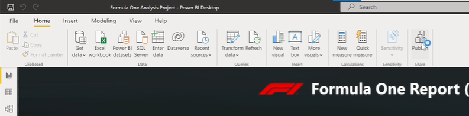
        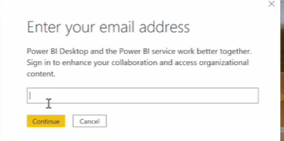
        * which workspace you want to publish your reporting.
        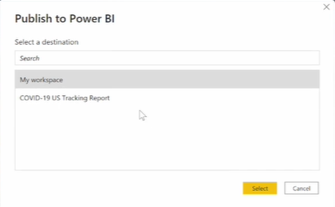
        * see in power bi pro:
        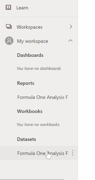
    * **From Service:** Using the `Get Data` -> `Local File` option to upload the `.pbix` file directly.
* **Workspace Destination:** When publishing, you must explicitly select a destination, such as "My Workspace" or another specific organizational workspace.
* **Hidden Pages:** Pages that are hidden in Power BI Desktop (such as tooltip pages) will remain hidden and inaccessible as standalone pages once published to the Power BI Service.
* **The Deletion Cascade Rule:** If you delete a dataset in the Power BI Service, it will automatically delete any reports and content associated with that dataset. 
* **Sharing Hierarchies:**
    * **Sharing a Report:** Automatically grants the recipient access to the underlying dataset.
    * **Sharing a Dataset:** ONLY grants access to the dataset. The user can build a new report from scratch using that data, but they will not see your original report.
* **Sharing Methods & Permissions:**
    * **Direct Access:** You can add specific users via their email and assign them explicit permissions (e.g., Read, Share, Build content).
    * **Link Sharing:** You can generate a link to share the report/dataset with others in your organization.
* **Revoking Access:** You can instantly remove a user's access by going to `Manage permissions`. This involves either removing them from the Direct Access list or deleting the specific link that was generated for them.

* **Demo Glitch:** You might notice a duplicate report in the "Shared with me" section during the video; the instructor notes to ignore this, as it was just a byproduct of uploading the file twice during the demonstration.

---

# Dashboards

* **What is a Dashboard?** A dashboard is a single-page canvas designed to tell a high-level story using only the most important visualizations. 
* **Service Exclusive:** Dashboards are a special feature of the Power BI Service (online). They *cannot* be created in Power BI Desktop.
* **Understanding Tiles:** * Visualizations placed on a dashboard are called **tiles**.
    * A single dashboard can contain tiles pinned from *multiple different reports* and datasets.
    * Tiles can be moved, resized, and interacted with. Clicking a tile will take the user directly to the underlying report it was pinned from.
* **Dashboard Limitations (Highly Testable):**
    * **No Filtering/Slicing:** Unlike reports, you cannot filter or slice data directly on a dashboard canvas.
    * **Custom Tooltips:** Custom report-level tooltips (like hidden tooltip pages created in Desktop) do not carry over to dashboard tiles. Dashboard tiles only display the standard default tooltip.
* **Adding Non-Data Tiles:** Dashboards aren't limited to just data visuals. You can also add web content, images, text boxes, and videos directly to the dashboard canvas.
* **Sharing:** Just like datasets and reports, dashboards can be shared with others via direct access or a link.

## 2. Notes

* **How to Pin a Visual:** To add a visual to a dashboard, hover over any visual in a report and click the "Pin Visual" icon. You will then be prompted to either create a new dashboard or pin it to an existing one.
* **Creating a Scratch Report:** creating a temporary report from scratch using a "Decomposition Tree" (analyzing race wins by driver and constructor) just to show how you can pin visuals from entirely different reports to the same dashboard.
* **Customization:** how to add a text box tile and how to change the overall Dashboard theme (e.g., switching to a Dark theme to make certain visualizations pop).

---

# Refreshing Data

* **The Local vs. Cloud Disconnect:** When you build a report using local files (like a local Excel sheet or on-premises SQL database) and publish it to the Power BI Service, the cloud environment cannot automatically reach back into your local machine to fetch new data.
* **What is a Data Gateway?** A Data Gateway acts as a secure bridge or tunnel. It facilitates the safe transfer of data from your on-premises network (local computers or local servers) up to the Power BI cloud service.
* **Types of Gateways (Highly Testable):**
    * **Personal Mode:** Designed for a single user. It only works with Power BI, only supports Import mode (no DirectQuery), and cannot be shared with a team.
    * **Standard Mode (Enterprise):** Designed for organizational use. It supports multiple users, multiple data sources, and works across other Microsoft services (Power Apps, Power Automate, Logic Apps). It also supports advanced connections like DirectQuery and Live Connection.
* **Scheduled Refresh Limits (Extra Certification Fact):** Power BI restricts how many times you can schedule an automatic refresh per day based on your license:
    * **Power BI Pro:** Maximum of **8** scheduled refreshes per day.
    * **Power BI Premium / Premium Per User (PPU):** Maximum of **48** scheduled refreshes per day.
* **Gateway Uptime Rule:** The physical machine hosting the Data Gateway *must* be powered on, awake, and connected to the internet at the exact time a refresh is triggered; otherwise, the refresh will fail. (Avoid installing gateways on laptops that go to sleep).

## 2. Interface Navigation & Configuration Steps
The standard workflow for fixing a refresh error and setting up a gateway:

1. **Diagnosing the Error:** If a dataset refresh fails in the workspace, you will see an error icon. You can use the **Lineage View** to map exactly which local source files the cloud dataset is failing to reach.
2. **Downloading the Gateway:** Navigate to `Settings` -> `Manage Gateways` (or `Settings` -> `Datasets` -> `Gateway connection`) to download the installer.
3. **Installation Location:** The gateway must be installed on a machine that has direct access to the local source files.
4. **Configuration & Credentials:** After installing and signing in with your Power BI Pro email, return to the Power BI Service Dataset Settings. Under `Gateway connection`, map the new gateway to your dataset and click `Edit credentials` to authenticate each individual local source file.
5. **Refreshing:** Once credentials are confirmed, you can manually click `Refresh Now` or toggle `Scheduled refresh` to set up automated daily or weekly updates.

## Notes

* **Demonstration Choice:** intentionally install the **Personal Mode** gateway because it is the fastest and most appropriate method for this specific single-user training demonstration. 
* **Validation Step:** After setting up the gateway, its advise doing a manual "Refresh Now" to ensure the connection is successful and the timestamps update before you rely on an automated schedule.

---

# Collaborative Workspaces

* **Collaboration Workspaces (App Workspaces):** Unlike "My Workspace," which is strictly for personal use, a collaboration workspace allows multiple developers to co-create, edit, and manage datasets, reports, and dashboards together.
* **Workspace Roles:** When granting access to a shared workspace, you assign specific roles to govern what users can do: Admin, Member, Contributor, or Viewer. 
* **Licensing Rule:** If a collaboration workspace is created under a "Pro" license mode, every user accessing or collaborating within that workspace must also have a Power BI Pro license.
* **What is a Power BI App?** An App is the official, packaged deployment of your workspace content. It is designed for broad distribution (e.g., sharing a finalized dashboard with an entire department or organization) in a clean, read-only viewing environment.
* **App Creation Limitations:** You can *only* publish an App from a Collaboration Workspace. The "Create App" feature does not exist within "My Workspace."
* **Selective App Packaging:** When publishing an App, you do not have to include everything from the workspace. You can selectively toggle which specific reports and dashboards are included in the final App package.

## 2. Interface Navigation & Configuration Steps
Key administrative actions for managing shared environments:

* **Creating the Workspace:** Navigate to `Workspaces` -> `Create workspace`. Here you define the name, advanced settings, and the required license capacity.
* **Managing Access:** Once created, you use the `Access` pane to type in user emails and assign their workspace role (Admin, Member, etc.).
* **Publishing the App:** Click the `Create App` button in the workspace menu. This opens a setup wizard where you define the App's description, upload a logo, select the navigation content, and set organizational permissions.
* **Installing the App (End-User View):** Users can access the published App via a direct link, or by navigating to `Get Data` -> `My organization` to find it in the organizational app directory.
* **Unpublishing & Deleting:** You can unpublish an active App via the workspace's menu options (three dots). To destroy the workspace entirely, you must go to `Workspace Settings` -> `Delete workspace`.

once a user launches the installed App, they are taken to a dedicated, streamlined App environment that is visually separated from the messy "developer" view of the workspace.