# DAX 

when we perform our transformation steps, for ex., formula bar:
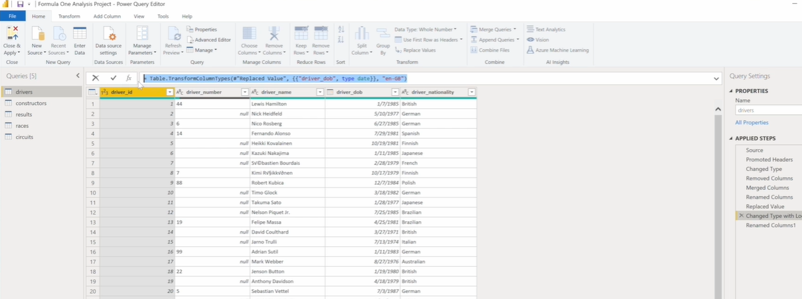
when you add a step. The code gets added behind the scenes.

Ex., This step changes the data type of 'race podium' column to Int64. If i want it to be Percentage,
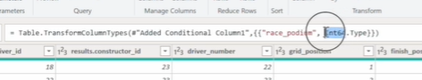
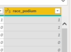
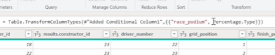
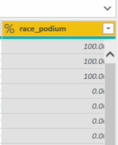

* M code:
Home Tab -> Advance Editor
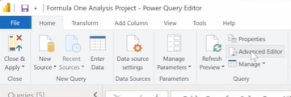
This shows the M code for each step where every line that starts with a hash is a new step.
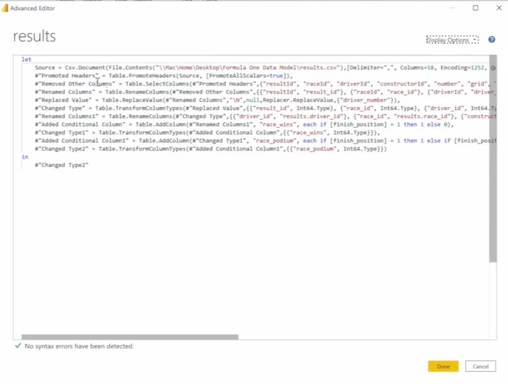
After #, there is the name of the step.
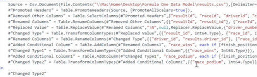
we can edit this code.

DAX stands for Data Analysis Expressions, while in language is used in the data preparation steps.
We use dax to create calculated columns and measures.

## Power BI Languages: M Code vs. DAX

### M Language (Power Query) vs. DAX (Data Model)
| Feature | M Language (Power Query Formula Language) | DAX (Data Analysis Expressions) |
| :--- | :--- | :--- |
| **Where it's used** | Power Query Editor | Data View / Report View |
| **Primary Purpose** | Data Preparation & Transformation (ETL) | Analytical Calculations & Data Modeling |
| **When it runs** | *Before* the data model is created/loaded. | *After* the data is loaded into the model. |
| **User Interaction** | Mostly GUI-driven; auto-generates code. | Written manually via the formula bar. |

### Understanding DAX: Columns vs. Measures
DAX is used to create two main types of calculations, and knowing when to use which is heavily needed:

Open Data View:

* **Calculated Columns:** * Performs operations at the **row level** (e.g., multiplying `Points` * 10 for every single row).
    * Adds a physical column to your table in the Data View.
    * Takes up memory/file space.

> Steps:
In data view:
1) Table Tools Tab -> New Column
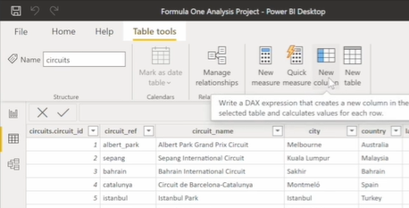
See the new column is added :
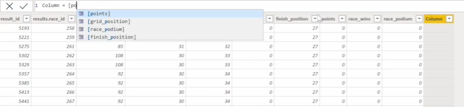

2) Write in the formula bar : new_col_name = [old_col_name] operation => Column = [points]*10
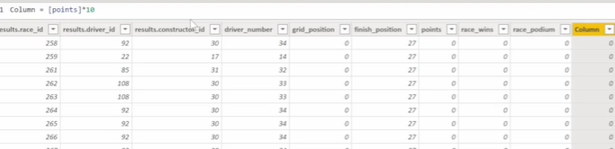

To verify the change, lets sort 'points' column in descending order:
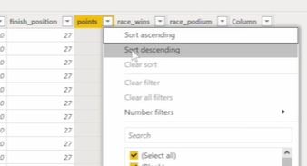
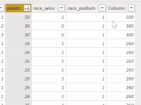

3) Change the new_col_name in formula: Pointsx10 = [points]*10
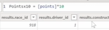
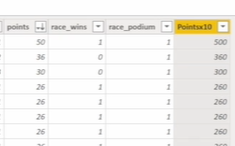
So whatever's on the left hand side of this equal sign is the name of the column. Whatever is on the right hand side is the expression.

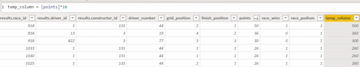

now lets add measure

* **Measures:** * Performs calculations at the **table or filter level** (e.g., `SUM` of all points), returning a single aggregated value.
    * Does *not* add physical rows/columns to your Data View; it sits in the Fields pane (indicated by a calculator icon) until dropped into a visual.
    * Highly efficient; calculates on the fly.

> Steps:
In data view:
1) Table Tools Tab -> New Measure
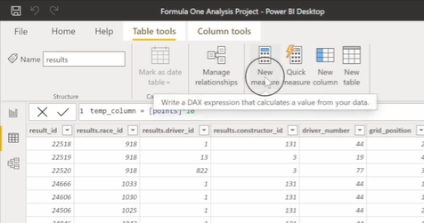
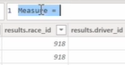

2) we can rename 'Measure = ' in formula bar.
Ex., Total points. That will be the sum of the Points column on the results table.
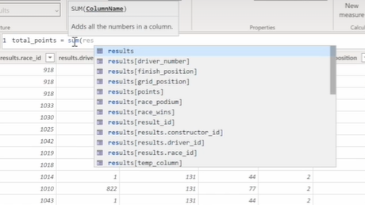
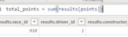

3) Where to see the created measure?
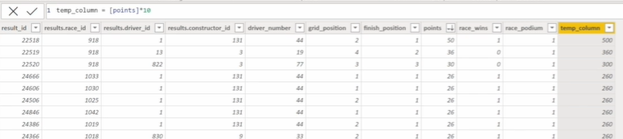

On the fields pane, there is 'temp column' and 'total_points' column.
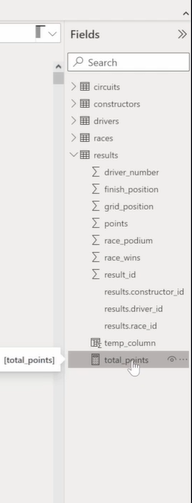

Note : The icon (Measure has an icon before the column name & The calculated column has a different icon before its name.)
- So the calculated column is a column that's added to table and it performs a function or operation at the row level.
- A measure is a calculation applied at the table or filter level, which returns just a single value.
- we can use measures in calculated columns to elaborate on both of these.
- We use Dax when creating calculated columns and measures.

> lets open power query editor.
Home -> Transform data
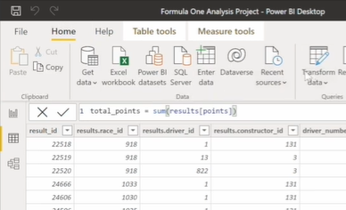

open the results query:
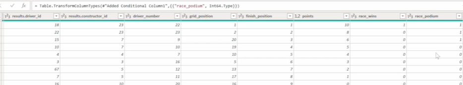
We can't see a calculated column or measure. They're added to the data model, but they're not included in these data preparation steps. They're added after the data preparation.

* **Crucial Rule:** Calculated columns and measures created with DAX *never* show up in the Power Query Editor because they exist strictly within the Data Model.

4) Delete the measure
click: 3 dots -> Delete from model
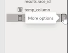
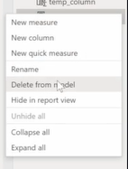
Do the same with temp_column.


## Summary
* **Viewing M Code:** In the Power Query Editor, you can view the M code for a specific step in the Formula Bar. To see the full script for the entire query, click `Advanced Editor` on the Home tab. 
    * *Note:* In the Advanced Editor, every line starting with a `#` represents a specific applied step.
* **Creating DAX Calculations:** In the Data View, use `Table tools` to select either `New column` or `New measure`.
* **DAX Syntax Structure:** The left side of the equals sign dictates the name, and the right side is the calculation: `Name = Expression` (e.g., `Total Points = SUM(Results[Points])`).
* **Deleting Model Elements:** You can delete a calculated column or measure by clicking the three dots next to its name in the Fields pane and selecting `Delete from model`.

---

# DAX Overview

Create a new table with dummy data.
Home -> Enter Data
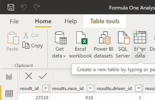
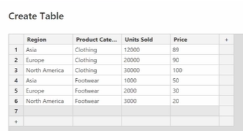
Table name : Company Sales
Load
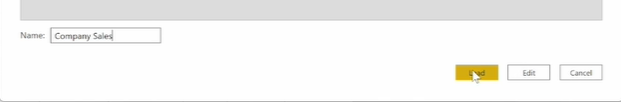

In the fields pane, click on Company Sales to open the table:
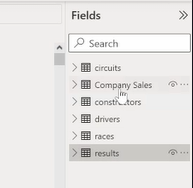

The new table is not associated to the rest of the tables.
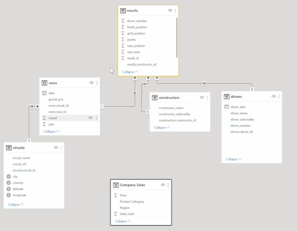

## referencing a table and a column in dax expressions.

###  Reference columns in dax formulas
* Create new calculated column hat multiplies the unit sold by the price (revenue)
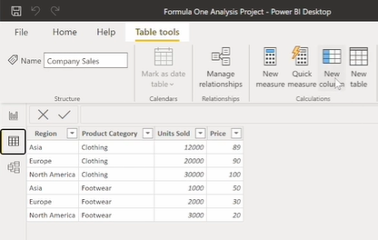

Then I want to reference this 'unit' column.
So to reference this column, start off by referencing the table name, which is company sales.

Note : Qualifying the column with the table name (Prefixing the table name before the column reference) gives context so that Power BI understands the table and column we r referencing.

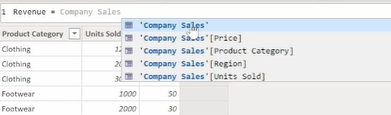
IntelliSense is able to suggest how I should references like. : 'Company Sales'

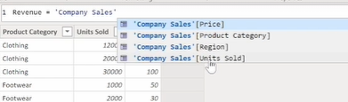

Final formula: Revenue = 'Company Sales'[Units Sold]*'Company Sales'[Price]
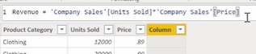
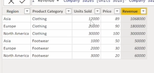

Bookmark the official Microsoft DAX documentation (`https://docs.microsoft.com/en-us/dax/`). There are hundreds of functions (Aggregation, Logical, Filter, etc.) and new ones are added regularly.

### Extra Start:

* **DAX Syntax & Referencing Rules** * The standard format for referencing a column in DAX is: `TableName[ColumnName]`.
    * **The White Space Rule:** If a table name contains a space (e.g., `Company Sales`), the table name **must** be wrapped in single quotes. Example: `'Company Sales'[Units Sold]`.
    * If a table name has no spaces (e.g., `Results`), single quotes are optional. Example: `Results[Points]`.
    * **Best Practice:** Avoid using spaces when naming tables in your data model to make writing DAX cleaner and less prone to syntax errors.
* **DAX Operator Types:**
    * **Arithmetic Operators:** Perform mathematical calculations (`+`, `-`, `*`, `/`) and return numerical values.
    * **Comparison Operators:** Compare values (`=`, `>`, `<`, etc.) and return a logical `TRUE` or `FALSE` result.
    * **Logical Operators:** Combine multiple expressions to produce a single result. Key symbols to recognize: `&&` (AND), `||` (OR), and `IN`.

## Interface Navigation & Configuration Steps
* **Creating Manual Data Tables:** You can quickly build small, static tables directly inside Power BI Desktop by navigating to the `Home` tab and clicking `Enter Data`. 
* **IntelliSense:** When typing in the DAX formula bar, Power BI's IntelliSense will automatically suggest table and column names, and it will automatically apply the single quotes if your table name has a space.

## DAX Fundamentals

### What is DAX?
**DAX (Data Analysis Expressions)** is the formula language used across Microsoft's analytical stack — Power BI, Power Pivot, and Analysis Services. It is a collection of functions, operators, and constants that can be used in formulas and expressions to calculate and return one or more values.

DAX is **not** a query language like SQL. It is an **expression language** — every DAX formula evaluates to a value (scalar or table).

### Calculated Columns vs Measures — The Most Critical Distinction

| Aspect | Calculated Column | Measure |
|---|---|---|
| **Where it lives** | Inside a table (as a new column) | Outside the table (in the measure tray) |
| **When evaluated** | At data refresh / model load time | On demand, at query time |
| **What it returns** | A value **per row** | A **single aggregated value** |
| **Filter context awareness** | Does not respond to report filters | Fully responds to filter context |
| **Storage** | Stored in the model (increases file size) | Not stored — computed on the fly |
| **Use case** | Row-level categorization, segmentation | Aggregations shown in visuals |
| **Syntax start** | `Column Name = expression` | `Measure Name = expression` |

**Calculated Column example:**
```dax
Revenue = 'Company Sales'[Units Sold] * 'Company Sales'[Price]
```
→ Creates a new column in the table. Every row has its own `Revenue` value.

**Measure example:**
```dax
Total Revenue = SUMX('Company Sales', 'Company Sales'[Units Sold] * 'Company Sales'[Price])
```
→ Returns one number. Changes dynamically based on what filters/slicers are active in the report.

> **Common Mistake:** Using a calculated column when you need a measure. Calculated columns don't respond to slicers. If your number never changes when you filter, you've likely used a column instead of a measure.

### Extra End

---
---

# Aggregation Functions

### Standard Aggregation Functions

These functions operate on an **entire column** at once — they don't iterate row by row.

| Function | Description |
|---|---|
| `SUM(column)` | Sum of all values in a column |
| `AVERAGE(column)` | Mean of all values |
| `MIN(column)` | Smallest value |
| `MAX(column)` | Largest value |
| `COUNT(column)` | Count of numeric values |
| `COUNTA(column)` | Count of non-blank values |
| `COUNTBLANK(column)` | Count of blank values |
| `DISTINCTCOUNT(column)` | Count of unique values |

**Syntax:**
```dax
Total Units = SUM('Company Sales'[Units Sold])
```

---

### Iterator (X) Functions — Row-by-Row Evaluation

Every standard aggregation function has a corresponding **X (iterator) version**:

| Standard | Iterator |
|---|---|
| `SUM` | `SUMX` |
| `AVERAGE` | `AVERAGEX` |
| `MIN` | `MINX` |
| `MAX` | `MAXX` |
| `COUNT` | `COUNTX` |

**Syntax pattern for all iterator functions:**
```dax
FunctionX( <table>, <expression> )
```
- **First argument:** The table to iterate over (row by row)
- **Second argument:** The expression to evaluate for each row

**SUMX Example:**
```dax
SumX_Revenue = SUMX('Company Sales', 'Company Sales'[Units Sold] * 'Company Sales'[Price])
```

---

### SUM vs SUMX — The Core Difference

This is one of the **most tested concepts** in DAX interviews.

**Using SUM (wrong approach for row-level multiplication):**
```dax
Sum_Column = SUM('Company Sales'[Units Sold]) * SUM('Company Sales'[Price])
-- SUM(Units Sold) = 68,000   (total of entire column)
-- SUM(Price)      = 379      (total of entire column)
-- Result          = 68,000 × 379 = 25,772,000  ← WRONG — mathematically meaningless!
```

**Using SUMX (correct approach):**
```dax
SumX_Column = SUMX('Company Sales', 'Company Sales'[Units Sold] * 'Company Sales'[Price])
-- Row 1: 12,000 × 89  = 1,068,000
-- Row 2: 20,000 × 90  = 1,800,000
-- ...
-- Total sum of all row results = 6,030,000  ← CORRECT revenue figure
```

**The rule:** Whenever you need to multiply (or otherwise combine) two columns and then aggregate, **always use an iterator function like SUMX** — not `SUM(col1) * SUM(col2)`.

---

### Practical Assignment Solutions

**Assignment 1 — Percentage of Total Revenue per Row:**
```dax
PCT_of_Total_Revenue =
    ('Company Sales'[Units Sold] * 'Company Sales'[Price])
    /
    SUMX('Company Sales', 'Company Sales'[Units Sold] * 'Company Sales'[Price])
    * 100
```
- Numerator: row-level revenue (Units Sold × Price for that row)
- Denominator: total revenue across all rows (using SUMX)
- Result: percentage share of total revenue for each row → all rows sum to 100%

**Assignment 2 — Percentage of Total Units Sold per Row:**
```dax
PCT_of_Total_Units =
    'Company Sales'[Units Sold]
    /
    SUM('Company Sales'[Units Sold])
    * 100
```
- No multiplication needed → `SUM` is sufficient here (summing a single column)
- Numerator: units for this row
- Denominator: total units across all rows

---

## Part 3: Filter Functions

### CALCULATE — The Most Important DAX Function

`CALCULATE` is the **king of DAX**. It evaluates an expression in a **modified filter context**. Almost every advanced DAX measure uses `CALCULATE` somewhere.

**Syntax:**
```dax
CALCULATE( <expression>, <filter1>, <filter2>, ... )
```

- `<expression>` — any valid DAX expression (SUM, AVERAGE, etc.)
- `<filter1>, <filter2>` — one or more filter conditions that modify the context

**Basic Example:**
```dax
NA_Units = CALCULATE(SUM('Company Sales'[Units Sold]), 'Company Sales'[Region] = "North America")
```
→ Returns the sum of units sold **only for North America**, regardless of any other filters applied in the report.

> Text values in DAX filters must be in **double quotes** `"North America"` — single quotes will cause a syntax error.

---

### FILTER — Returns a Filtered Table

`FILTER` is a table function — it returns a **subset of a table** based on a condition.

**Syntax:**
```dax
FILTER( <table>, <condition> )
```

**Example:**
```dax
FILTER('Company Sales', 'Company Sales'[Region] = "North America")
```
→ Returns a table containing only rows where Region = "North America"

`FILTER` is almost always used **inside** another function like `CALCULATE`, never standalone in a measure.

---

### CALCULATE with direct filter vs CALCULATE with FILTER

Both of these return the same numeric result:

```dax
-- Method 1: Direct filter argument in CALCULATE
NA_Units_v1 = CALCULATE(SUM('Company Sales'[Units Sold]), 'Company Sales'[Region] = "North America")

-- Method 2: FILTER function inside CALCULATE
NA_Units_v2 = CALCULATE(SUM('Company Sales'[Units Sold]), FILTER('Company Sales', 'Company Sales'[Region] = "North America"))
```

**But they behave differently:**

| Aspect | Direct Filter in CALCULATE | FILTER inside CALCULATE |
|---|---|---|
| Mechanism | Evaluates row-by-row; includes/excludes rows from the existing context | Creates a new virtual sub-table first, then passes it to CALCULATE |
| Interaction with existing context | **Overrides** existing filter context for that column | **Replaces** the table with a filtered sub-table |
| Rows not matching filter | Excluded from calculation; other regions return their own values | Rows not in the sub-table are blank |
| Performance | Generally faster (simple filter override) | Slightly heavier (materializes a sub-table) |
| Use when | Simple equality/comparison filters | Complex conditions, iterating over a derived table |

**Practical visual behavior difference:**

When building a table visual with Region rows:
- `CALCULATE(..., Region = "North America")` → Shows NA value for all rows (North America, Asia, Europe all show the same NA total — the filter context is overridden)
- `CALCULATE(..., FILTER(..., Region = "North America"))` → Shows NA value only for the North America row; Asia and Europe rows are **blank**

---

### ALL — Remove All Filters

`ALL` removes all filter context from a column or table, returning all rows regardless of active slicers or visual filters.

**Syntax:**
```dax
ALL( <table_or_column> )
```

**Used inside CALCULATE:**
```dax
All_Units = CALCULATE(SUM('Company Sales'[Units Sold]), ALL('Company Sales'))
```
→ Always returns 68,000 (the grand total) — ignores any slicer or visual filter applied.

**Common use case — Grand Total for ratio calculations:**
```dax
% of Total = 
    DIVIDE(
        SUM('Company Sales'[Units Sold]),
        CALCULATE(SUM('Company Sales'[Units Sold]), ALL('Company Sales'))
    )
```
→ Denominator is always the grand total regardless of what filter context is active on the numerator.

**Variants of ALL:**

| Function | Behaviour |
|---|---|
| `ALL(Table)` | Removes all filters from the entire table |
| `ALL(Table[Column])` | Removes filters only from that specific column |
| `ALLEXCEPT(Table, Col1, Col2)` | Removes all filters except those on the specified columns |
| `ALLSELECTED(Table)` | Removes filters from the table but respects outer slicer/visual selections |

---

## Part 4: Logical Functions

### SWITCH — Clean Alternative to Nested IF

`SWITCH` evaluates an expression against a list of values and returns the result for the first matching value. It is far cleaner than nested `IF` statements for multiple conditions.

**Syntax:**
```dax
SWITCH(
    <expression>,
    <value1>, <result1>,
    <value2>, <result2>,
    ...
    <else_result>
)
```

**Example:**
```dax
Switch_One =
SWITCH(
    'Company Sales'[Region],
    "Asia",          1,
    "North America", 2,
    0                -- else / default
)
```
- If Region = "Asia" → returns 1
- If Region = "North America" → returns 2
- Anything else → returns 0

> **Order matters in SWITCH.** The first matching condition is returned. If the same value appears twice, the first match wins.

**SWITCH(TRUE()) pattern — for range-based conditions:**

Standard SWITCH only matches exact values. To handle ranges or complex conditions, use `SWITCH(TRUE())`:

```dax
Price_Band =
SWITCH(
    TRUE(),
    'Company Sales'[Price] < 50,  "Budget",
    'Company Sales'[Price] < 100, "Mid-Range",
    'Company Sales'[Price] < 200, "Premium",
    "Luxury"
)
```
→ Each condition is evaluated as TRUE or FALSE. The first `TRUE` condition wins.

---

### IF — Basic Conditional

```dax
IF( <condition>, <value_if_true>, <value_if_false> )

High_Value = IF('Company Sales'[Revenue] > 100000, "High", "Low")
```

For multiple conditions, prefer `SWITCH(TRUE())` over nested IFs for readability.

---

## Part 5: Filter Context and Row Context

Understanding context is the foundation of all advanced DAX.

### Row Context
- Exists automatically in **calculated columns**
- When DAX evaluates a calculated column, it knows the current row → can reference `[Units Sold]` for that specific row
- Created explicitly by **iterator functions** (SUMX, AVERAGEX, etc.) — they iterate and create a row context for each row

### Filter Context
- Exists in **measures**
- Comes from slicers, visual filters, row/column headers in a matrix, and `CALCULATE` filters
- When you click "North America" on a slicer, all measures are re-evaluated within a filter context where Region = "North America"

### Context Transition
When `CALCULATE` is used inside a row context (e.g., inside a calculated column or SUMX), it **converts the row context into a filter context** — this is called context transition.

```dax
-- In a calculated column, CALCULATE causes context transition:
Running_Total =
CALCULATE(
    SUM('Company Sales'[Revenue]),
    FILTER(ALL('Company Sales'), 'Company Sales'[Date] <= EARLIER('Company Sales'[Date]))
)
```

`EARLIER` refers to the outer row context value when nested row contexts exist.

---

## Part 6: Key DAX Functions Reference

### Time Intelligence Functions
*(Require a properly marked Date table in the model)*

```dax
-- Year to Date
Revenue_YTD = TOTALYTD(SUM('Sales'[Revenue]), 'Date'[Date])

-- Previous Year same period
Revenue_PY = CALCULATE(SUM('Sales'[Revenue]), SAMEPERIODLASTYEAR('Date'[Date]))

-- Month to Date
Revenue_MTD = TOTALMTD(SUM('Sales'[Revenue]), 'Date'[Date])

-- Quarter to Date
Revenue_QTD = TOTALQTD(SUM('Sales'[Revenue]), 'Date'[Date])

-- Date shift — previous month
Revenue_PM = CALCULATE(SUM('Sales'[Revenue]), DATEADD('Date'[Date], -1, MONTH))
```

### DIVIDE — Safe Division
Always use `DIVIDE` instead of `/` to handle division by zero gracefully:

```dax
-- Unsafe (crashes on divide-by-zero)
Margin_Unsafe = [Profit] / [Revenue]

-- Safe (returns BLANK or custom value on zero)
Margin_Safe = DIVIDE([Profit], [Revenue], 0)  -- returns 0 if Revenue = 0
```

### RELATED — Lookup from Related Table
Used in calculated columns to fetch a value from a related (lookup) table:

```dax
-- In the Sales table, fetch the Category from the Products table
Product_Category = RELATED('Products'[Category])
```
Requires an existing relationship between the tables in the data model.

### RELATEDTABLE — Fetch Related Rows
Used to retrieve a table of related rows (inverse of RELATED):

```dax
-- Count how many sales rows each product has
Sales_Count = COUNTROWS(RELATEDTABLE('Sales'))
```

### RANKX — Dynamic Ranking
```dax
Sales_Rank =
RANKX(
    ALL('Products'[ProductName]),    -- rank across all products
    [Total Revenue],                  -- the measure to rank by
    ,                                 -- blank = use current measure value
    DESC,                             -- descending order
    Dense                             -- Dense = no gaps in rank numbers
)
```

### HASONEVALUE / SELECTEDVALUE — Check Filter State
```dax
-- Returns true if only one value is selected in filter context
Category_Label = IF(HASONEVALUE('Products'[Category]), VALUES('Products'[Category]), "Multiple")

-- Returns the selected value or an alternate if multiple are selected
Selected_Region = SELECTEDVALUE('Sales'[Region], "All Regions")
```

### CONCATENATEX — String Iterator
```dax
-- Concatenate product names for a category
Product_List = CONCATENATEX('Products', 'Products'[ProductName], ", ")
```

### COUNTROWS
```dax
Number_of_Transactions = COUNTROWS('Sales')
-- vs
Non_Blank_Count = COUNTA('Sales'[OrderID])
-- COUNTROWS is generally preferred for counting table rows
```

---

## Part 7: CALCULATE Deep Dive — Advanced Patterns

### Pattern 1: Multiple Filters (AND logic)
```dax
NA_Clothing_Units =
CALCULATE(
    SUM('Company Sales'[Units Sold]),
    'Company Sales'[Region] = "North America",
    'Company Sales'[Category] = "Clothing"
)
-- Multiple filter arguments are implicitly ANDed together
```

### Pattern 2: OR Logic with FILTER
```dax
NA_or_Europe_Units =
CALCULATE(
    SUM('Company Sales'[Units Sold]),
    FILTER('Company Sales', 'Company Sales'[Region] = "North America" || 'Company Sales'[Region] = "Europe")
)
-- The || operator means OR inside FILTER
```

### Pattern 3: Percentage of Total (Grand Total Ratio)
```dax
Pct_of_Grand_Total =
DIVIDE(
    SUM('Company Sales'[Units Sold]),
    CALCULATE(SUM('Company Sales'[Units Sold]), ALL('Company Sales'))
)
```

### Pattern 4: Percentage of Parent (e.g., Category Total)
```dax
Pct_of_Category =
DIVIDE(
    SUM('Company Sales'[Units Sold]),
    CALCULATE(SUM('Company Sales'[Units Sold]), ALLEXCEPT('Company Sales', 'Company Sales'[Category]))
)
```

### Pattern 5: Running Total
```dax
Running_Total =
CALCULATE(
    SUM('Sales'[Revenue]),
    FILTER(
        ALLSELECTED('Date'[Date]),
        'Date'[Date] <= MAX('Date'[Date])
    )
)
```

### Pattern 6: Moving Average (Last N Periods)
```dax
Rolling_3M_Avg =
AVERAGEX(
    DATESINPERIOD('Date'[Date], LASTDATE('Date'[Date]), -3, MONTH),
    [Monthly Revenue]
)
```